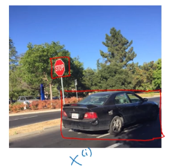
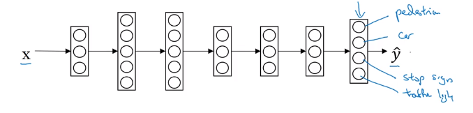

# Multi-task learning

 In transfer learning, you have a sequential process where you learn from task A and then transfer that to task B. In multi-task learning, you start off simultaneously, trying to have one neural network do several things at the same time. And then each of these task helps hopefully all of the other task.

## Simplified autonomous driving example

Self driving tasks need to detect many objects $y^{(i)}$.
* Pedestraians
* cars
* stop signs
* traffic light

Let's say we want to detect 4 kinds of objects, then $y^{(i)}$ is (4,1) vector, and

$Y=\begin{bmatrix}
|&|&|&&|\\
y^{(1)}&y^{(2)}&y^{(3)}&\cdots&y^{(m)}\\
|&|&|&&|\\
\end{bmatrix}$ is $(4,m)$ matrix.

To train the NN, define loss function. The loss averaged over your entire training set would be 1 over m sum from i = 1 through m, sum from j = 1 through 4 of the losses of the individual predictions.

$\hat{y}= \frac{1}{m}\sum_{i=1}^{m}\sum_{j=1}^4\mathcal{L}(\hat{y}_{j}^{(i)}, y_j^{(i)})$ where

** logistic loss** $\mathcal{L}(\hat{y}_{j}^{(i)}, y_j^{(i)}) = -y^{(i)}_j \log \hat{y}_j^{(i)}-(1-y^{(i)}_j)\log (1-\hat{y}_j^{(i)})$

Unlike softmax regression:
  one image can have multiple label (for each iamge, does it have a car, does it have stop sign?)

With this setting, one image can have multiple labels. If you train a neural network to minimize this cost function, you are carrying out multi-task learning. Because what you're doing is building a single neural network that is looking at each image and basically solving four problems.

Multi-task training still works even the labels are not fully available.

$Y=\begin{bmatrix}
1&0&0&&0\\
0&?&1&&?\\
?&?&1&\cdots&?\\
?&?&0&&/\\
\end{bmatrix}$

In this case, sum only over value of j with 0 or 1. $\sum_{j=1}^4$ could be for input with fully labeled with 0 or 1.$\sum_{j=1}^1$ if only one is labeled.

## When multi-task learning makes sense?
* Training on a set of taskls that could benefit from having shared lower-level features.
* Usually: amount of data you have for each tasks is quite similar.
* Can train a big enough neural network to do well on all the tasks.
* 
