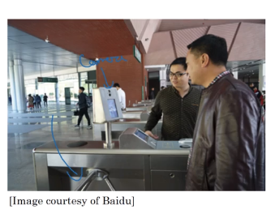
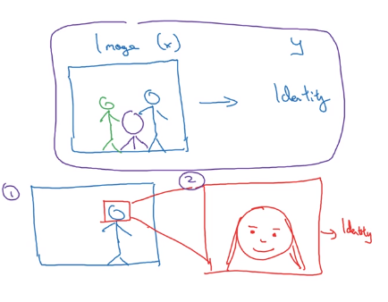

# What is end-to-end deep learning?

there have been some data processing systems, or learning systems that require multiple stages of processing. And what end-to-end deep learning does, is it can take all those multiple stages, and replace it usually with just a single neural network.

## Speech recognition example

**Traditional deep learning pipeline:**
* Works well with smaller training Data

**$x$**: audio $\xrightarrow[ ]{MFCC}$ features $\xrightarrow[ ]{ML}$ Phonemes $\rightarrow$ words $\rightarrow$ $y$: transcript

3,000 h

The components work as follows:
1. Compute features: Extract hand-designed features, such as MFCC (​Mel-frequency cepstrum coefficients) features, ​which try to capture the content of an utterance while disregarding less relevant properties, such as the speaker’s pitch.
2. Phoneme recognizer: Some linguists believe that there are basic units of sound called “phonemes.” For example, the initial “k” sound in “keep” is the same phoneme as the “c” sound in “cake.” This system tries to recognize the phonemes in the audio clip.
3. Final recognizer: Take the sequence of recognized phonemes, and try to string them together into an output transcript.
4.
In contrast, an end-to-end system might input an audio clip, and try to directly output the transcript:

**End to end deep learning:**
* Works well with larger training data

**$x$**: audio $\longrightarrow$ $y$: transcript

## Face recognition

This second approach allows the learning algorithm or really two learning algorithms to solve two much simpler tasks and results in overall better performance. This approach works if there is a lot of data for each step.

**$x$**: audio $\xrightarrow[ ]{MFCC}$ features $\xrightarrow[ ]{ML}$ Phonemes $\rightarrow$ words $\rightarrow$ $y$: transcript

Many parts of this pipeline were “hand-engineered”:
- MFCCs are a set of hand-designed audio features. Although they provide a reasonable summary of the audio input, they also simplify the input signal by throwing some information away.
- Phonemes are an invention of linguists. They are an imperfect representation of speech sounds. To the extent that phonemes are a poor approximation of reality, forcing an algorithm to use a phoneme representation will limit the speech system’s performance.
These hand-engineered components limit the potential performance of the speech system. However, allowing hand-engineered components also has some advantages:
- The MFCC features are robust to some properties of speech that do not affect the content, such as speaker pitch. Thus, they help simplify the problem for the learning algorithm.
- To the extent that phonemes are a reasonable representation of speech, they can also help the learning algorithm understand basic sound components and therefore improve its performance.
-
Having more hand-engineered components generally allows a speech system to learn with less data. The hand-engineered knowledge captured by MFCCs and phonemes “supplements” the knowledge our algorithm acquires from data. When we don’t have much data, this knowledge is useful.

More examples:
- Machine translation
- Estiamting child age from images
  - Image $\rightarrow$ Bone $\rightarrow$ age (This approach works better)
  - Image $\rightarrow$ age (THis requires a lot of data )
