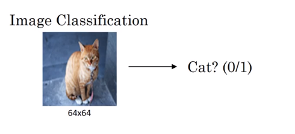
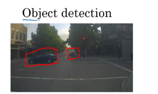
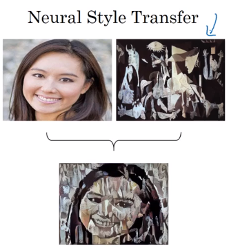
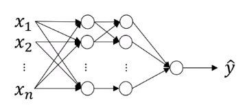

# Computer Vision

## Example of computer vision problems:

## Challenges

1. Inputs can be really big.

* This example, gives $64*64*3=12288$

* This example, gives $1000*1000*3=3,000,000$ 

1,000x1,000 pixels

So, in the NN, input ($x\in \mathbb{R}^{3M}$) will be 3 million dimention (3000000, 1) and assuming the first hidden layer has 1000 units, then $W^{[1]}$ dimention is (1000, 3000000) and this matrix will have 3 billion parameters.

2. With that many parameters, it's difficult to get enough data to prevent a neural network from overfitting.
3. The computational requirements and the memory requirements to train a neural network with three billion parameters is infeasible.

To address these challenges, we need to implement the convolution operation, which is one of the fundamental building blocks of convolutional neural networks. 
