# Edge Detection Example

The early layers of the neural network might detect edges and then the some later layers might detect cause of objects and then even later layers may detect cause of complete objects like people's faces in this case.
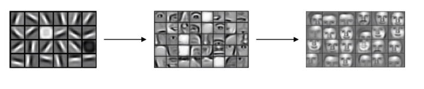

Vertical edges detector can be used to detect vertical lines, and you could use a horizontal detector to detect horizontal lines in the image on the left.
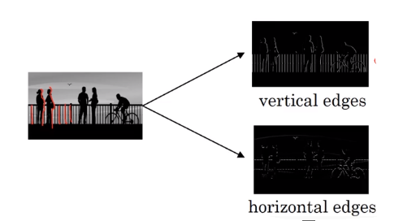

## How do you detect edges like above?
* Example using 6x6x1 matrix 
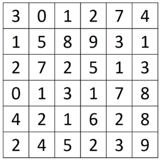

1. add a filter (or kernel) (3x3x1)
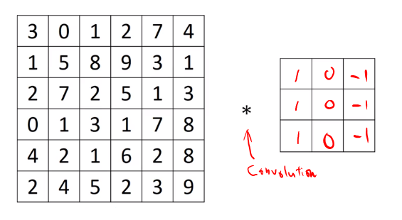

2. Convolution operation
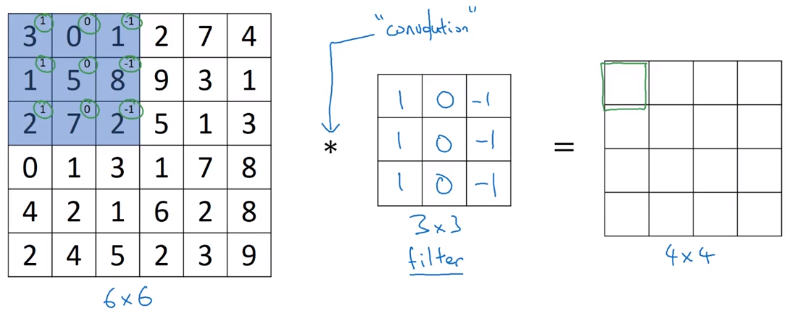
2.1 first cell 
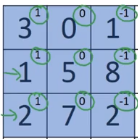 $\Rightarrow -5$ 
$(3\times1) + (1\times1)+(2\times1)+(0\times0)+(5\times0)+(7\times0)+(1\times-1)+(8\times -1)+(2\times-1)=-5$
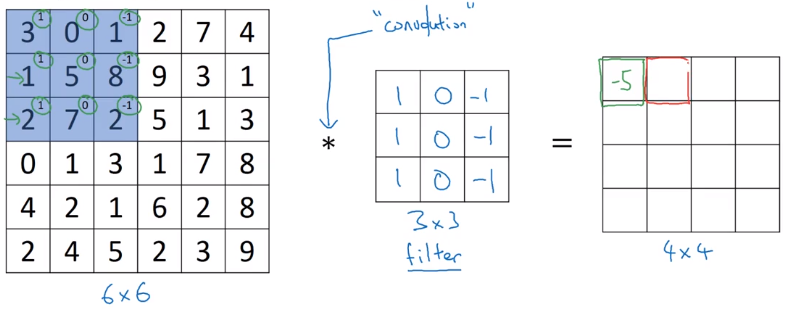
2.2 second cell 
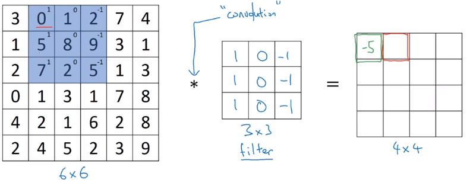
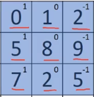  $\Rightarrow -4$ 
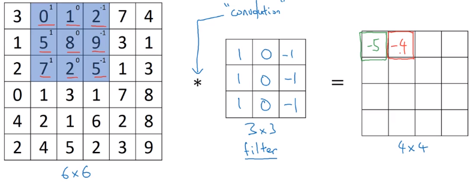

2.3 repeat this for all cells
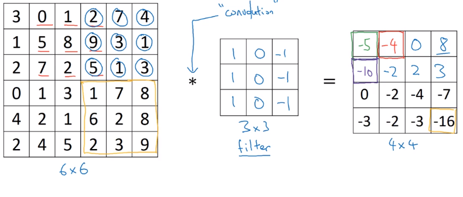

## Python functions:
* In python, we use `conv-forward`
* In tensorflow: `tf.nn.conv2d`
* In keras: `conv2d`

## How vertical edge detector work?

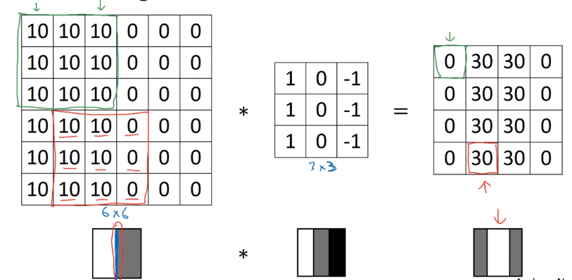
A vertical edge is a three by three region since we are using a 3 by 3 filter where there are bright pixels on the left, you do not care that much what is in the middle and dark pixels on the right. The middle in this 6 by 6 image is really where there could be bright pixels on the left and darker pixels on the right and that is why it thinks its a vertical edge over there.

##  Positive and negative edges
These filters make a difference between the light to dark versus the dark to light edges
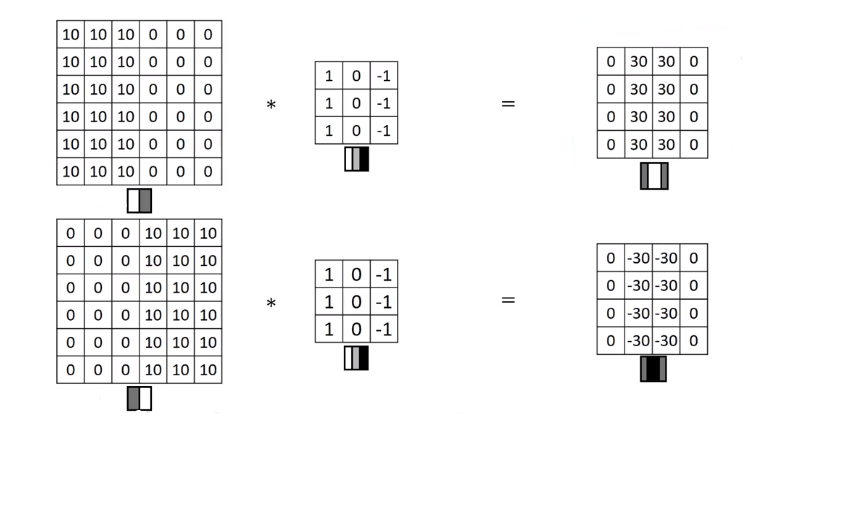

## Vertical and Horizontal Edge Detection
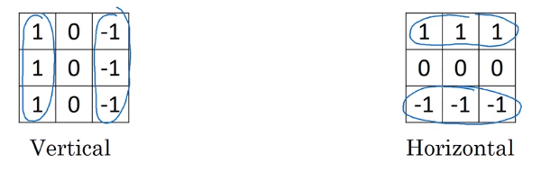
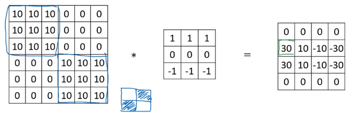

Different filters allow you to find vertical and horizontal edges.

## Lerning to detect edges
* Vertical edge detections
$\begin{bmatrix}
1&0&-1\\
1&0&-1\\
1&0&-1\\
\end{bmatrix}$
* Sobel filter
$\begin{bmatrix}
1&0&-1\\
2&0&-2\\
1&0&-1\\
\end{bmatrix}$

* Scharr filter
$\begin{bmatrix}
3&0&-3\\
10&0&-10\\
3&0&-3\\
\end{bmatrix}$

* learn filter
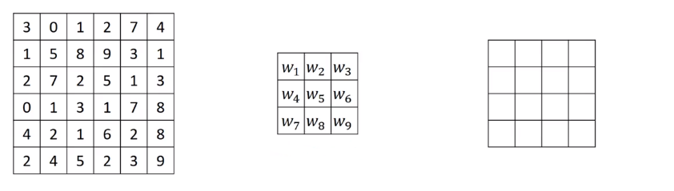
To detect edges in some complicated image, you can just learn the nine numbers of thes matrix as parameters, which you can then learn using back propagation. And the goal is to learn nine parameters so that when you take the 6x6 image, and convolve it with your 3x3 filter, that this gives you a good edge detector.

The idea you can treat these nine numbers as parameters to be learned has been one of the most powerful ideas in computer vision.
