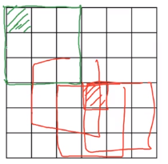
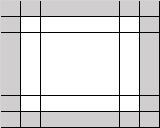

# Padding

Given $n\times n$ images, and $f\times f$ filter, you will get $(n-f+1)\times (n-f+1)$ matrix.

There are two downside to this:
1. Image shrinks.
2. Throwing away a lot of information frmo the pixels that are near the edges of the images.
As seen in below, the pixel in green is used only in one of the outputs, because this touches that three by three region.

**Solution**
To solve this problem, we could padd 1 pixcel around the the image.

 
In this example, p=padding=1

Resulting output image through $f \times f$ filter from $n\times n$ input iamge will be ($n+2p-f+1, n+2p-f+1$)

## Valid and Same Convolution

* Valid: no Padding

$(n\times n) * (f\times f)=(n-f+1 \times n-f+1)$

*Same: Pad so that output size is the same as the input size.

$n+2p-f+1 \times n+2p-f+1$

$n+2p-f+1=n$, $p=\frac{f-1}{2}$

$f$ is usually odd number. If it is not odd number then padding has to be asymetrical.
$3 \times 3, 5 \times 5, 7 \times 7$ are the common dimensions of the filters.
