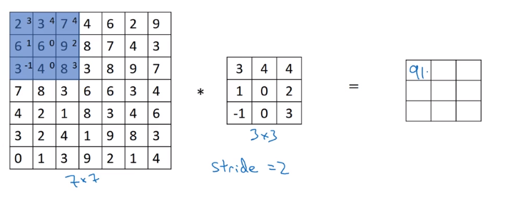
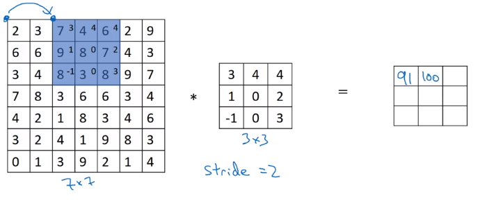
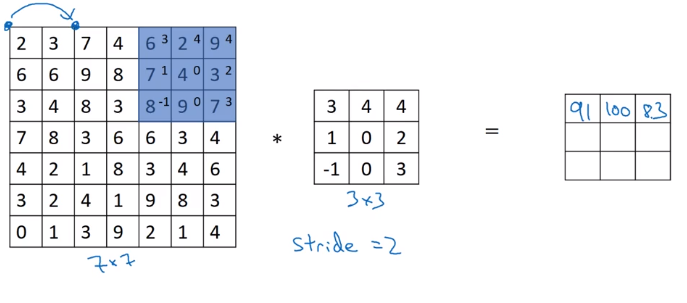
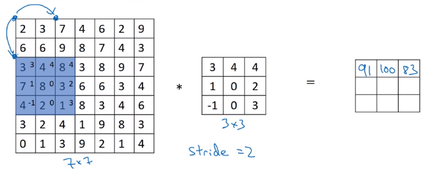
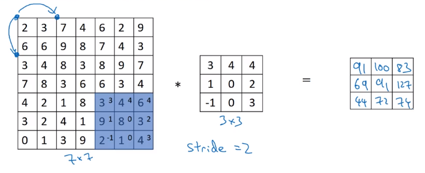
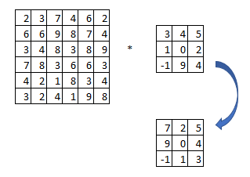

# Stride Convolution

For $n\times n * f\times f$ with $p$ and strid $s$ then the output is

$\lfloor\frac{n+2p-f}{s}+1\rfloor\times \lfloor\frac{n+2p-f}{s}+1 \rfloor$

so in the above example, $\frac{7+0-3}{2} +1 = 3$

## Technical note on cross-correlation vs. Convolution
 In mathmatics, the filter is supposed to be rotated 90 degrees and flipped as shown below for convolution operation.

Technically, what we're actually doing in the convolution neural network, the operation we've been doing is called **cross-correlation($\star$)** instead of **convolution($*$)**. But in the deep learning literature by convention, we just call this a **convolutional operation**.
