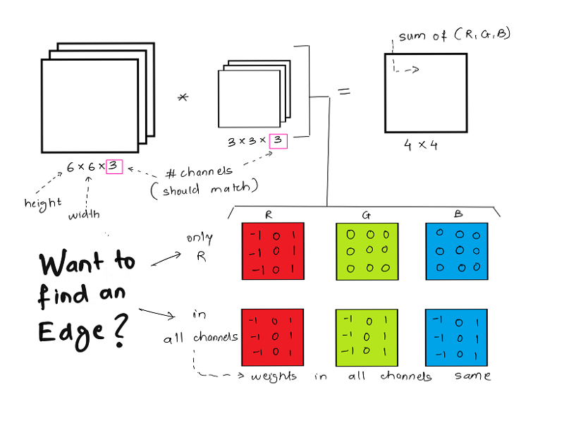
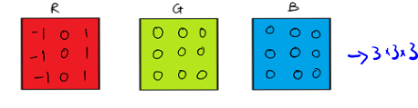
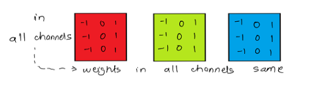
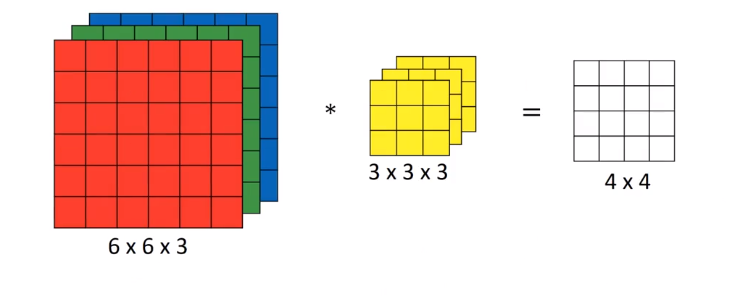
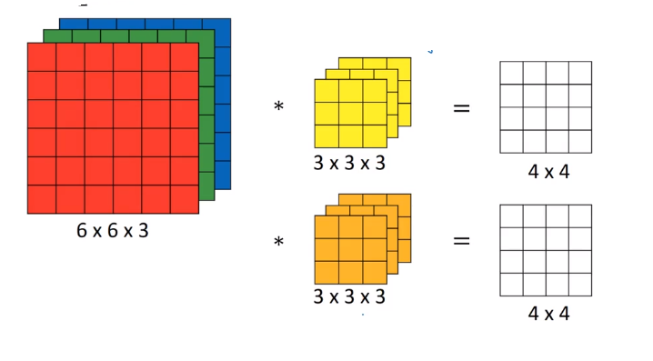
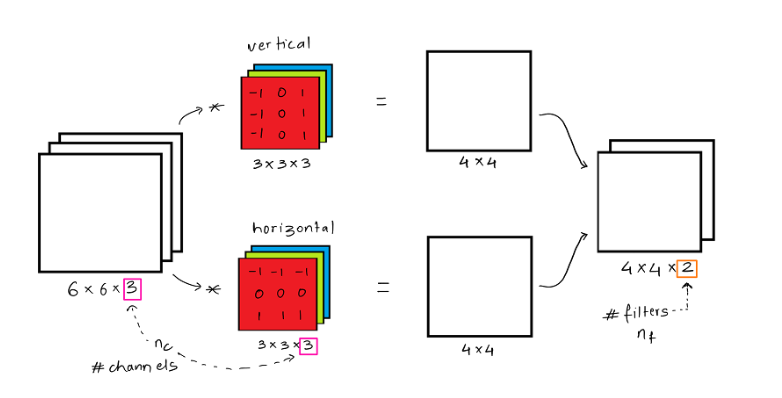

# Convolution Over Volume

How we can implement convolutions over 3D volumes? ‘volume’ is just a way of saying images with more than one channel i.e. RGB or any other channels.

## Convolution on RGB Images

Detect features in a RGB image ($6 \times 6 \times 3$).

Below is a simple example of convolution over volume, of an image having dimension `6 x 6 x 3` with 3 denoting the 3 channels R, G and B. Similarly the filter is of dimension `3 x 3 x 3`

* In the given example the purpose of the filter is to detect vertical edges.
* In order to detect edges or some other feature in this image, use a 3D filter (red, green, and blue channels)

* The number of channels in your image must match the number of channels in your filter.

 Take each of these 27 numbers and multiply them with the corresponding numbers from the red, green, and blue channels of the image, so take the first nine numbers from red channel, then the three beneath it to the green channel, then the three beneath it to the blue channel, and multiply it with the corresponding 27 numbers that gets covered by this yellow cube show on the left.

 Then add up all those numbers and this gives you this first number in the output, and then to compute the next output you take this cube and slide it over by one, and again, due to 27 multiplications, add up the 27 numbers, that gives you this next output, do it for the next number over, for the next position over, that gives the third output and so on.

If the edge needs to be detected only in the R channel,then only the weights in R channel need to set for the requirement. If you need to detect vertical edges across all channels, then all filter channels will have the same weight as demonstrated above.

If the edge needs to be detected in all channels, then you can have filters like this.

## Multiple filters
What if we don't just wanted to detect vertical edges? What if we wanted to detect vertical edges and horizontal edges and maybe 45 degree edges and maybe 70 degree edges as well, but in other words, what if you want to use multiple filters at the same time?

So, here's we have six by six by three convolved with the three by three by three, gets four by four, and maybe this is a vertical edge detector, or maybe it's run to detect some other feature.

Now, maybe a second filter may be denoted by this orange-ish color, which could be a horizontal edge detector.

Convolving it with the first filter gives you this first four by four output and convolving with the second filter gives you a different four by four output.

And what we can do is then take these two four by four outputs, take this first one within the front and you can take this second filter output like the figure below.

So, let's just summarize the dimensions.

$n \times n \times n_c * f \times f \times n_c \rightarrow n-f+1 \times n-f+1 \times n_c^{'}$ where $n_c^{'}$ is the number of filters.
