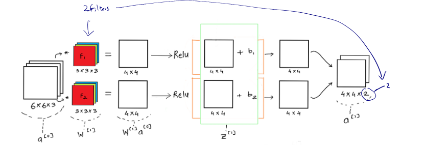
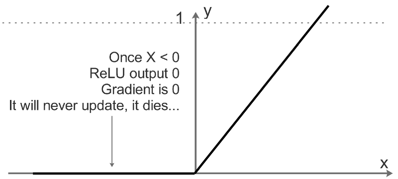
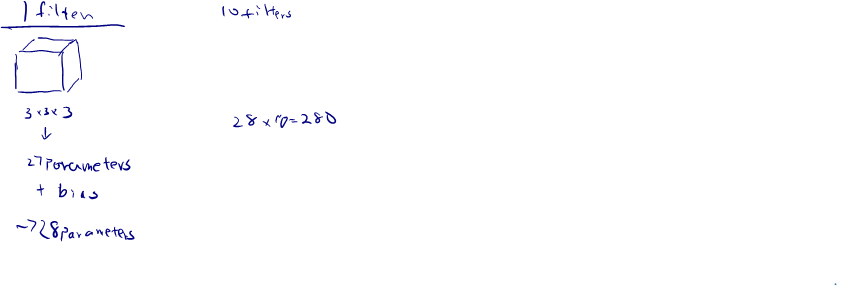

# One Layer of a Convolutional Network

If we consider one layer of a convolution network without the pooling layer and flattening, then it will appear close to this:

In any given neural network

$z^{[1]}=W^{[1]}a^{[0]}+b^{[1]}$

$a^{[1]}=g(z^{[1]})$ where $g$ is ReLU

It is important to understand that like in any other neural network, a convolutional neural network also has the input data $x$ which is an image here and model weights given by the filters F1 and F2 i.e. $W.$ Once the weights and the input image is convolved we get the weighted output $W * x$ and then we add the bias $b$.

One of the key functions here is the RELU activation function, which is rectified linear unit. Relu helps us add non-linearity to the learning model and helps us better train/ learn the model weights for the generalized case.

For values which are below a certain threshold ( here 0), the relu function doesn’t update the parameters at all. It simply dies. For a particular training example to be considered for training, it needs to have a set minimum value for the neuron to be activated. Also Relu helps us reduce the vanishing and exploding gradient problem faced in most deep neural network, as Relu provides efficient gradient propagation.

## Example

Problem: If you have 10 filters that are $3 \times 3 \times 3$ in one layer of a neural network, how many parameters does that layer have?

## Summary of notation

If layer $l$ is a convolution layer:

Filter size: $f^{[l]}=$

Padding: $p^{[l]}$

Strided: $s^{[l]}$

Number of filters: $n_c^{[l]}$

Each filter: $f^{[l]}\times f^{[l]}\times n_c^{[l-1]}$  since the number of channels in your filter, must match the number of channels in your input

Activations: $a^{[l]}\rightarrow n_H^{[l]}\times n_W^{[l]} \times n_c^{[l]}$

Activation in vectorized implementation or batch gradient descent or mini batch gradient descent: $A^{[l]} \rightarrow m\times n_H^{[l]}\times n_W^{[l]} \times n_c^{[l]}$

Weight:  $\underbrace{f^{[l]}\times f^{[l]}\times n_c^{[l-1]}}_{\text{weight for one filter}}\times n_c^{[l]}$

bias: $1 \times 1 \times 1 \times n_x^{[l]}$

Input: $n_H^{[l-1]}\times n_W^{[l-1]} \times n_c^{[l-1]}$

Output: $n_H^{[l]}\times n_W^{[l]} \times n_c^{[l]}$

Dimension of $n_H^{[l]}=\lfloor\frac{n_H^{[l]}+2p^{[l]}-f^{[l]}}{s^{[l]}} +1\rfloor$

Dimension of $n_W^{[l]}=\lfloor\frac{n_W^{[l]}+2p^{[l]}-f^{[l]}}{s^{[l]}} +1\rfloor$
