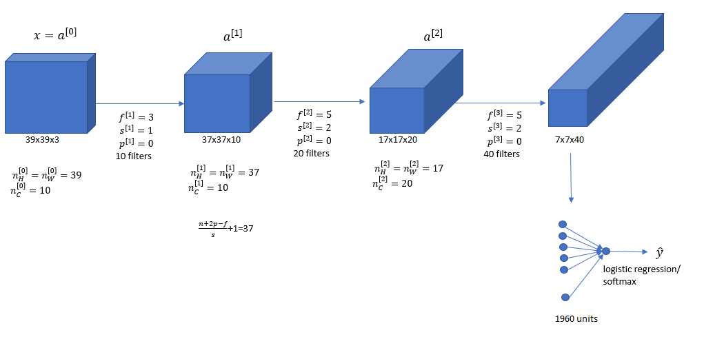

# Simple Convolutional Network

#Example

We have an image x and decide is this a cat of not (0 or 1).

Input Image:$x$

$n_H^{[0]}=n_W^{[0]}=39$ 
$n_c^{[0]}=3$

10 filters 
$f^{[1]}=3$ 
$s^{[1]}=1$ 
$p^{[1]}=0$

Output Image: $a^{[1]}$ 
$\frac{n+2p-f}{s}+1=37$ so the output is $37\times 37 \times 10$

$n_H^{[1]}=n_W^{[1]}=37$ 
$n_c^{[1]}=10$

Repeat this process. Finally $a^{[3]}$ gets flattened to 1960 units.

## Types of layer in a convolutional network

1. Convolution (Conv)
2. Pooling (POOL)
3. Fully Connected (FC)
