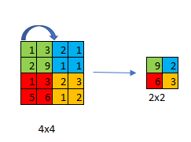
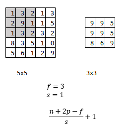
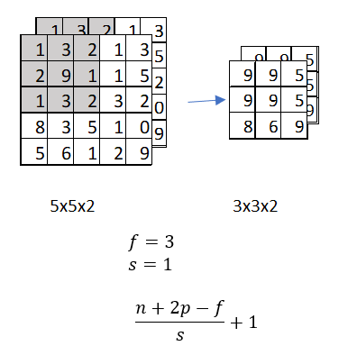
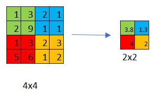

# Pooling Layers

ConvNets often use pooling layers to reduce the size of the representation, to speed the computation, as well as make some of the features that detects a bit more robust.

## Max Pooling
Max pooling is a sample-based discretization process. The objective is to down-sample an input representation (image, hidden-layer output matrix, etc.), reducing its dimensionality and allowing for assumptions to be made about features contained in the sub-regions binned.

For each of the regions represented by the filter, we will take the max of that region and create a new, output matrix where each element is the max of a region in the original input.

### Example 1:

Hyperparameters:

$f=2$

$s=2$

### Example 2 with 1 channel:

### Example 3 - with 2 channels:

## Average Pooling
An average pooling layer performs down-sampling by dividing the input into rectangular pooling regions and computing the average values of each region.

Max pooling is used much more often than average pooling with one exception, which is sometimes very deep in a neural network you might use average pooling to collapse your representation.

## Summary of Pooling
Hyperparameters:

* Filter size $f$
* Stride: $s$
* Padding: $p$ This is rarely used
* Dimensions:
  $N_H \times n_W \times n_C$ 
$\lfloor \frac{n_H-f}{s}+1\rfloor \times \lfloor \frac{n_W-f}{s}+1\rfloor$
