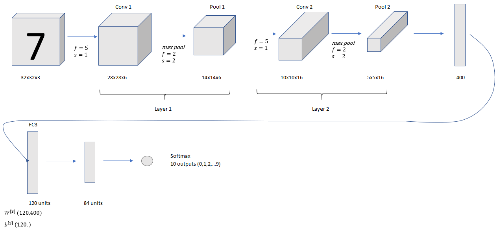

# Convolutional Neural Network Example

As you go deeper to the network, $n_H, n_W$ decrease while $n_c$ increases.

The common construction of Conv net is

`conv` $\rightarrow$ `pool` $\rightarrow$ `conv` $\rightarrow$ `pool` $\rightarrow$ `FC` $\rightarrow$ `FC` $\rightarrow$ `FC` $\rightarrow$ `softmax`

| --    | Activation Shape | Activation Size | # parameters |
| ----- | ---------------- | --------------- | ------------ |
| Input | (32,32,3)        | 3072 $a^{[0]}$  | 0            |
|CONV1 (f=5, s=1) |(28,28,8)| 6272|     208=5*5*8+8|
|POOL1   |(14,14,8)   |1568   |   0|
|CONV2 (f=5, s=1) |(10,10,16)| 1600|     416|
|POOL2   |(5,5,16)   |400   |   0|
|FC3   |(120,1)|120   |48,001   |
|FC4   |(84,1)|84   |10,081   |
|Softmax   |(10,1)   |10   | 841  |

Activation size should gradually decrease.
