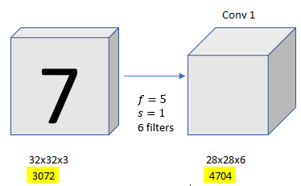
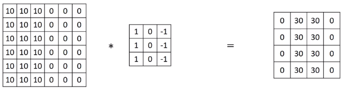
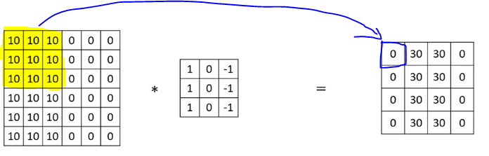
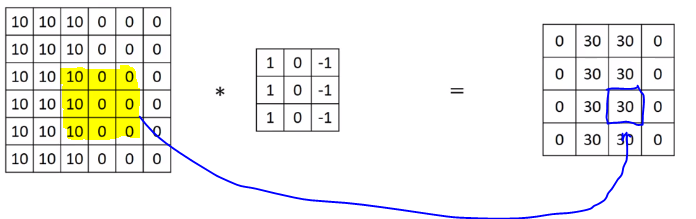
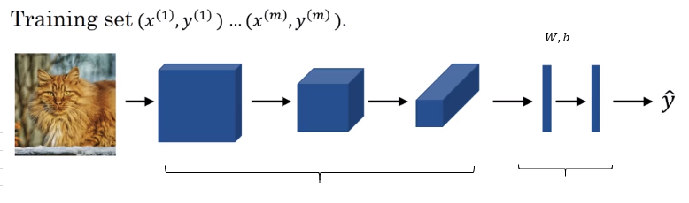

# Why Convolutions

There are two advantages to convolutions than the fully connected layers.

1. Parameter Sharing
2. Sparsity of Connections

Let's say we have `32x32x3` image, and `conv1` with `28x28x6`, and if you were to create a neural network with `3,072` units in one layer, and with `4,704` units in the next layer, and if you were to connect every one of these neurons, then the weight matrix, the number of parameters in a weight matrix would be `3,072` times `4,704` which is about **14 million**.

If you look at the number of parameters in the filter, there are `5x5=25` plus a bias parameter so you will have `26` parameters in each filter, and there are 6 filters, so we get **156** parameters in `5x5x6` filter.

The reason that a ConvNet has these small parameters is really two reasons.

**Parameter Sharing**: A feature detector (such as a vertical edge detector) that's useful in one part of the image is probably useful in another par of the iamge.

 Three by three filter for detecting vertical edges can be applied to the region 1, and then the next region over, and the next region over, and so on. So, each of these feature detectors, can use the same parameters in lots of different positions in your input image in order to detect vertical edge or some other features. This is true for low-level features like edges, as well as the higher level features. This is one of the ways the number of parameters is reduced.

**Sparsity of connections:** In each layer, each output value depends only on a small number of inputs.

For instance, the `0` on the picture below is computed from the region highlighted. Parameters on other region have nothing to do with this zero.

Through these two mechanisms, a neural network has a lot fewer parameters which allows it to be trained with smaller training cells and is less prone to be overfitting or reduce variances. 

## Summary

Cost: $\mathcal{J}=\frac{1}{m}\sum_{i=1}^m\mathcal{L}(\hat{y}^{(i)},y^{(i)})$

Use gradient descent to optimize parameters to reduce $\mathcal{J}$
