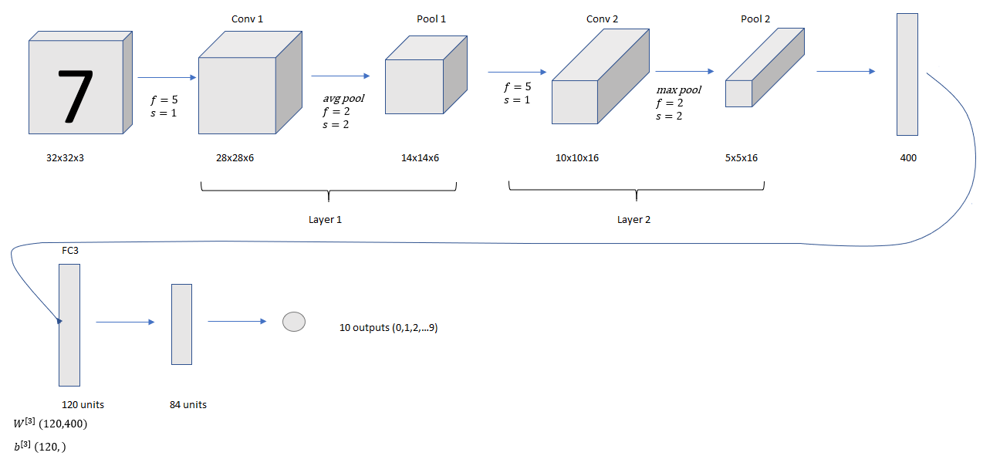
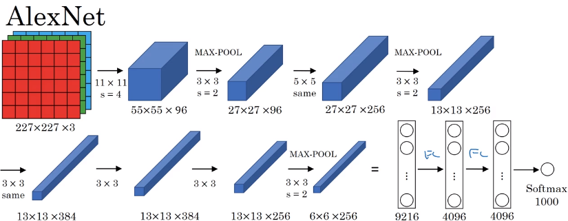
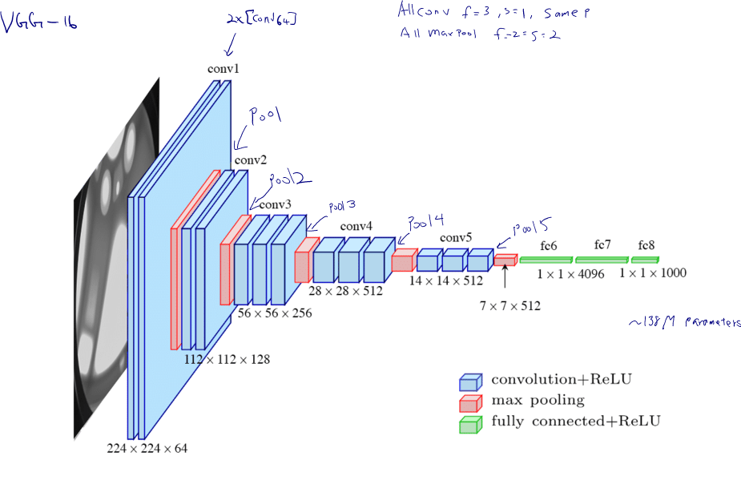

# Classic networks

## Classic LeNet-5


In modern implementation, `avg pool` is replaced by `max pool` and `sigmoid/tanh` was replaced by `softmax` with 10 class output.

* 60k Parameters backthen
* $n_h$ and $n_w$ $\downarrow$, and $n_c$ $\uparrow$
* `conv` $\rightarrow$ `pool`  $\rightarrow$ `conv` $\rightarrow$ `pool` $\rightarrow$ `FC` $\rightarrow$ `FC` $\rightarrow$ `output` structure is still common.

Implementation of LeNet 5 in Keras
```Python
# Implementation of LeNet-5 in keras
# [LeCun et al., 1998. Gradient based learning applied to document recognition]
# Some minor changes are made to the architecture like using ReLU activation instead of
# sigmoid/tanh, max pooling instead of avg pooling and softmax output layer

import numpy as np
import matplotlib.pyplot as plt
import pandas as pd

train = pd.read_csv('train.csv')
test = pd.read_csv('test.csv')

Y_train = train[['label']]
X_train = train.drop(train.columns[[0]], axis=1)
X_test = test

#Visualizing the data
sample = X_train.iloc[10, :]
sample = sample.reshape([28,28])
plt.imshow(sample, cmap='gray')

X_train = np.array(X_train)
X_test = np.array(X_test)

#Reshape the training and test set
X_train = X_train.reshape(X_train.shape[0], 28, 28, 1)
X_test = X_test.reshape(X_test.shape[0], 28, 28, 1)

#Padding the images by 2 pixels since in the paper input images were 32x32
X_train = np.pad(X_train, ((0,0),(2,2),(2,2),(0,0)), 'constant')
X_test = np.pad(X_test, ((0,0),(2,2),(2,2),(0,0)), 'constant')

#Standardization
mean_px = X_train.mean().astype(np.float32)
std_px = X_train.std().astype(np.float32)
X_train = (X_train - mean_px)/(std_px)

#One-hot encoding the labels
from keras.utils.np_utils import to_categorical
Y_train = to_categorical(Y_train)


import keras
from keras.models import Sequential
from keras.layers import Conv2D
from keras.layers import MaxPooling2D
from keras.layers import Flatten
from keras.layers import Dense


model = Sequential()
#Layer 1
#Conv Layer 1
model.add(Conv2D(filters = 6,
                 kernel_size = 5,
                 strides = 1,
                 activation = 'relu',
                 input_shape = (32,32,1)))
#Pooling layer 1
model.add(MaxPooling2D(pool_size = 2, strides = 2))
#Layer 2
#Conv Layer 2
model.add(Conv2D(filters = 16,
                 kernel_size = 5,
                 strides = 1,
                 activation = 'relu',
                 input_shape = (14,14,6)))
#Pooling Layer 2
model.add(MaxPooling2D(pool_size = 2, strides = 2))
#Flatten
model.add(Flatten())
#Layer 3
#Fully connected layer 1
model.add(Dense(units = 120, activation = 'relu'))
#Layer 4
#Fully connected layer 2
model.add(Dense(units = 84, activation = 'relu'))
#Layer 5
#Output Layer
model.add(Dense(units = 10, activation = 'softmax'))
model.compile(optimizer = 'adam', loss = 'categorical_crossentropy', metrics = ['accuracy'])

model.fit(X_train ,Y_train, steps_per_epoch = 10, epochs = 42)

y_pred = model.predict(X_test)

#Converting one hot vectors to labels
labels = np.argmax(y_pred, axis = 1)

index = np.arange(1, 28001)

labels = labels.reshape([len(labels),1])
index = index.reshape([len(index), 1])

final = np.concatenate([index, labels], axis = 1)

#Prediction csv file
np.savetxt("mnist_1.csv", final, delimiter = " ", fmt = '%s')

```

## AlexNet
- Much bigger than LeNet 5. This neural network has 60 million parameters
- Use ReLU
- Multiple GPU (trained on two GPU)
- Local Response Normalization (LRN)-



Alex Krizhevsky, Ilya Sutskever, and Geoffrey E. Hinton. 2012. [ImageNet classification with deep convolutional neural networks. In Proceedings of the 25th International Conference on Neural Information Processing Systems](https://papers.nips.cc/paper/4824-imagenet-classification-with-deep-convolutional-neural-networks.pdf) - Volume 1 (NIPS'12), F. Pereira, C. J. C. Burges, L. Bottou, and K. Q. Weinberger (Eds.), Vol. 1. Curran Associates Inc., USA, 1097-1105.

## VGG -16
A remarkable thing about the VGG-16 net is that instead of having so many hyperparameters, it use a much simpler network where just having a conv-layers that are just three-by-three filters with a stride of one and always use same padding.
Conv=3x3 filter, s=1, same Padding
Max pool = 2x2, s=2



VGG -19 is used in some literature, but VGG -16 works as good as VGG -19.

## References
1. [LeCun et al., 1998](http://yann.lecun.com/exdb/publis/pdf/lecun-01a.pdf): Gradient-Based Learning Applied to Document Recognition (Proc. IEEE 1998)

2. Alex Krizhevsky, Ilya Sutskever, and Geoffrey E. Hinton. 2012. [ImageNet classification with deep convolutional neural networks. In Proceedings of the 25th International Conference on Neural Information Processing Systems](https://papers.nips.cc/paper/4824-imagenet-classification-with-deep-convolutional-neural-networks.pdf) - Volume 1 (NIPS'12), F. Pereira, C. J. C. Burges, L. Bottou, and K. Q. Weinberger (Eds.), Vol. 1. Curran Associates Inc., USA, 1097-1105.

3. K. Simonyan, A. Zisserman, [Very Deep Convolutional Networks for
Large-Scale Image Recognition](https://arxiv.org/pdf/1409.1556), ICLR 2015
https://youtu.be/OQe-9P51Z0s
