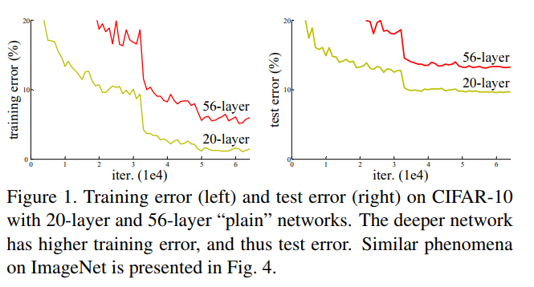
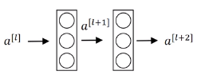
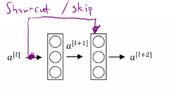
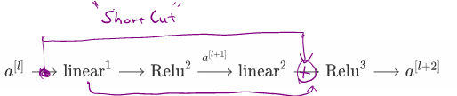
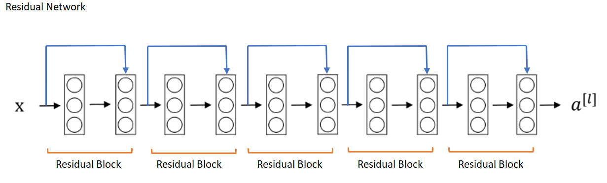
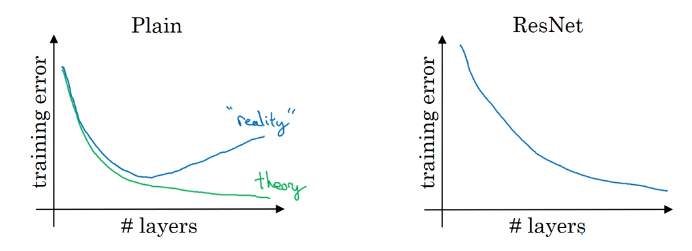
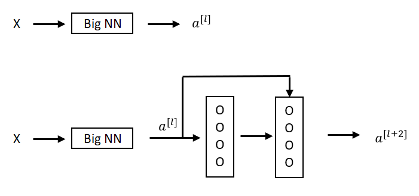
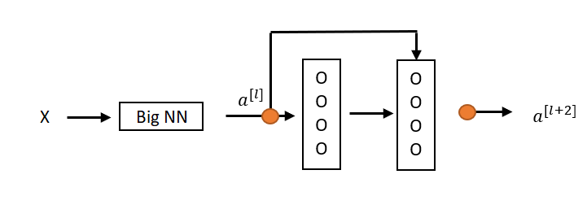
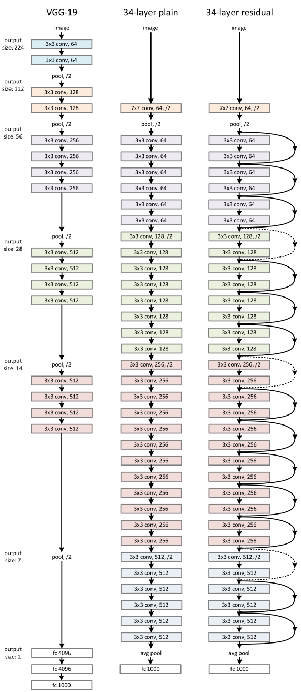

# ResNets

Very deep neural networks are difficult to train because of vanishing and exploding gradient types of problems. As the gradient is back-propagated to earlier layers, repeated multiplication may make the gradient infinitively small. As a result, as the network goes deeper, its performance gets saturated or even starts degrading rapidly.

Figure from He et al. paper [1]

ResNet makes it possible to train up to hundreds or even thousands of layers and still achieves compelling performance.

## Residual block
ResNets are built out of a residual block.
### Main Path
**Main path** between $a^{[l]}$ to $a^{[l+2]}$ can be represented as follow:

$a^{[l]} \longrightarrow \text{linear}^1 \longrightarrow \text{Relu}^2 \xrightarrow{a^{[l+1]}} \text{linear}^2  \longrightarrow \text{Relu}^3  \longrightarrow a^{[l+2]}$

- $\text{linear}^1$: $z^{[l+1]} = W^{[l+1]}a^{[l]}+b^{[l+1]}$
- $\text{Relu}^2$: $a^{[l+1]} = g(z^{[l+1]})$
- $\text{linear}^2$: $z^{[l+2]} = W^{[l+2]}a^{[l+1]}+b^{[l+2]}$
- $\text{Relu}^3$: $a^{[l+2]} = g(z^{[l+2]})$

### Skip/Shortcut
In **residual network**, $a^{[l]}$ is added to Relu activation to form a redisual block.

 

So, $a^{[l+1]} = g(z^{[l+1]}+a^{[l]})$

### Residual blocks in residual network

## Why use ResNets

## Why ResNets Work?
#  When input $a^{[l]}$ and output $a^{[l+2]}$ have the same dimensions

**Example**

ReLU, $a\ge 0$

$\begin{align}
a^{[l+2]}&=g(z^{[l+2]}+a^{[l]})\\
&=g(W^{[l+2]}a^{[l+1]}+b^{[l+2]}+a^{[l]})
\end{align}$

For (1), we are assuming that  $z^{[l+2]}$ and $a^{[l]}$ have the same dimension, so in ResNet, same convolutions are used and therefore, the input and the output represented as a $\color{Orange}{\text{orange dot have the same dimension}}$.

In  L2 regularisation weight decay, that will tend to shrink the value of $W^{[l+2]}$.

If $W^{[l+2]}=0$ and $b^{[l+2]}=0$, then $W^{[l+2]}a^{[l+1]}+b^{[l+2]}$=0, so (2) becomes

$a^{[l+2]}=g(a^{[l]})=a^{[l]}$

So, identity function is easy for residual block to learn. And it's easy to get $a^{[l+2]}$ equals to $a^{[l]}$ because of this skip connection.
Adding these two layers as in the second neural network above, it doesn't hurt the neural network's ability to do as well as the simpler network without these two extra layers, because it's quite easy for it to learn the identity function to just copy $a^{[l]}$ to $a^{l+2}$ using despite the addition of these two layers.

### When input $a^{[l]}$ and output $a^{[l+2]}$ have different dimensions

For example, if $a^{[l]}$ is a 128 dimensional and $z^{[l+2]}$ or $a^{[l+2]}$ is 256 dimensional, we add an extra matrix called $W_s$ and $W_s$ would be $\mathbb{R}^{256x128}$ dimensional matrix.
$W_s$ can be learned parameters or fixed parameters.

## ResNets, Plain, VGG-19

## References
[1] K. He, X. Zhang, S. Ren, and J. Sun. Deep residual learning for image recognition. [Deep Residual Learning for Image Recognition.](https://arxiv.org/pdf/1512.03385.pdf) arXiv:1512.03385,2015.
