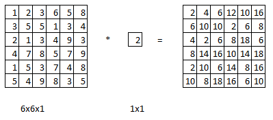
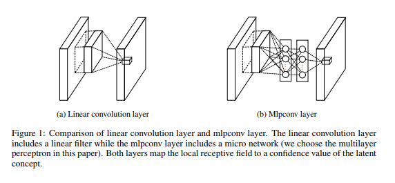
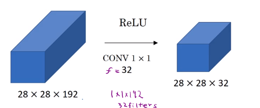
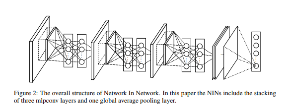

# Networks in Networks (NIN) and 1x1 Convolutions

Convolution by 1x1 filter is not particularly useful.

But, it can be useful for `6x6x32` image instead of `6x6x1`.
A value in the output is the element wise product of `32` numbers from the `6x6x32` and `32` numbers from `1x1x32` followed by ReLu non-linearlity.
The paper called this as **Mlpconv Layer**.

## Comparison between linear convolution layer and Mlpconv layer
 

>The overall structure of the NIN is the stacking of multiple mlpconv layers. It is called “Network In Network” (NIN) as we have micro networks (MLP), which are composing elements of the overall deep network, within
mlpconv layers.

>Instead of adopting the traditional fully connected layers for classification in CNN, we directly output the spatial average of the feature maps from the last mlpconv layer as the confidence of categories via a global average pooling layer, and then the resulting vector is fed into the softmax layer. In traditional CNN, it is difficult to interpret how the category level information from the objective cost layer is passed back to the previous convolution layer due to the fully connected layers which act as a black box in between. In contrast, global average pooling is more meaningful and interpretable as it enforces correspondance between feature maps and categories, which is made possible by a stronger local modeling using the micro network. Furthermore, the fully connected layers are prone to overfitting and heavily depend on dropout regularization [4] [5], while global average pooling is itself a structural regularizer, which natively prevents overfitting for the overall structure.
M Lin et al. 2013

So, NIN (1x1 Conv) will shrink $n_C$ where as Pooling shrinks $n_H$ and $n_W$

## Overall NIN

# Reference
M Lin, Q Chen, S Yan. [Network In Network.](https://arxiv.org/pdf/1312.4400.pdf)  arXiv preprint arXiv:1312.4400, 2013
