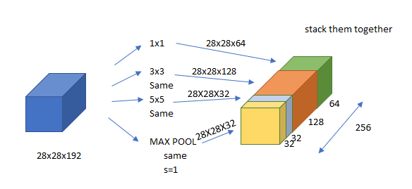
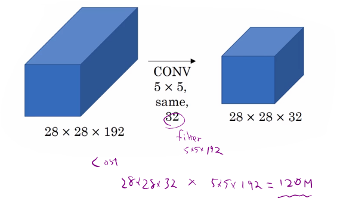
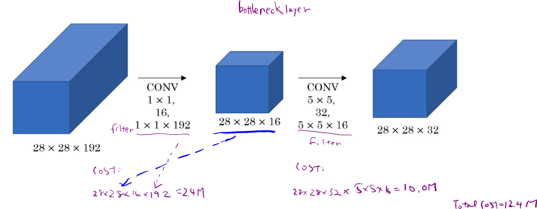
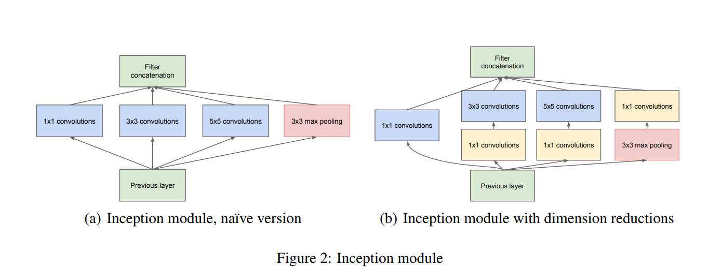
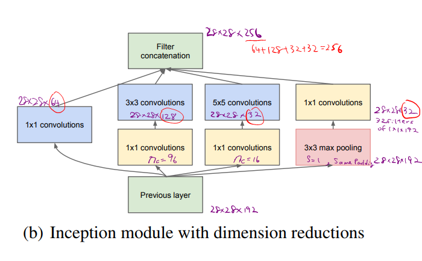

# GoogLeNet - Inception Network

When designing a layer for a ConvNet, you might have to pick, do you want a 1 x 3 filter, or 3 x 3, or 5 x 5, or do you want a pooling layer? What the inception network does is it says, why should you do them all? And this makes the network architecture more complicated, but it also works remarkably well.

Downside is that it requires a lots of computations.

## Problem with computational cost
Take 5x5 Conv as an example,

**Computational Cost**

$f$=32 and filter is 5x5x192 so we will get 28x28x32 x 5x5x192 =120M parameters. With 1x1 Conv, we could reduce the comupuational cost.

## Motivation
So using 1x1 Conv, we could reduce the dimension of the second layer (sometimes it is called a bollteneck layer) and we still get the same dimension with less computation and without hurting the performance.

1. Input and the bottleneck layer: 28x28x16 x 192 = 2.4M

## Inception module

## Inception Network

Inception Network consists of multiple inception modules as seen in the figure in the paper.

 
Figure 3: GoogLeNet network with all the bells and whistles 
Going Deeper with Convolutions - Scientific Figure on ResearchGate. Available from: https://www.researchgate.net/figure/GoogLeNet-network-with-all-the-bells-and-whistles_fig1_265787949 [accessed 3 Feb, 2019]

There are additional side block that consists of softmax non-lineality.  It helps to ensure that the features computed, even in the hidden units, even at intermediate layers, that they're not too bad for predicting the output image. And this appears to have a regularizing effect on the inception network and helps prevent this network from overfitting.

This is developed by authors at Google and it is called GoogLeNet.

## References
[1] Christian Szegedy, Wei Liu, Yangqing Jia, Pierre Sermanet, Scott Reed, Dragomir Anguelov, Dumitru Erhan, Vincent Vanhoucke, Andrew Rabinovich, [Going Deeper with Convolutions](https://arxiv.org/pdf/1409.4842.pdf), In CVPR, 2014
