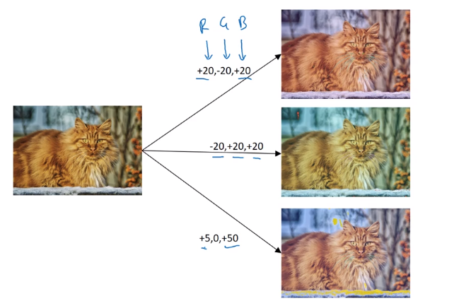

# Data Augmentation

There are several techniques to increase the images for training.

- Mirroring
- Random Cropping
- Shearing
- Locak warping
- Color shifting RGB +20,-20,+20 etc

-PCA color argumentation
