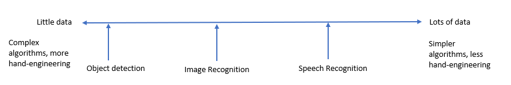
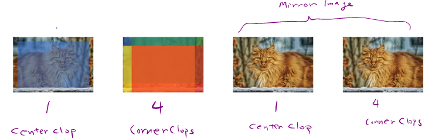

# State of Computer vision

## Data vs. Hand-Engineering

Two sources of knowledge
* Labeled data (x,y)
* Hand engineered features/network architecture/other components

For computer visions, because there not enough image data, many complex algorithms have been developed.

 When you don't have enough data hand-engineering is a very difficult, very skillful task that requires a lot of insight. And someone that is insightful with hand-engineering will get better performance.

 ## Tips for doing well on benchmarks/winning competitions.

 These may not be used for production as they have high computational cost.

 * ensembling
   - Train several networks independently (3-15 networks) and average their outputs
 * multi-crop at test time
   - Run classifier on multiple versions of test images and average results

    10 crops
    

One of the big problem with ensembling is that it requires a lots of memory to keep the indendent network, and computationally costly.    
