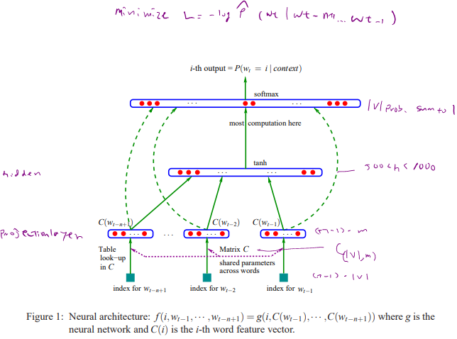
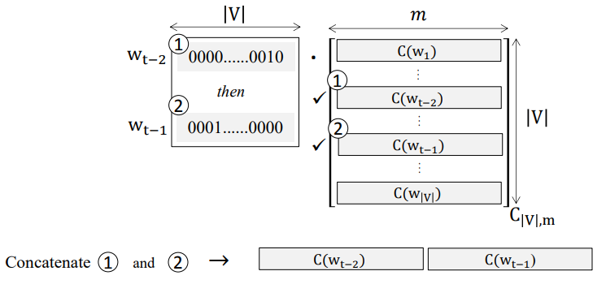

# Neural Networks Language Models
A language model captures the statistical characteristics of sequences of words in a natural language, typically allowing one to make probabilistic predictions of the next word given preceding ones.
E.g. the standard “trigram” method:

$P(w_i|w_{i-2}, w_{i-1})=\frac{count(w_{i-2}w_{i-1}w_{i})}{count(w_{i-2}w_{i-1})}$

# N-gram backoff language model
 In backoff, we use the trigram if the evidence is *backoff* sufficient, otherwise we use the *bigram*, otherwise the *unigram*. In other words, we only *“backoff”* to a lower-order N-gram if we have zero evidence for a higher-order N-gram.

For example if we are trying to compute $P(w_n|w_{n−2}w{n−1})$ but we have no examples of a particular trigram $w_{n−2}w{n−1}$, we can instead estimate its probability by using the bigram probability $P(w_n|w_{n−1})$. Similarly, if we don’t have counts to compute $P(w_n|w_{n−1})$, we can look to the unigram $P(w_n)$.

So we can approximate

$p(W) = p(w_1, w_2, ..., w_n) \tag{1}$

by the chain rule,

$p(W) = \sum_ip(w_i|w_1,w_2, ..., w_{i-1}) \tag{2}$

and limit the history (Markov order) like using 4-gram probability

 $p(w_i|w_1,w_2, ..., w_{i-1})\simeq p(w_i|w_{i-3},w_{i-2}, w_{i-1})$

* each $p(w_i|w_{i-3},w_{i-2}, w_{i-1})$ may not have enough statistics to estimate, then we back off to $p(w_i|w_{i-2}, w_{i-1})$,  $p(w_i|w_{i-1})$ all the way to $p(w_i)$

## Neural network language Models

- A **neural network language model** is a language model based on neural networks, exploiting their ability to learn distributed representations.
- A **distributed representation** of a word is a vector of activations of neurons (real values) which characterizes the meaning of the word.
- A **distributed representation** is opposed to a **local representation**, in which only one neuron (or very few) is active at each time.

### Word Embeddings
Given a sequence of D words in a sentence, the task is to compute the probabilities of all the words that would end this sentence. The words are chosen from a given vocabulary **(V)**.Object is learn a good model to compute the following conditional probability:

$$P(w^{(i)}_{D+1}|(w^{(i)}_1, w^{(i)}_2,\cdots, w^{(i)}_D))$$

for any given example ($i$). Each word is represented by a vector $w$, which has the dimension of the dictionary size ($|V|$). $V$ is a large but finite set. For example, consider the sentence:

$$\text{“We all have it”}$$

In this case $D=3$. Given {We, all, have} we need to compute the probability of getting {it} as the 4th word. Each word has an index in the vocabulary. For example:

$$\text{{We = 91}, {all = 1}, {have = 3}, {it = 181}}$$

which translates to the word vectors $w$ as follows: $w1$ representing “We” will be a $|V|$ dimensional vector with the entry 91 being equal to 1, and all other entries equal to 0. Similarly, $w2$ representing “all” will have its 1st entry equal to 1 and all others 0 etc.

So, indeces are based on one hot encoding.

A neural network would require an input layer with the size of the vocabulary, which could be very large. A traditional network would also require a huge number of neurons to calculate the probabilities, which would lead to a very large number parameters to be optimized. To avoid over-fitting, one needs a giant dataset for training which could make the problem intractable. This problem (a.k.a curse of dimensionality) can be circumvented by introducing word embeddings through the construction of a lower dimensional vector representation of each word in the vocabulary.  This approach not only addresses the curse of dimensionality, but also results in an interesting consequence: Words having similar context turn out to have embedding vectors close to each other. For instance, the network would be able to generalize from

$$\text{“The cat is walking in the bedroom”}$$

to

$$\text{“A dog is running in a room”}$$

since “cat” – “dog”, “walking” – “running” , “bedroom” – “room” have similar contexts thus they are close to each other in the space of word embedding vectors.

### The Network Architecture
Bengio's NNLM[1]



The **input layer** contains the indices of the words from the vocabulary $V$ and there are $D$ of them (since a training example has $D$ words, and the task is to predict the word $D+1$ to finish the sentence).  Typically, $|V|>10^6$, $100<D<500$. The second layer is the **projection layer (embedding layer)**, and transforms each input word (that has the dimension of the vocabulary $|V|$), into a lower dimensional vector representation (say $h1$). There is one hidden layer with size $h2$, and the output layer has size $|V|$ which is then fed into a softmax function to compute the probability of each word in the vocabulary.

Passing from the **input** to the **projection layer**, one obtains an embedding vector for each of the D words that are stacked together to form the $(D , h1)$ dimensional vector $(a1)$:

$$a^{(i)}_1=\begin{bmatrix}
C^{T}w_1^{(i)}\\
C^{T}w_2^{(i)}\\
\vdots\\
C^{T}w_D^{(i)}
\end{bmatrix}$$

Here, the embedding weights $(C)$ are shared among all the $D$ words. In passing from the input layer with word indices to the projection layer resulting in $a_1$, the operation shown above is a **table lookup**. Namely, for each given word index, one needs to find out which row in **C** its embedding is located. To make it clearer, let’s consider an example. Suppose we have a training batch with D=3 stacked in a matrix as follows:

$$\text{input batch}=\begin{bmatrix}
91&5&\cdots\\
1&112&\cdots\\
3&82&\cdots\end{bmatrix}$$

Each column represents a training example: The 1st column represents the words $\text{{We = 91}, {all = 1}, {have = 3}}$ given above. Given the word embeddings $C$ (determined through the training process), the table lookup involves unfolding the input_batch into a vector and subsetting the rows  of C corresponding to each word in the vocabulary. Namely,

$$\text{input batch vector}=\begin{bmatrix}91& 1& 3& 5& 112& 82& \cdots\end{bmatrix}$$

and

$$a^{(1)}_1 = C[\begin{bmatrix}91&1&3\end{bmatrix},:]=\begin{bmatrix}
C[91,:]\\
C[1,:]\\
C[3,:]
\end{bmatrix}$$

$$a^{(2)}_1 = C[\begin{bmatrix}5&112&82\end{bmatrix},:]=\begin{bmatrix}
C[5,:]\\
C[112,:]\\
C[82,:]
\end{bmatrix}$$

$\vdots$

Now that the embedding vectors are obtained, we can feed forward through the network to compute probabilities.

$w_i \in V \xrightarrow{\text{mapping C}}\mathbb{R}^m$

Above can be also represented as the below figure.
* Performs a simple table lookup in $C_{|V|,m}$ then concatenate the rows of the shared mapping matrix $C_{|V|,m}$ corresponding to the context words.


$C_{|V|,m}$ contains the weight parameters that are tuned at each step. After training, it contains what we call the **Word Vectors**

#### NNLM Hidden Layer and Output layers and Training

*Softmax is used for the output layer.
for $i^{th}$ unit in the output layer. Now $D$ is $t-1$

$\hat{P}(w_i=w_t|w_{t-n+1}...w_{t-1})=\frac{e^{yw_i}}{\sum_{i'=1}^{|V|}e^{yw_{i'}}}$

where

$y=g(d+H.x)$

- $g$: tanh activation
- $x$: Concatenation $C(w)$ of the context weight vectors seen previously
- $b$: (,$|V|$)
- $d$: bias term in hidden layer $(,h)$
- $U$:$|v|*h$ matrix storing the hidden to output weights
- $H$ : $(h * (n − 1)m)$ matrix storing the projection-to-hidden weights
- $\theta=(b,d,U,H,C)$

Computationally costly: $n ∗ m + n ∗ m ∗ h + h ∗ |v|$

- computational bottleneck: nonlinear hidden layer $(h ∗ |V| term)$

Training is performed via **stochastic gradient descent** (learning rate $\epsilon$):

$$\theta \leftarrow \theta+\epsilon\cdot\frac{dE}{d\theta}=\theta+\epsilon\cdot\frac{dlog\hat{P}(w_t|w_{t-n+1\cdots w_{t-1}})}{d\theta}$$


## nnlm-en-dim128
Token based text embedding trained on English Google News 200B corpus
### Overview
Text embedding based on feed-forward Neural-Net Language Models[1] with pre-built out-of-vocabulary(OOV). Maps from text to 128-dimensional embedding vectors.
Out-of-vocabulary (OOV) words are unknown words that appear in the testing speech but not in the recognition vocabulary. They are usually important content words such as names and locations which contain information crucial to the success of many speech recognition tasks

Example use
```python
embed = hub.Module("https://tfhub.dev/google/nnlm-en-dim128/1")
embeddings = embed(["cat is on the mat", "dog is in the fog"])
```

### Details
Based on Bengio's NNLM with three hidden layers.

#### Input
The module takes a batch of sentences in a 1-D tensor of strings as input.

#### Pre-processing
The module preprocesses its input by splitting on spaces.

#### Out of vocabulary tokens
Small fraction of the least frequent tokens and embeddings (~2.5%) are replaced by hash buckets. Each hash bucket is initialized using the remaining embedding vectors that hash to the same bucket.

#### Sentence embeddings
Word embeddings are combined into sentence embedding using the sqrtn combiner (see tf.nn.embedding_lookup_sparse).

# References
[1] Yoshua Bengio, Réjean Ducharme, Pascal Vincent, Christian Jauvin. A Neural Probabilistic Language Model. Journal of Machine Learning Research, 3:1137-1155, 2003.
