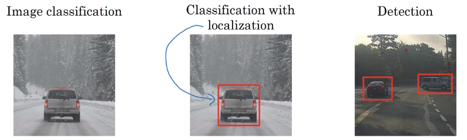
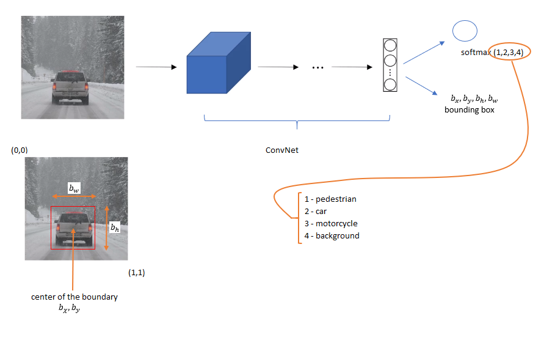
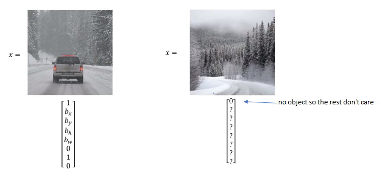

# Object Localization and Detection

Here is the example of image classification of a car, classification with localization that adds a boundary around the car, and object detection on multiple objects.

## Making object localization and detection as a classification problem

Softmax output layer can output class label 1, 2, 3, and 4 where
1. Pedestrian
2. Car
3. Motorcycle
4. background

and we need to output
$b_x, b_y, b_h, b_w$ where $b_x, b_y$ is the center of the boundary, $b_h$ is the height of the boundary, and $b_w$ is the wideth of the bounday.

### Target $y$
Target label $y$ can be defined as

$y=\begin{bmatrix}
p_c\\
b_x\\
b_y\\
b_h\\
b_w\\
c_1\\
c_2\\
c_3
\end{bmatrix}$

where

$p_c$: is there an object? 1 = there is an object, 0 = there is no object

$c_1, c_2, c_3$ corresponds to classes 1, 2, 3.

So for example, x is the image, and y can be defined with a vector.

### Loss function
$\mathcal{L}(\hat{y},y)=$\
$\begin{cases}
{(\hat{y_1}-{y_1})^2+(\hat{y_2}-{y_2})^2+,\cdots, (\hat{y_8}-{y_8})^2}, & \text{if }y_1=1 \text{ if there is an object }p_c=1 \\
(\hat{y_1}-{y_1})^2 & \text{if }y_1=0 \text{ if there is no object }p_c=0
\end{cases}$
