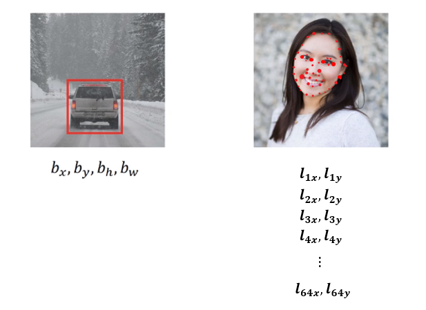
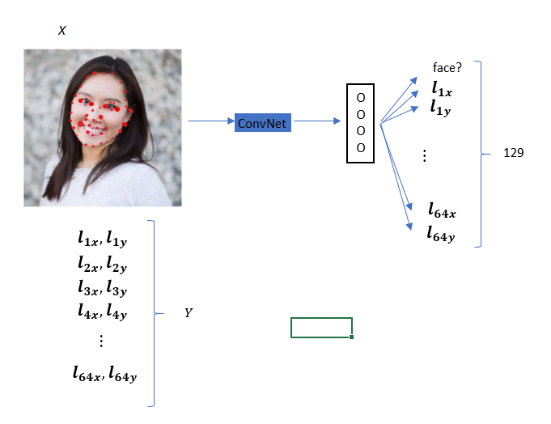

# Landmark Detection

## Adding landmark (red dots)
We can add landmark on the images. A landmark is expressed as $(l_{nx}, l_{ny})$

Then we can pass the input to convnets as shown in below figure.

This is the basic building block for
- detecting the emotion

Note that landmark has to be consistent. So, if landmark 1 is used the left corner of the left eye on the first image, all other images uses landmark 1 for the same location of the face.
