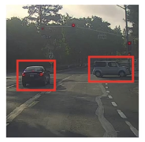
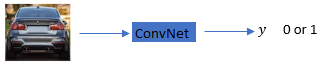
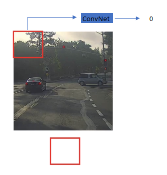
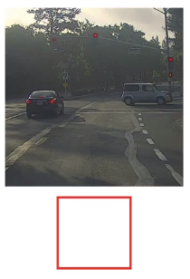

# Object detection

## Examples
Let's say, we want to build an object detection classifier.

### Step 1
First, we need to prepare a training set

### Step 2
Build a conv net and train it to detect if there is an object (car in this case)

### Step 3 Slideing with a smaller window

### Step 4 Sliding with a larger window
Repeat woth a larger window throughout the image.

Repeat with even larger window.

