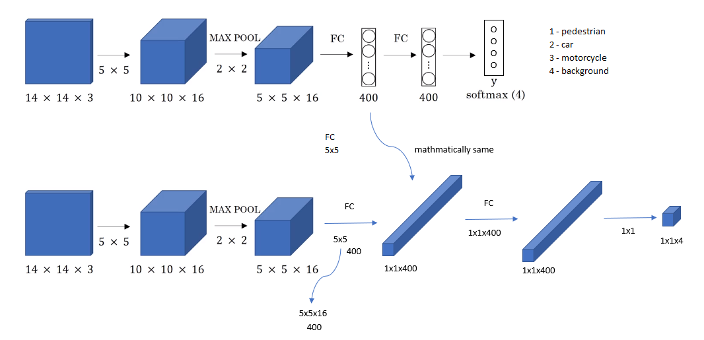
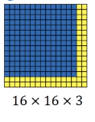
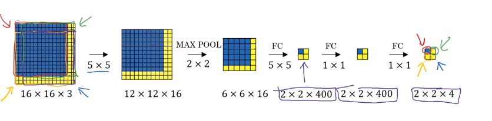
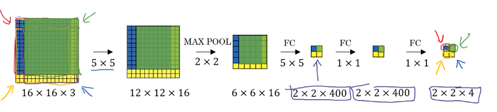
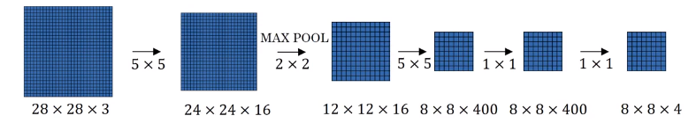
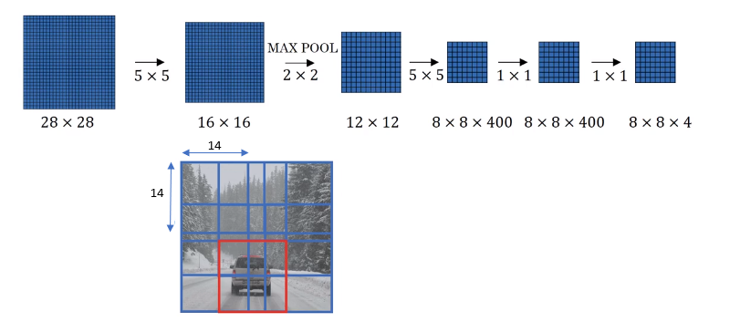
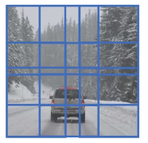

# Convolutional Implementation of Sliding Windows

## Turning FC Layer into convolutional layers

## Convolutional Implementation of Sliding Windows

Test image

The convolutional implementation of sliding windows allows these 4 regions in the convnet to share a lot of computation. It turns out that the blue 1x1x4 subset gives you the result of running in the upper left hand corner 14 by 14 image. The upper right 1 by 1 by 4 volume indicated by green arrow gives the upper right result of the 14x14x3 indicated by green arrow.

Let's look at the green example below. If there is a green cropped out region and passed it through the convnet through the convnet on top, then the first layer's activations would have been exactly the green region of the second 12x12x16. The next layer's activation after max pooling would have been exactly the green region of the 6x6x16  and then the next layer, the next layer would have been as shown in the below figure.  Instead of running 4 propagation on 4 subsets of the input image independently, this convolution implementation combines all 4 into one form of computation and shares a lot of the computation in the regions of image that are common.

The max pooling 2x2 corresponds to running the neural network with a stride of two on the original image.

To implement sliding windows, the image needs to be cropped out in a smaller region. Let's say the cropped region size is 14x14 and run that through the convnet and do that for the next region over, then do that for the next 14 x 14 region, then the next one, then the next one, then the next one, then the next one and so on, until hopefully that one recognizes the car.

Instead of doing it sequentially, with this convolutional implementation, you can implement the entire image, all 28 x 28 and convolutionally make all the predictions at the same time by one forward pass through this big convnet and hopefully have it recognize the position of the car. This is how sliding windows can be implemented convolutionally and it makes the whole thing much more efficient.

There is one problem with this approach since the boundaries may not well fit to the objects to be identified.

## Reference

Sermanet et al., [OverFeat: Integrated Recognition, Localication and Detection using Convolutional networks](https://arxiv.org/pdf/1312.6229.pdf)
