# YOLO
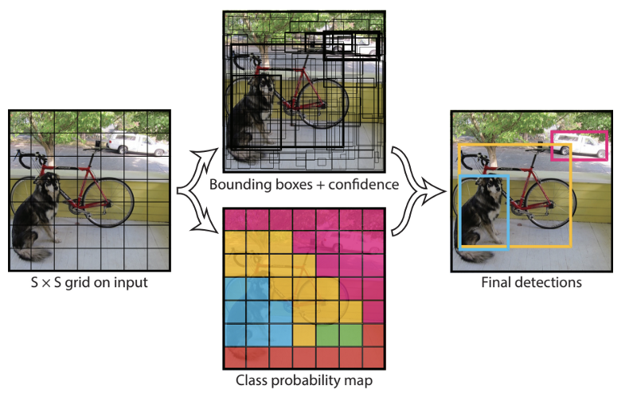
How YOLO works is that we take an image and split it into an SxS grid, within each of the grid we take $m$ bounding boxes. For each of the bounding box, the network outputs a class probability and offset values for the bounding box. The bounding boxes having the class probability above a threshold value is selected and used to locate the object within the image.

YOLO is orders of magnitude faster(45 frames per second) than other object detection algorithms. The limitation of YOLO algorithm is that it struggles with small objects within the image, for example it might have difficulties in detecting a flock of birds. This is due to the spatial constraints of the algorithm.

## class probability (Bounding Box Predictions)

 Using a convolutional implementation of sliding windows makes more computationally efficient, but it still has a problem of not quite outputting the most accurate bounding boxes.  In this case, none of the boxes really match up perfectly with the position of the car, and the blue box as shown below is the best match.
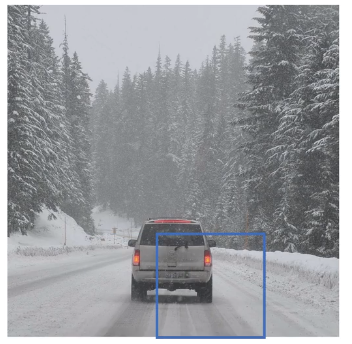

Also, it looks like in drawn through, the perfect bounding box isn't even quite square, it's actually has a slightly wider rectangle or slightly horizontal aspect ratio.

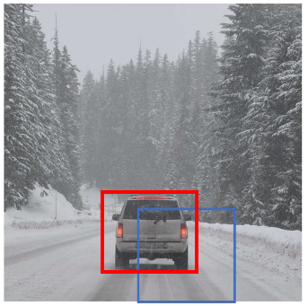

Is there a way to get this algorithm to outputs more accurate bounding boxes? A good way to get this output more accurate bounding boxes is with the **YOLO (You Only Look Once) algorithm**.

## YOLO Algorithm

The basic idea is to take the image classification and localization algorithm, and apply it to each of the 9 grids  cells of this image.

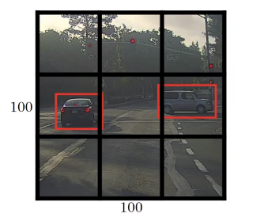

### Labels for training

For each grid cell, 8-dimentional label Y is defined.

$y=\begin{bmatrix}
p_c\\
b_x\\
b_y\\
b_h\\
b_w\\
c_1\\
c_2\\
c_3
\end{bmatrix}$

The first cell on the top left corner,

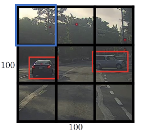

Tere is no object, so
$y=\begin{bmatrix}
0\\
?\\
?\\
?\\
?\\
?\\
?\\
?
\end{bmatrix}$

Other two cells on the top row also have no object, so
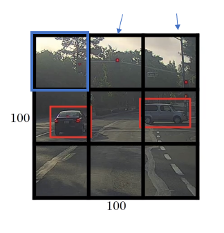

$y=\begin{bmatrix}
0\\
?\\
?\\
?\\
?\\
?\\
?\\
?
\end{bmatrix}$

 The YOLO algorithm takes the midpoint of each of the two objects and then assigns the object to the grid cell containing the midpoint. So the left car is assigned to the green grid cell, and the car on the right is assigned to the yellow grid cell, and Y is

 $y=\begin{bmatrix}
 1\\
 b_x\\
 b_y\\
 b_h\\
 b_w\\
 0\\
 1\\
 0
 \end{bmatrix}$

  Even though the central grid cell has some parts of both cars, the central grid cell has no interesting object so that the central grid cell class label Y is

 $y=\begin{bmatrix}
 0\\
 ?\\
 ?\\
 ?\\
 ?\\
 ?\\
 ?\\
 ?
 \end{bmatrix}$

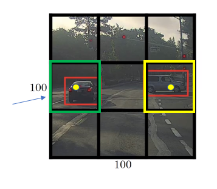

So, we will have following labels.
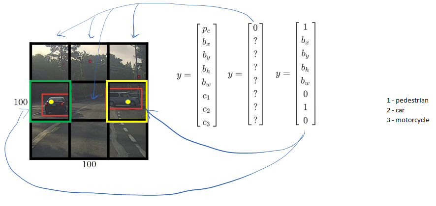

Since for each grid cell, there is 8x1 Y, so the target output is 3x3x8
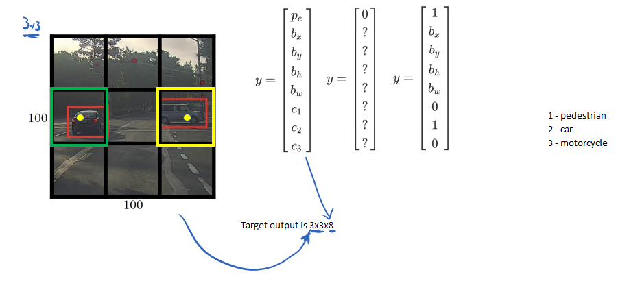
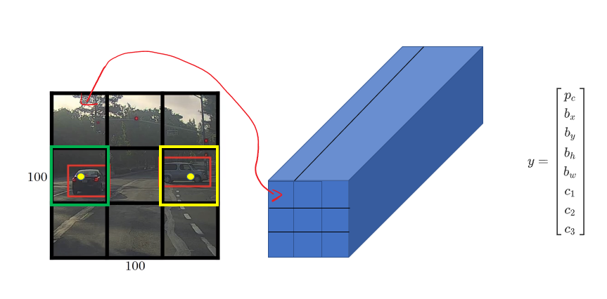
The advantage of this algorithm is that the neural network outputs precise bounding boxes
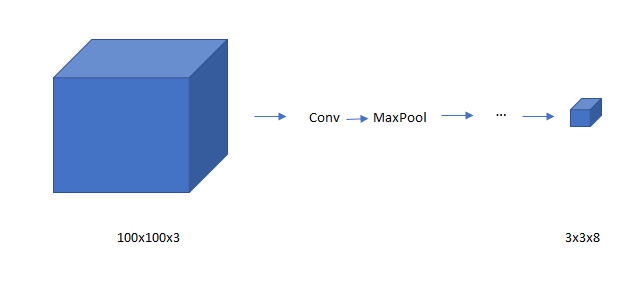

As long as each grid cell doesn't have no more than one object, this algorithm will work. In practice, the grid cell is more finer like 19X19, and the output is 19x19x8

## Encoding bounding boxes
How do we encode the bounding boxes indicated in orange?

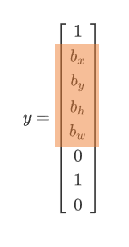

For this image, we apply 3x3 grid.

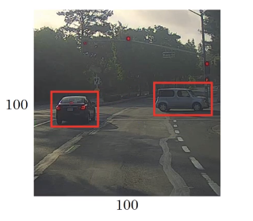

Now, we have 3x3 grid.

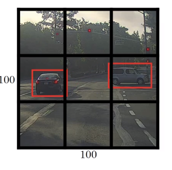

Taken an example from the car on the right.

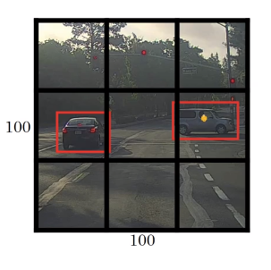

In YOLO, we assume the upper left point is (0,0) and the lower right point is (1,1)
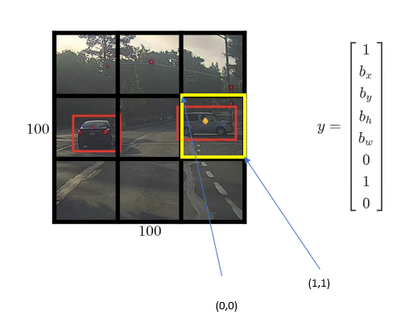

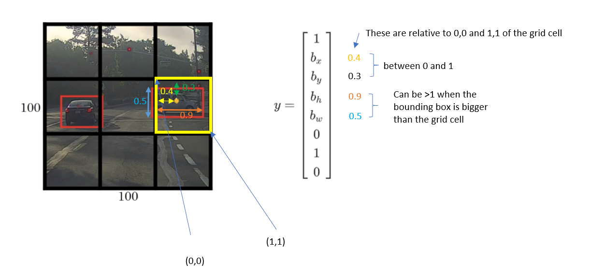

## How to build a training set?
Suppose we want to detect three classes.
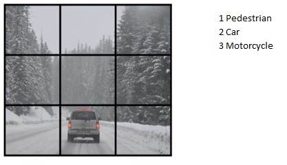

We can use [anchor boxes](https://stomioka.github.io/deeplearning/docs/100-anchor-boxes.html).

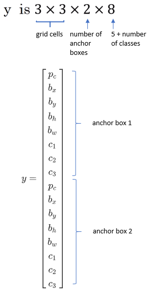

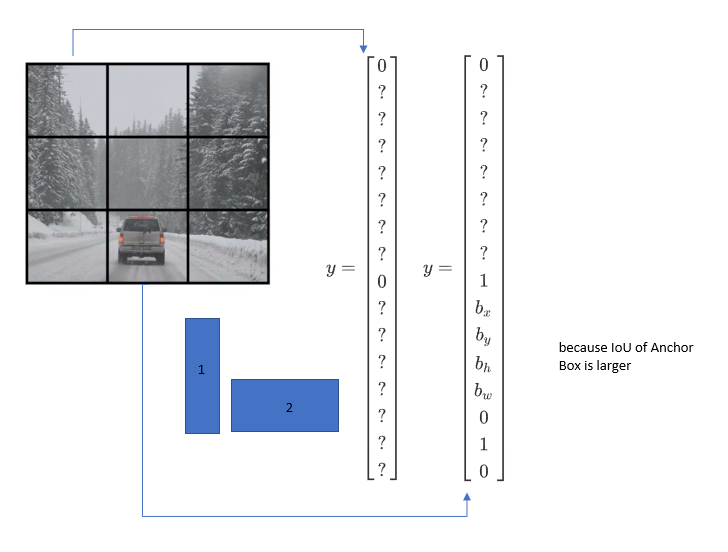
**Training**

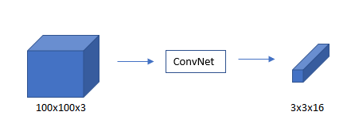

**Predection**

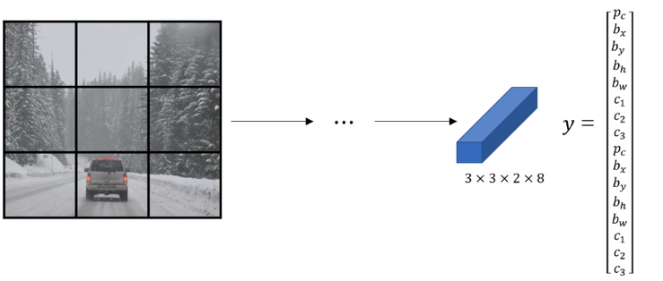
## Outputting the [non max supressed](https://stomioka.github.io/deeplearning/docs/099-non-max-suppression.html) outputs
1. Create 3x3 grid cells

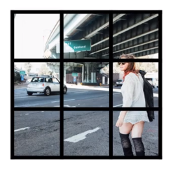

2. for each grid cell, get 2 predicted [bounding boxes](https://stomioka.github.io/deeplearning/docs/095-object-detection.html).

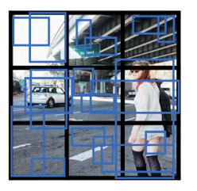

3. Get rid of low probability Predictions

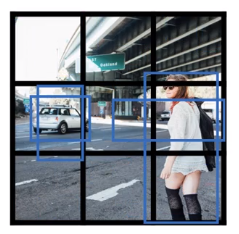

4. For each class (pedestrian, car, motorcycle), use [non max suppression](https://stomioka.github.io/deeplearning/docs/099-non-max-suppression.html) to generate final predictions.

## Reference

 Joseph Redmon, Santosh Divvala, Ross Girshick and Ali Farhadi [You Only Look Once: Unified, Real-Time Object Detection](https://arxiv.org/abs/1506.02640)
http://cs231n.stanford.edu/slides/2017/cs231n_2017_lecture11.pdf
