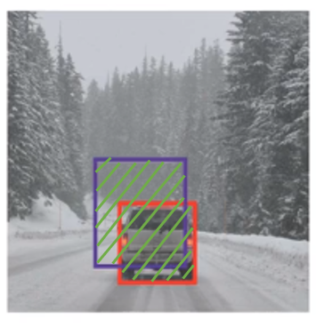
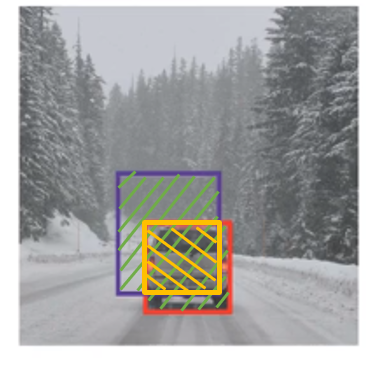
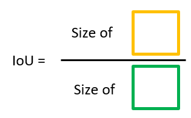

# Intersection over union

How do you tell if your object detection algorithm is working well? There is a function called, "Intersection Over Union" which is used for evaluating the object detection algorithm, as well as to add another component to the object detection algorithm, to make it work even better.

## Evaluating object localization
Imagine that the red box is the ground truth, and the purple box is the prediction, how do we evaluate the object localization?

Intersection over union (IoU) computes the intersection over union of these two bounding boxes as shown by the area with yellow lines. More generally, IoU is a measure of the oberlap between two bounding boxex.

**Union (green region)**

**Intersection (yellow region)**

IoU is then derived by

Many literlatures says "Correct" if IoU $\ge0.5$
