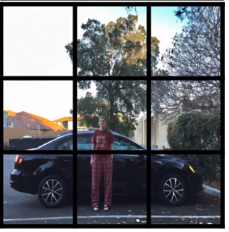
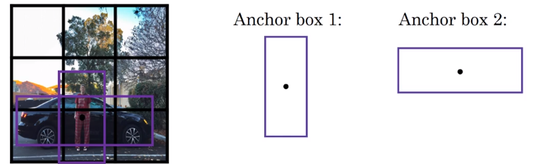
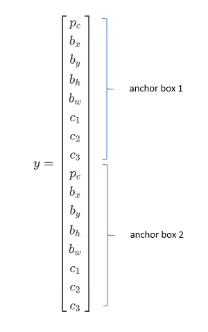
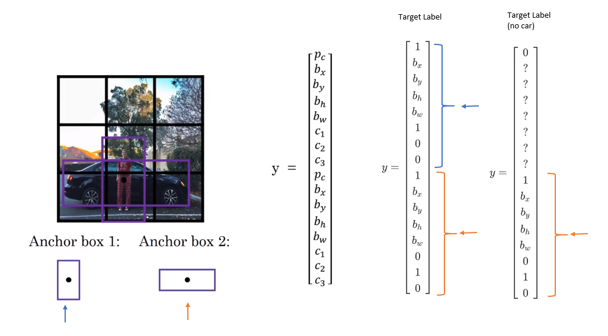

# Anchor Boxes

One of the problems with object detection is that each of the grid cells can detect only one object. What if a grid cell wants to detect multiple objects?

For image like the one on above, we could predefine anchor boxes.

 and the vector

$y=\begin{bmatrix}
p_c\\
b_x\\
b_y\\
b_h\\
b_w\\
c_1\\
c_2\\
c_3\\
p_c\\
b_x\\
b_y\\
b_h\\
b_w\\
c_1\\
c_2\\
c_3
\end{bmatrix}$

**Previously**

Each object in training image is assigned to grid cell that contains that object's midpoint, so the output is 3x3x8

With two anchor boxes, each object in training image is assigned to grid cell that contains object's midpoint and anchor box for the grid cel with highest IoU.

Output Y is 3x3x16

This doesn't handle well in the cases like
* if you have two anchor boxes but three objects in the same grid cell
* if you have two objects associated with the same grid cell
