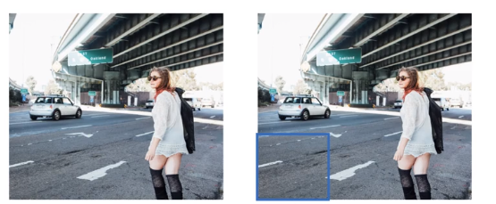
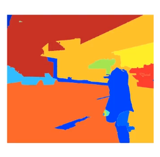
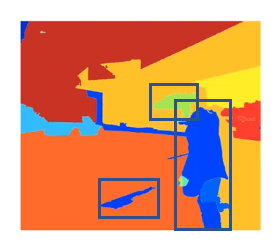
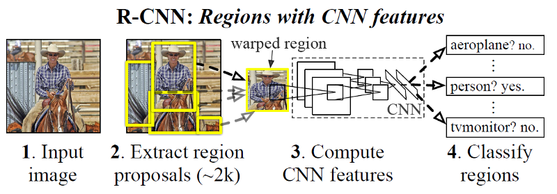
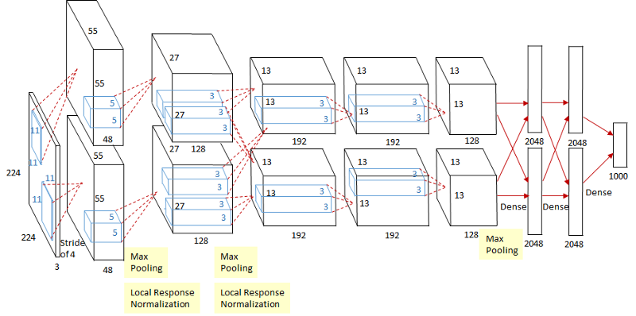
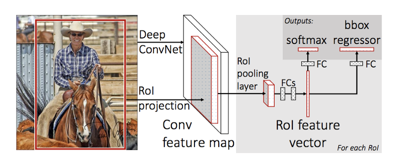
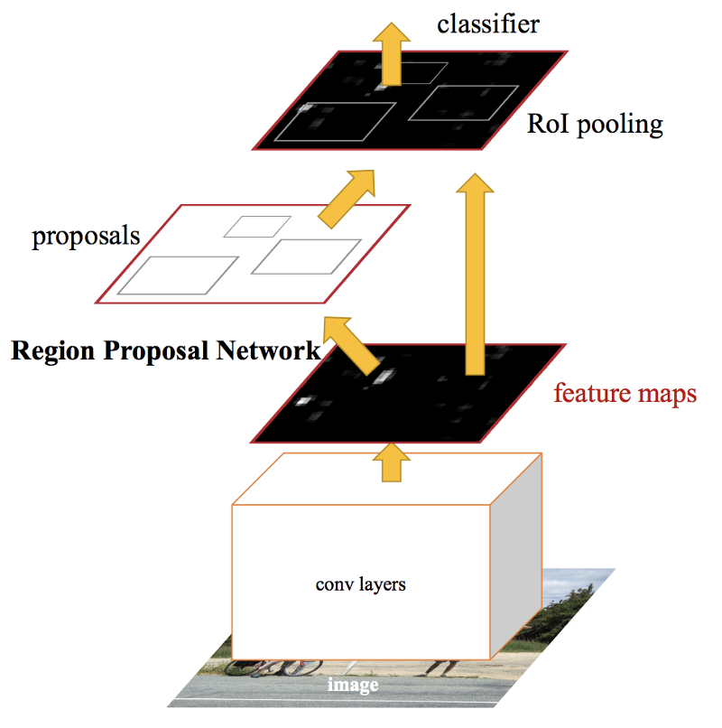

# R-CNN

 In the sliding windows approach, the train classifier runs it across all of the different grid cells and run the detector to see if there's a car, pedestrian, or a motorcycle. We could run the algorithm convolutionally, but one downside is that a lot of the regions have no object.

Russ Girshik, Jeff Donahue, Trevor Darrell, and Jitendra Malik proposed Region CNN.
Instead of going through each step of sliding window approach, it tales only selected regions.

THey run a segmentation algorithm.

And run classifier on selected bounding boxes.

1. First, color similarities, texture similarities, region size, and region filling are used as non-object-based segmentation. Therefore we obtain many small segmented areas as shown at the bottom left of the image above.
2. Then, bottom-up approach is used that small segmented areas are merged together to form larger segmented areas.
3. Thus, about 2K region proposals (bounding box candidates) are generated as shown in the image.

AlexNet is used to extract the CNN features.

## Problems with R-CNN
It still takes a huge amount of time to train the network as you would have to classify 2000 region proposals per image.
It cannot be implemented real time as it takes around 47 seconds for each test image.
The selective search algorithm is a fixed algorithm. Therefore, no learning is happening at that stage. This could lead to the generation of bad candidate region proposals.

1. R-CNN: Propose regions. Classify proposed regions **one at a time**. Output label and bounding box.
2. Fast R-CNN:

propose regions. Use convolution implementation of sliding windows to classify all the proposed regions.
3. Faster R-CNN:
4. 
# Reference
Girshik et al, 2013 [Rich feature hierachies for accurate object detection and semantic segmentation](https://arxiv.org/pdf/1311.2524.pdf)
Girshik et al, 2015 [Fast R-CNN](https://arxiv.org/pdf/1504.08083.pdf)
Ren at al., 2016 [Faster R-CNN: Towards Real-Time Object
Detection with Region Proposal Networks](https://arxiv.org/pdf/1506.01497.pdf)
