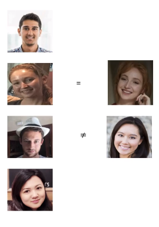
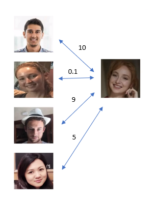
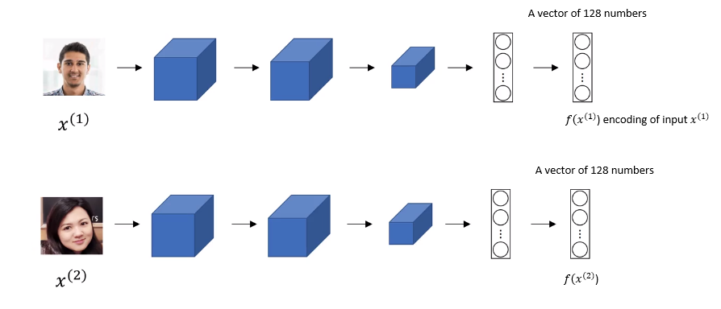
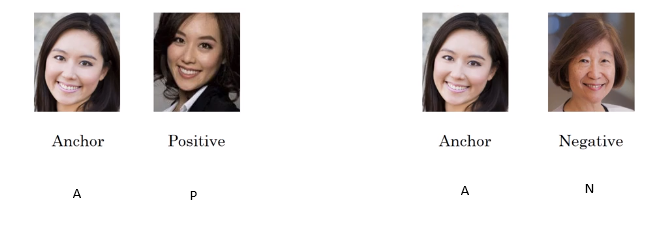
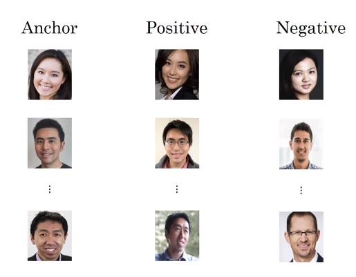
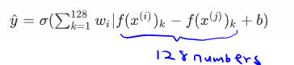
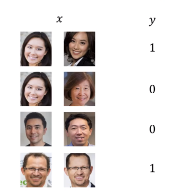

# Face Recognition

## What is face recognition?

## Face verification vs face Recognition

### verification
- Input image, name/ID
- output whether the input image is that of the claimed person

### Recognition
- Has a database of K persons
- Get an input image
- Output ID if the image is any of the K persons (or 'not recognized')

## One Shot Learning

* Learning from one example to recognize the person again
* One of the challenge in face recognition because the neural network needs to recognize a person with a single image file.

* Using a CNN with softmax layer won't work well due to the limitation of the training data, and the model won't be able to recognize a new person and to add one additional class, the model needs to be re-trained.

### Similarity Function
* Solution is to learn a **similarity function** using *d(img1, img2)* = degree of difference between images.

During the **verification**,

if d(img1, img2) $\le \tau$ then "same" 
if d(img1, img2) $\gt \tau$ then "different"

### Siamese Network

Siamese network is a good way to input two faces and tell how similar or how different they are.

$d(x^{(1)}, x^{(2)})=||f(x^{(1)})-x^{(2)}||_2^2$

Parameters of NN define an encoding $f(x^{(i)})$ which is 128 dimensions.
Learn parameters so that:
  if  $f(x^{(i)})$ and  $f(x^{(j)})$ are the same person, $||f(x^{(i)})-f(x^{(j)})||_2^2$ is small

### Triplet Loss

We want: $||f(A)-f(P)||^2_2  + \alpha \le ||f(A)-f(N)||^2_2$ for above example.

$||f(A)-f(P)||^2_2 - ||f(A)-f(N)||^2_2 + \alpha \le 0$

$\alpha$ is added to make sure that the neural network doesn't just output zero for all the encoding. $\alpha$ is also called margin.

### Loss Function
Given 3 images A, P, and N,

$\mathcal{L}(A, P, N) = max(||f(A)-f(P)||^2_2 - ||f(A)-f(N)||^2_2 + \alpha,0)$

So if $||f(A)-f(P)||^2_2 - ||f(A)-f(N)||^2_2 + \alpha$ $\le 0$ then $\mathcal{L}(A, P, N)=0$

and cost will be

$\mathcal{J}=\sum^{m}_{i=1}\mathcal{L}(A^{(i)},B^{(i)},N^{(i)})$

### Traing Set
If 10K pictures of 1K person, then you classify 10K to A, P, or N for 1K person.

## Choosing the triplets A, P, N
During training, if A,P, and N are chosen randomly,
$d(A,P)+\alpha \le d(A,N)$ is  easily satisfied.

So to train the neural networ, choose triplets that are **hard** to train on.
Choose $d(A,P) \approx d(A,N)$

## Face Verification and Binary Classification

Where $\hat{y}$ is 0 or 1

Instead of feeding in two separate encodings, alternatively,

$\hat{y}=\sigma (\sum_{k=1}^{128}w_i|f(x^{(i)})_k-f(x^{(j)})_k+b)$

where $f(x^{(i)})$ is the encoding of image $x^{(i)}$ the substitute $k$ means to just select out the $k$ components of this vector.

Another way to obtain 128 numbers is $X^2$ formula

$\frac{(f(x^{(i)})_k-f(x^{(j)})_k)^2}{f(x^{(i)})_k+f(x^{(j)})_k}$

## Reference
Y. Taigman, M. Yang, M. Ranzato and L. Wolf, (2014). [DeepFace: Closing the Gap to Human-Level Performance in Face Verification](https://www.cs.cmu.edu/~rsalakhu/papers/oneshot1.pdf), 2014 IEEE Conference on Computer Vision and Pattern Recognition, Columbus, OH,  pp. 1701-1708.
doi: 10.1109/CVPR.2014.220
