# Neural Style Transfer

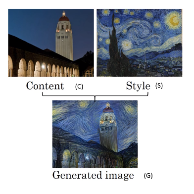

As Zeiler & Fergus. (2013) demonstrated, the earlier layers of a ConvNet tend to detect lower-level features such as edges and simple textures, and the later (deeper) layers tend to detect higher-level features such as more complex textures as well as object classes.

The "generated" image G should have similar content as the input image C. Suppose some layer's activations is chosen to represent the content of an image. In practice, the most visually pleasing results come from a layer in the middle of the network--neither too shallow nor too deep.

# Deep ConvNets learning
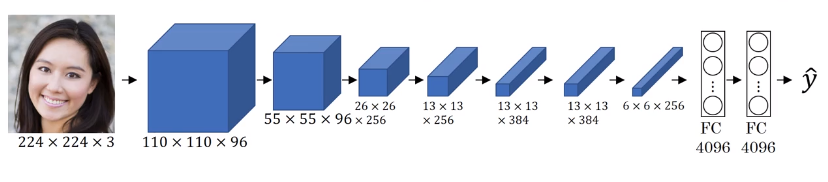
Pick a unit in layer 1. Find the nine image patches that maximize the unit's activation.
In other words, pause your training set through your neural network, and figure out what is the image that maximizes that particular unit's activation. Now, notice that a hidden unit in layer 1, will see only a relatively small portion of the neural network. And so if you visualize, if you plot what activated unit's activation, it makes sense to plot just a small image patches, because all of the image that that particular unit sees. So if you pick one hidden unit and find the nine input images that maximizes that unit's activation, you might find nine image patches like this.

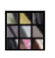

So looks like that in the lower region of an image that this particular hidden unit sees, it's looking for an egde or a line that looks like that. So those are the nine image patches that maximally activate one hidden unit's activation.

Repeat for other units.
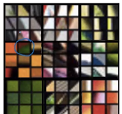

## Visualizing deep layers

#### Layer 1
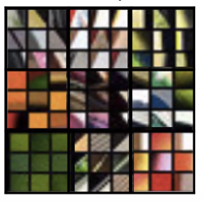
#### Layer 2 - detecting more detail features
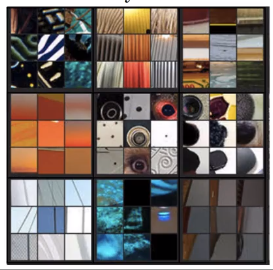
#### Layer 3
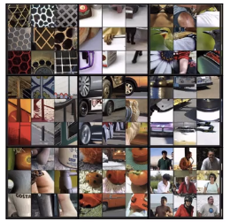
### Layer 4
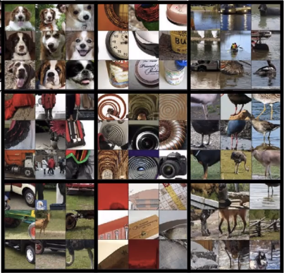
### Layer 5
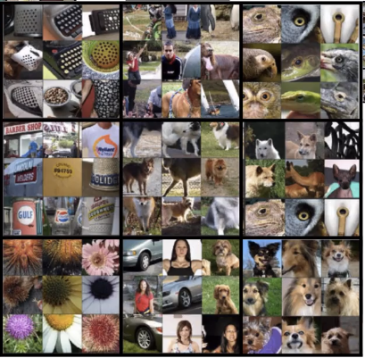

## Cost Function

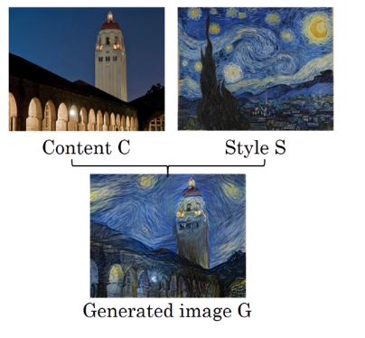

$\mathcal{J}(G)=\alpha\mathcal{J}_{content}(C,G)+\beta\mathcal{J}_{style}(C,G)$

$\mathcal{J}_{content}(C,G)$ measures how similar the content are between C and G.
$\mathcal{J}_{style}(S,G)$ measures how similar the style are between S and G.

After defining the cost,

1. Initiate G randomly
  - G: 100x100x3
2. Use gradient descent to minimize $\mathcal{J}(G)$
$G:=G-\frac{\partial \mathcal{J}(G)}{\partial G}$

## Content Cost Function
$\mathcal{J}(G)=\alpha\mathcal{J}_{content}(C,G)+\beta\mathcal{J}_{style}(C,G)$

Suppose one particular hidden layer was selected and set the image C as the input to the pretrained VGG network, and run forward propagation. Let $a^{(C)}$ be the hidden layer activations in the layer that was chosen. (The superscript $[l]$ is dropped from $a^{[l](C)}$ to simplify the notation. Usually $[l]$ is the mid layer of CovNets) This will be a $n_H \times n_W \times n_C$ tensor. Repeat this process with the image G: Set G as the input, and run forward progation. Let $a^{(G)}$ be the corresponding hidden layer activation.
We will define as the content cost function as:

$$J_{content}(C,G) =  \frac{1}{4 \times n_H \times n_W \times n_C}\sum _{ \text{all entries}} ||a^{(C)} - a^{(G)}||^2\tag{1} $$

$\frac{1}{4 \times n_H \times n_W \times n_C}$ can be $\frac{1}{2}$ or something else.

Here, $n_H, n_W$ and $n_C$ are the height, width and number of channels of the hidden layer you have chosen, and appear in a normalization term in the cost. For clarity, note that $a^{(C)}$ and $a^{(G)}$ are the volumes corresponding to a hidden layer's activations. In order to compute the cost $J_{content}(C,G)$, it might also be convenient to unroll these 3D volumes into a 2D matrix, as shown below. (Technically this unrolling step isn't needed to compute $J_{content}$, but it will be good practice for when you do need to carry out a similar operation later for computing the style const $J_{style}$.)

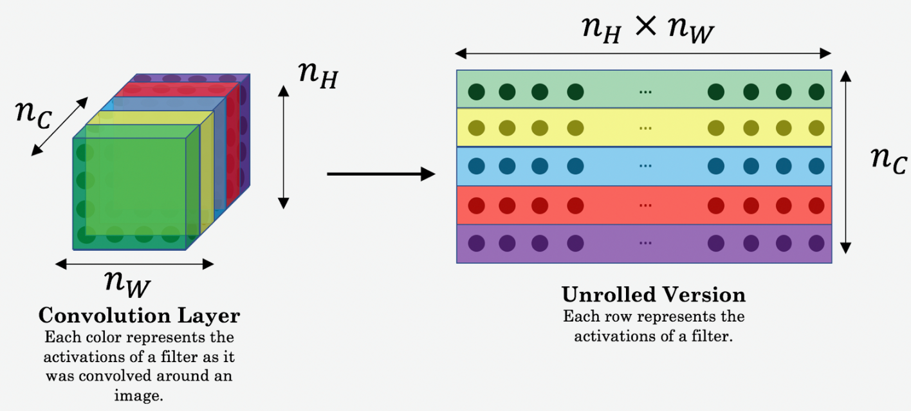

- The content cost takes a hidden layer activation of the neural network, and measures how different $a^{(C)}$ and $a^{(G)}$ are.
- When we minimize the content cost later, this will help make sure $G$ has similar content as $C$.

## Style Cost Function

After generating the Style matrix (Gram matrix), our goal will be to minimize the distance between the Gram matrix of the "style" image S and that of the "generated" image G. For now, we are using only a single hidden layer $a^{[l]}$, and the corresponding style cost for this layer is defined as:

where $G^{(S)}$ and $G^{(G)}$ are respectively the Gram matrices of the "style" image and the "generated" image, computed using the hidden layer activations for a particular hidden layer in the network.

Intuitively, if we use layer $l$'s activation to measure style, define style as correlation between activations across channels.
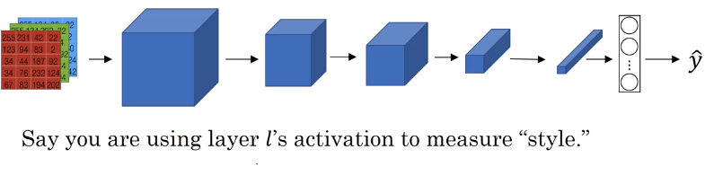
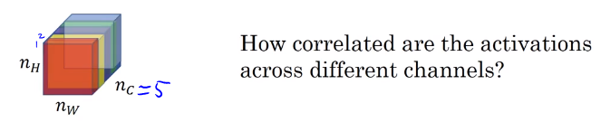
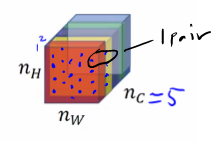

For example, the figure above has 5 channel. First, you take the first two channels and see how correlated (unnormalized cross covariates) are activation in these, so that gives a pair of numbers.
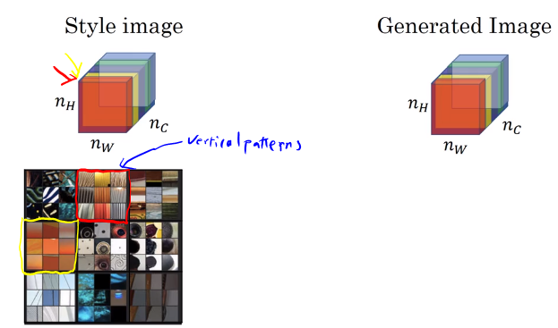

The **unnormalized cross covariates** tells you which of these high level texture components tend to occur or not occur together in part of an image and that's the degree of correlation that gives you one way of measuring how often these different high level features, such as vertical texture or this orange tint or other things as well, how often they occur and how often they occur together and don't occur together in different parts of an image.

If we use the degree of correlation between channels as a measure of the style, then what you can do is measure the degree to which in your generated image, this first channel is correlated or uncorrelated with the second channel and that will tell you in the generated image how often this type of vertical texture occurs or doesn't occur with this orange-ish tint and this gives you a measure of how similar is the style of the generated image to the style of the input style image.

## Style matrix
Let $a^{[l]}_{i,j,k}=$ activation at $(i,j,k)$. $G^{[l]}$ is $n^{[l]}_c \times n^{[l]}_c$

For style image: $G^{[l](S)}_{kk'}=\sum_i^{n^{[l]}_H} \sum_j^{n^{[l]}_W} a^{[l](S)}_{ijk} a^{[l](S)}_{ijk'}$ where $k=1,\cdots,n_c^{[l]}$

For generated image:
$G^{[l](G)}_{kk'}=\sum_i^{n^{[l]}_H} \sum_j^{n^{[l]}_W} a^{[l](G)}_{ijk} a^{[l](G)}_{ijk'}$ where $k=1,\cdots,n_c^{[l]}$

The style matrix is also called a "Gram matrix." In linear algebra, the Gram matrix G of a set of vectors $(v_{1},\dots ,v_{n})$ is the matrix of dot products, whose entries are ${\displaystyle G_{ij} = v_{i}^T v_{j} = np.dot(v_{i}, v_{j})  }$. In other words, $G_{ij}$ compares how similar $v_i$ is to $v_j$: If they are highly similar, you would expect them to have a large dot product, and thus for $G_{ij}$ to be large.

Note that there is an unfortunate collision in the variable names used here. We are following common terminology used in the literature, but $G$ is used to denote the Style matrix (or Gram matrix) as well as to denote the generated image $G$.

The Style matrix can be computed by multiplying the "unrolled" filter matrix with their transpose in NST:

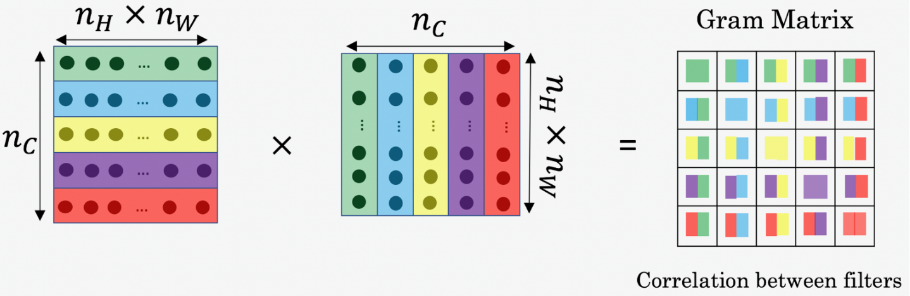

The result is a matrix of dimension $(n_C,n_C)$ where $n_C$ is the number of filters. The value $G_{ij}$ measures how similar the activations of filter $i$ are to the activations of filter $j$.

One important part of the gram matrix is that the diagonal elements such as $G_{ii}$ also measures how active filter $i$ is. For example, suppose filter $i$ is detecting vertical textures in the image. Then $G_{ii}$ measures how common  vertical textures are in the image as a whole: If $G_{ii}$ is large, this means that the image has a lot of vertical texture.

By capturing the prevalence of different types of features ($G_{ii}$), as well as how much different features occur together ($G_{ij}$), the Style matrix $G$ measures the style of an image.
The gram matrix of A is $G_A = AA^T$.

# Reference
Zeiler & Fergus. (2013). [Visualizing and Understanding Convolutional Networks](https://arxiv.org/abs/1311.2901), arXiv 1311.2901
Leon A. Gatys, Alexander S. Ecker, Matthias Bethge. (2015). [A Neural Algorithm of Artistic Style](https://arxiv.org/abs/1508.06576), 	arXiv:1508.06576
