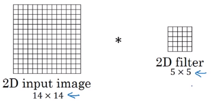
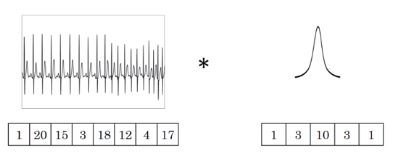
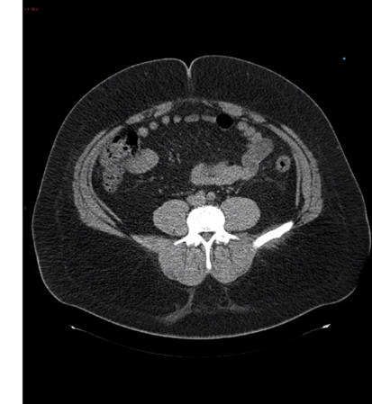
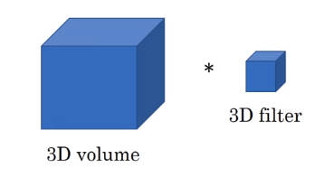

# Convolutional Network in 1D and 3D Data

## Convolution in 2D

$14 \times 14$ convolved with $5 \times 5$ gives $10 \times 10$. $\frac{14-5}{1}+1$

If you have 16 filters on image,
$14 \times 14  \times 3$ convolved with $5 \times 5 \times 3$ gives $10 \times 10 \times 16$.

## 1D example from ECG wave

1D numbers represent voltage

If we have 14 dimentional input, we want the filter to be 1D of 5 dimention, and if the 14 dimentional input is convolved with 5 dimention, we will have 10 dimentional output. If we have 16 filters, then the output will be $10 \times 16$.

## 3D Data

**3D convolution**

With $n_c=1$ and 16 filters, $14 \times 14  \times 14 \times 1$ convolved with $5 \times 5 \times 5 \times 1$ gives $10 \times 10 \times 10 \times 16$.
