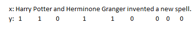
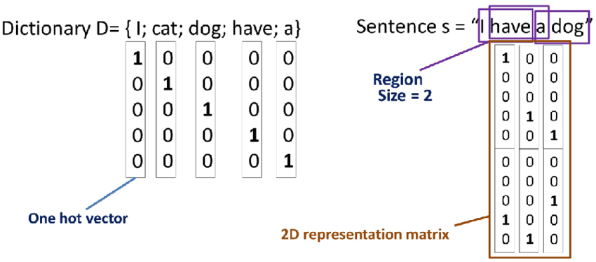

# RNN Notations

## Motivating Example
If you want a sequence model to automatically tell you where are the peoples names in this sentence. This is a problem called **Named-entity** recognition

Each word in X can be noted as $x^{<1>},\cdots, x^{<9>}$

The length of sequence X is $T_x=9$

Similary each y can be noted as $y^{<1>},\cdots, y^{<9>}$

The length of sequence  Y is $T_y=9$

The length of sequence $X$ of sample $i$ is $T_x^{(i)}$

vocabulary is represented by

$$V=\begin{bmatrix}
w_1^{(i)}\\
w_2^{(i)}\\
\vdots\\
w_D^{(i)}
\end{bmatrix}$$

**One-hot encoding**

Unknown word will be represented as <unk>
