#Recurrent Neural Network Model

## Why not a standard model?

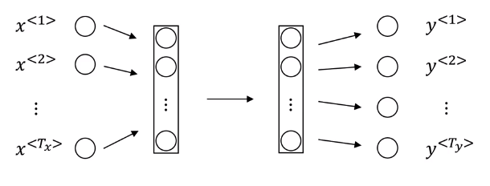

Problems:

Inputs, outputs can be different lengths in different examples.

Doesnt share fearues learned across different positions of text

## RNN

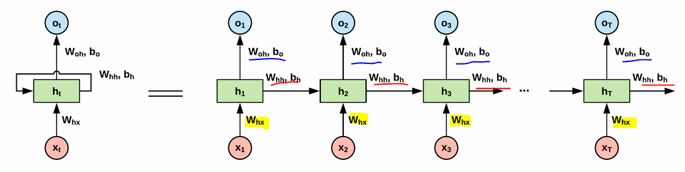
parameters are shared

One weakness of this RNN is that it only uses the information that is earlier in the sequence to make a prediction.

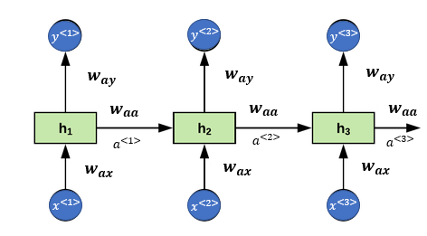


* Start with $a^{<0>}=\vec{0}$

* $a^{<1>}=g(W_{aa}a^{<0>}+W_{ax}x^{<1>}+b_a)$

* $\hat{y}^{<1>}=g(W_{ya}a^{<1>}++b_y)$

$a\rightarrow  W_{ax}X^{<1>}$<br>
The second index $x$ means that this $W_{ax}$ is going to be multiplied by some $X$-like quantity, and The first index $a$ means that this is used to compute some $a$-like quantity

$W_{ya}$ is multiplied by some $a$ like quantity to compute a $y$ type quantity.

In RNN, tanh is very common choice. ReLu is sometimes used.

In generalized way
* $a^{<t>}=g(W_{aa}a^{<t-1>}+W_{ax}x^{<t>}+b_a)$

* $\hat{y}^{<1>}=g(W_{ya}a^{<t>}+b_y)$ g will depends on what y as usual

This can be rewritten as:
* $a^{<t>}=g(W_{a}[a^{<t-1>},x^{<t>}]+b_a)$
* $W_a=[W_{aa} W_{ax}]$

 If $a$ was a 100 dimensional, and $x$ was 10,000 dimensional, then $W_{aa}$ would have been a 100 by 100 dimensional matrix, and  $W_{ax}$ would have been a 100 by 10,000 dimensional matrix.
 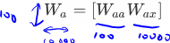

 $[a^{<t-1>},x^{<t>}]$=$\begin{bmatrix}
a^{<t-1>}\\
x^{<t>}
 \end{bmatrix}$

 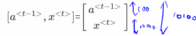

 ## Backpropagation through time
 ### Forward and backword Propagation
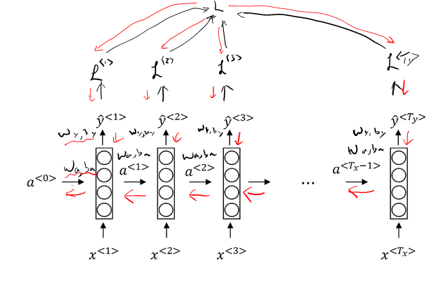<br>
Backpropagation through time

 **Loss Function**
 $\mathcal{L}^{<t>}(\hat{y}^{<t>},y^{<t>})=-y^{<t>}\log \hat{y}^{<t>}-(1-y^{<t>})\log (1-\hat{y}^{<t>})$

 **Overall loss of sequence**

 $\mathcal{L}(\hat{y},y)=\sum_{t=1}^{T_x}\mathcal{L}^{<t>}(\hat{y}^{<t>},y^{<t>})$

 ## Different types of RNN
 Andrej Karpathy http://karpathy.github.io/2015/05/21/rnn-effectiveness/

 ### Many to Many Architecture

 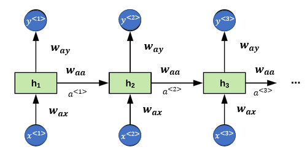

 ### Many to One Architecture

 Use case: Sentence Classification

 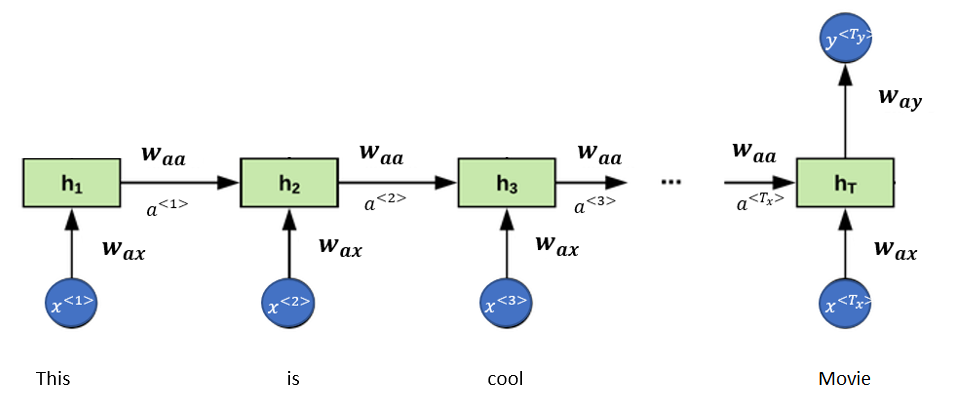

 ### One to Many Architecture
 Use case: Music generalizations
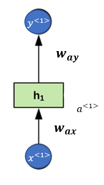
 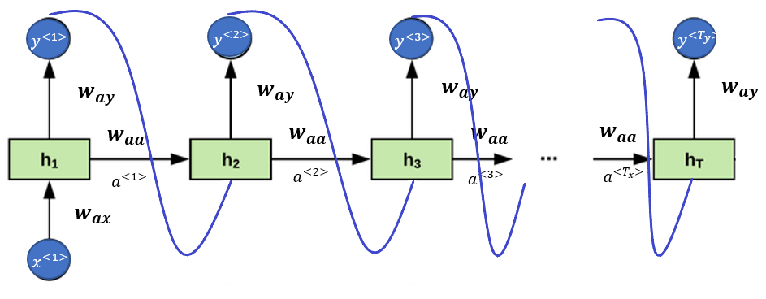

 ### Other many to many architecture
Translation


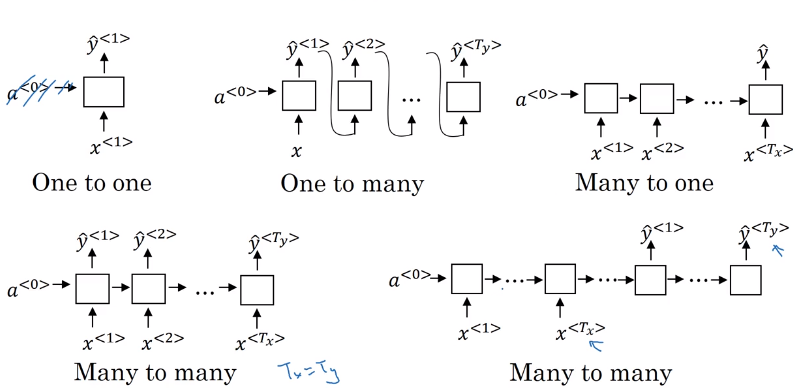


## RNN cell forward
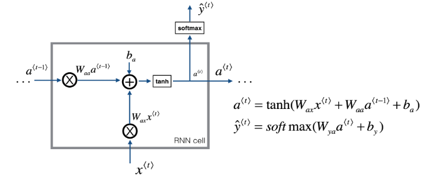
```python
def rnn_cell_forward(xt, a_prev, parameters):
    """
    A single forward step of the RNN-cell

    Arguments:
    xt -- Input data at timestep "t", numpy array of shape (n_x, m).
    a_prev -- Hidden state at timestep "t-1", numpy array of shape (n_a, m)
    parameters -- python dictionary containing:
                        Wax -- Weight matrix multiplying the input, numpy array of shape (n_a, n_x)
                        Waa -- Weight matrix multiplying the hidden state, numpy array of shape (n_a, n_a)
                        Wya -- Weight matrix relating the hidden-state to the output, numpy array of shape (n_y, n_a)
                        ba --  Bias, numpy array of shape (n_a, 1)
                        by -- Bias relating the hidden-state to the output, numpy array of shape (n_y, 1)
    Returns:
    a_next -- next hidden state, of shape (n_a, m)
    yt_pred -- prediction at timestep "t", numpy array of shape (n_y, m)
    cache -- tuple of values needed for the backward pass, contains (a_next, a_prev, xt, parameters)
    """

    Wax = parameters["Wax"]
    Waa = parameters["Waa"]
    Wya = parameters["Wya"]
    ba = parameters["ba"]
    by = parameters["by"]


    a_next =np.tanh(np.dot(Wax,xt)+np.dot(Waa,a_prev)+ ba)
    yt_pred = softmax(np.dot(Wya,a_next) + by)

    cache = (a_next, a_prev, xt, parameters)

    return a_next, yt_pred, cache

```


## RNN Forward pass

```python
def rnn_forward(x, a0, parameters):
    """
    Implement the forward propagation of the recurrent neural network described in Figure (3).

    Arguments:
    x -- Input data for every time-step, of shape (n_x, m, T_x).
    a0 -- Initial hidden state, of shape (n_a, m)
    parameters -- python dictionary containing:
                        Waa -- Weight matrix multiplying the hidden state, numpy array of shape (n_a, n_a)
                        Wax -- Weight matrix multiplying the input, numpy array of shape (n_a, n_x)
                        Wya -- Weight matrix relating the hidden-state to the output, numpy array of shape (n_y, n_a)
                        ba --  Bias numpy array of shape (n_a, 1)
                        by -- Bias relating the hidden-state to the output, numpy array of shape (n_y, 1)

    Returns:
    a -- Hidden states for every time-step, numpy array of shape (n_a, m, T_x)
    y_pred -- Predictions for every time-step, numpy array of shape (n_y, m, T_x)
    caches -- tuple of values needed for the backward pass, contains (list of caches, x)
    """

    # Initialize "caches"
    caches = []

    # Retrieve dimensions from shapes of x and parameters["Wya"]
    n_x, m, T_x = x.shape
    n_y, n_a = parameters["Wya"].shape

    # initialize
    a = np.zeros([n_a,m,T_x])
    y_pred = np.zeros([n_y,m,T_x])
    a_next =a0

    # loop over all time-steps
    for t in range(T_x):
        # Update next hidden state, compute the prediction, get the cache
        a_next, yt_pred, cache =  rnn_cell_forward(x[:,:,t], a_next, parameters)
        # Save the value of the new "next" hidden state in a
        a[:,:,t] = a_next
        y_pred[:,:,t] = yt_pred
        caches.append(cache)

    caches = (caches, x)

    return a, y_pred, caches

```

## RNN backward

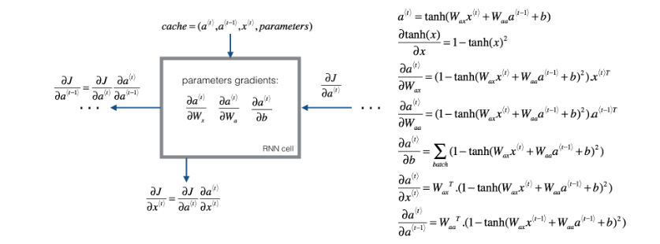

The derivative of $\tanh$ is $1-\tanh(x)^2$. You can find the complete proof [here](https://www.wyzant.com/resources/lessons/math/calculus/derivative_proofs/tanx). Note that: $ \text{sech}(x)^2 = 1 - \tanh(x)^2$

Similarly for $\frac{ \partial a^{\langle t \rangle} } {\partial W_{ax}}, \frac{ \partial a^{\langle t \rangle} } {\partial W_{aa}},  \frac{ \partial a^{\langle t \rangle} } {\partial b}$, the derivative of  $\tanh(u)$ is $(1-\tanh(u)^2)du$.

The final two equations also follow same rule and are derived using the $\tanh$ derivative. Note that the arrangement is done in a way to get the same dimensions to match.

```python
def rnn_cell_backward(da_next, cache):
    """
    Implements the backward pass for the RNN-cell (single time-step).

    Arguments:
    da_next -- Gradient of loss with respect to next hidden state
    cache -- python dictionary containing useful values (output of rnn_cell_forward())

    Returns:
    gradients -- python dictionary containing:
                        dx -- Gradients of input data, of shape (n_x, m)
                        da_prev -- Gradients of previous hidden state, of shape (n_a, m)
                        dWax -- Gradients of input-to-hidden weights, of shape (n_a, n_x)
                        dWaa -- Gradients of hidden-to-hidden weights, of shape (n_a, n_a)
                        dba -- Gradients of bias vector, of shape (n_a, 1)
    """

    (a_next, a_prev, xt, parameters) = cache
    Wax = parameters["Wax"]
    Waa = parameters["Waa"]
    Wya = parameters["Wya"]
    ba = parameters["ba"]
    by = parameters["by"]


    # compute the gradient of tanh with respect to a_next
    dtanh = (1-a_next**2)*da_next

    # compute the gradient of the loss with respect to Wax
    dxt =  np.dot(Wax.T,dtanh)
    dWax = np.dot(dtanh,xt.T)

    # compute the gradient with respect to Waa
    da_prev = np.dot(Waa.T,dtanh)
    dWaa = np.dot(dtanh,a_prev.T)

    # compute the gradient with respect to b
    dba = np.sum( dtanh,keepdims=True,axis=-1)


    # Store the gradients in a python dictionary
    gradients = {"dxt": dxt, "da_prev": da_prev, "dWax": dWax, "dWaa": dWaa, "dba": dba}

    return gradients
```

## RNN backward

```Python
def rnn_backward(da, caches):
    """
    Implement the backward pass for a RNN over an entire sequence of input data.

    Arguments:
    da -- Upstream gradients of all hidden states, of shape (n_a, m, T_x)
    caches -- tuple containing information from the forward pass (rnn_forward)

    Returns:
    gradients -- python dictionary containing:
                        dx -- Gradient w.r.t. the input data, numpy-array of shape (n_x, m, T_x)
                        da0 -- Gradient w.r.t the initial hidden state, numpy-array of shape (n_a, m)
                        dWax -- Gradient w.r.t the input's weight matrix, numpy-array of shape (n_a, n_x)
                        dWaa -- Gradient w.r.t the hidden state's weight matrix, numpy-arrayof shape (n_a, n_a)
                        dba -- Gradient w.r.t the bias, of shape (n_a, 1)
    """

    ### START CODE HERE ###

    # Retrieve values from the first cache (t=1) of caches 
    (caches, x) = caches
    (a1, a0, x1, parameters) = caches[0]

    # Retrieve dimensions from da's and x1's shapes
    n_a, m, T_x = da.shape
    n_x, m = x1.shape

    # initialize the gradients with the right sizes
    dx = np.zeros((n_x, m, T_x))
    dWax = np.zeros((n_a, n_x))
    dWaa = np.zeros((n_a, n_a))
    dba = np.zeros((n_a, 1))
    da0 = np.zeros((n_a, m))
    da_prevt = np.zeros((n_a, m))

    # Loop through all the time steps
    for t in reversed(range(T_x)):
        # Compute gradients at time step t. Choose wisely the "da_next" and the "cache" to use in the backward propagation step.
        gradients = rnn_cell_backward(da[:,:,t] + da_prevt, caches[t])
        # Retrieve derivatives from gradients
        dxt, da_prevt, dWaxt, dWaat, dbat = gradients["dxt"], gradients["da_prev"], gradients["dWax"], gradients["dWaa"], gradients["dba"]
        # Increment global derivatives w.r.t parameters by adding their derivative at time-step t
        dx[:, :, t] = dxt
        dWax += dWaxt
        dWaa += dWaat
        dba += dbat

    # Set da0 to the gradient of a which has been backpropagated through all time-steps (≈1 line)
    da0 = da_prevt

    # Store the gradients in a python dictionary
    gradients = {"dx": dx, "da0": da0, "dWax": dWax, "dWaa": dWaa,"dba": dba}

    return gradients
```
