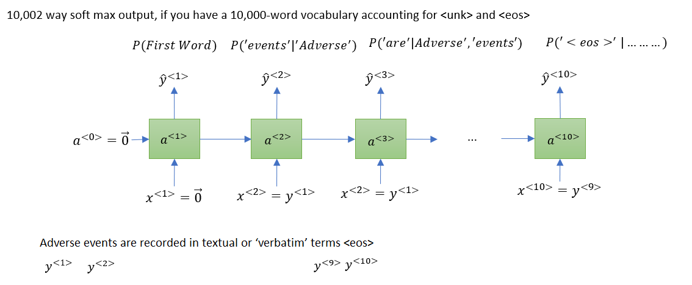

## Language modelling with an RNN

1. training set - large corpus of english Text
2. tokenize
3. add <eos> end of sentence if you want the model to know when the sentence ends
4. If a particular word is not in the list of words, it is expressed as <UNK>

Example:

Input sentence:

Cose function:

$\mathcal{L}(\hat{y}^{<t>},{y}^{<t>})=-\sum_i y_i^{<t>}\log\hat{y}_i^{<t>}$

$\mathcal{L}=\sum_i \mathcal{L}(\hat{y}^{<t>},{y}^{<t>})$
