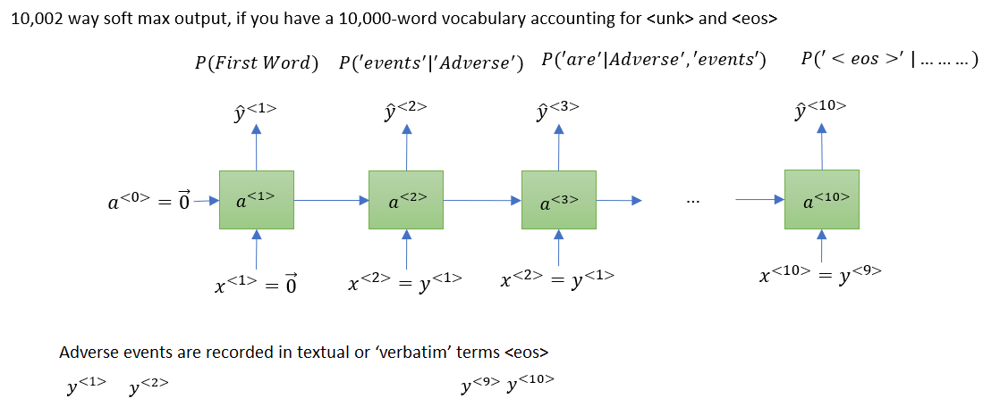
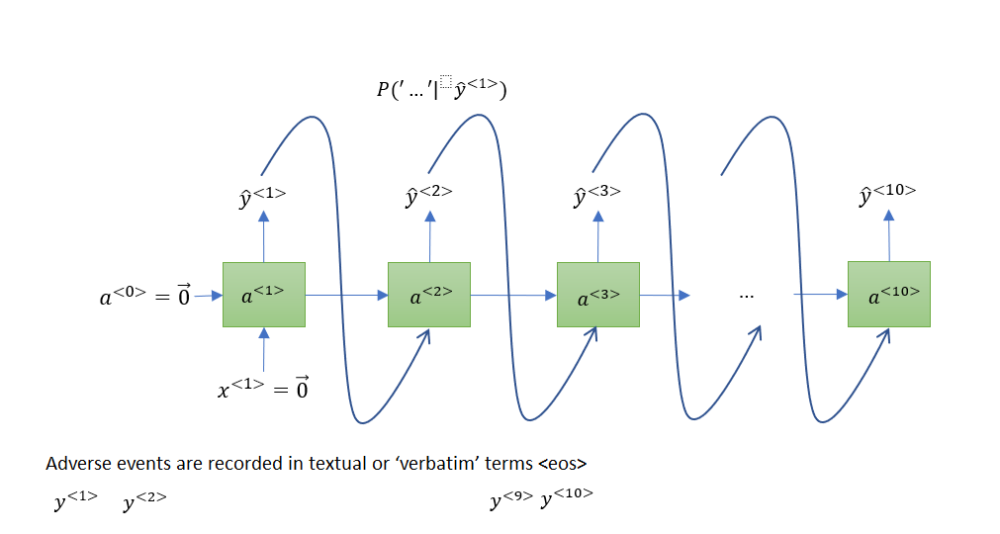

# Sampling Novel sequence
One of the ways you can informally get a sense of what is learned is to have a sample novel sequences.

The network was trained using this structure shown at the top.

When learning, the output of an RNN is a probability distribution instead of one word.
When generating text we choose only one of the words ourselves given the probabilities and feed that back into the network. This is called sampling.

If the end of sentence token is part of your vocabulary, you could keep sampling until you generate an EOS token. Alternatively, if you do not include this in your vocabulary then you can also just decide to sample 20 words or 100 words or something.

If you want to make sure that your algorithm never generates <unk> token, one thing you could do is just reject any sample that came out as unknown word token and just keep resampling from the rest of the vocabulary until you get a word that's not an unknown word.
