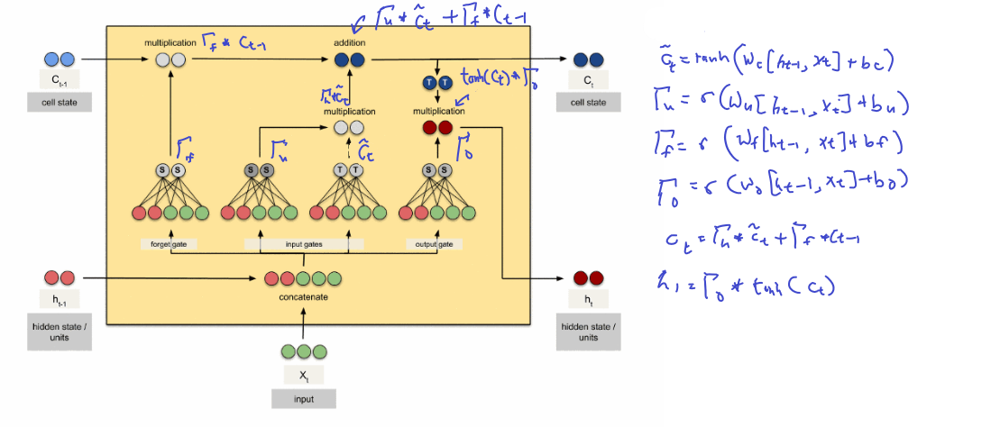
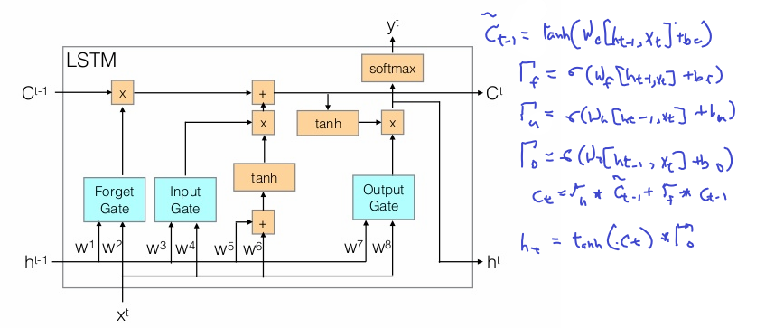

# LSTM

Original image from [here](https://cdn-images-1.medium.com/max/800/1*goJVQs-p9kgLODFNyhl9zA.gif) before annotation

$\tilde{c}^{<t>}=tanh(W_c[\Gamma{r}*h^{<t-1>}, x^{<t>}]+b_c)$

$\Gamma{f}=\sigma(W_r[c^{<t-1>}, x^{<t>}]+b_r)$

$\Gamma{u}=\sigma(W_u[c^{<t-1>}, x^{<t>}]+b_u)$

$\Gamma{o}=\sigma(W_o[c^{<t-1>}, x^{<t>}]+b_o)$

$c^{<t>}=\Gamma{f}*\tilde{c}^{<t-1>}+(\Gamma{u})*\tilde{c}^{<t>}$

$h_{<t>}=\Gamma{o}*tanh(c^{<t>})$

In motion

THis is much cleaner

