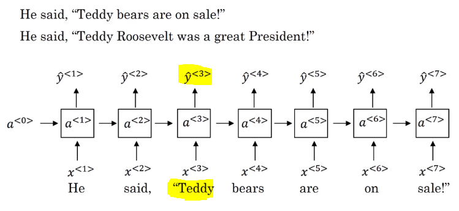
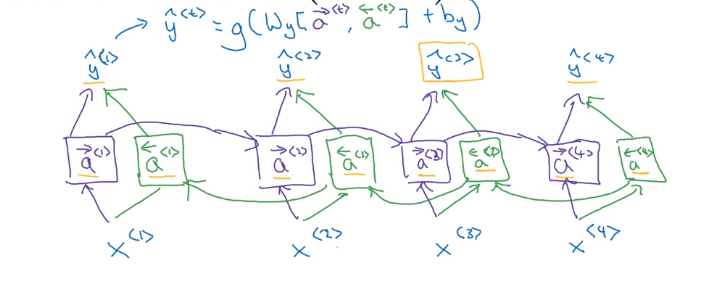
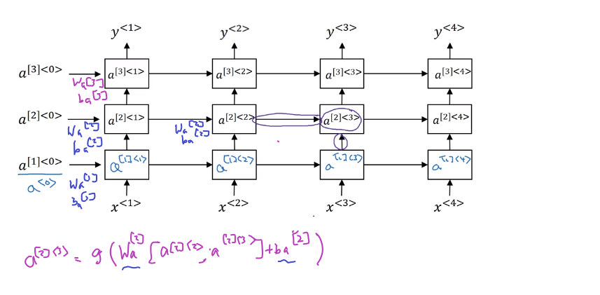

# Bidirectional RNN

In the example here, with only the first three words, we cannot tell if Teddy is the name or the teddy bears.

- Note, that BiRNN is an acyclic graph.
- Part of the forward propagation goes from left to right, and part - from right to left. It learns from both sides.
- To make predictions we use ŷ<t> by using the two activations that come from left and right.
-The blocks here can be any RNN block including the basic RNNs, LSTMs, or GRUs.
- For a lot of NLP or text processing problems, a BiRNN with LSTM appears to be commonly used.
- The disadvantage of BiRNNs that you need the entire sequence before you can process it. For example, in live speech recognition if you use BiRNNs you will need to wait for the person who speaks to stop to take the entire sequence and then make your predictions.
# Deep RNN
- In a lot of cases the standard one layer RNNs will solve your problem. But in some problems its useful to stack some RNN layers to make a deeper network.
- For example, a deep RNN with 3 layers would look like this:

