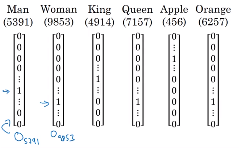
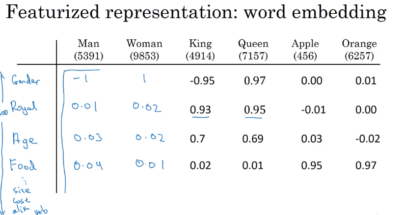
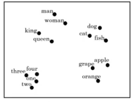
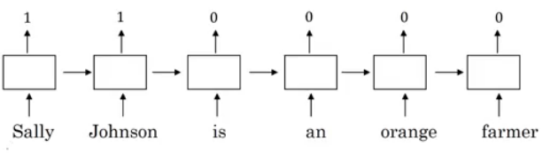
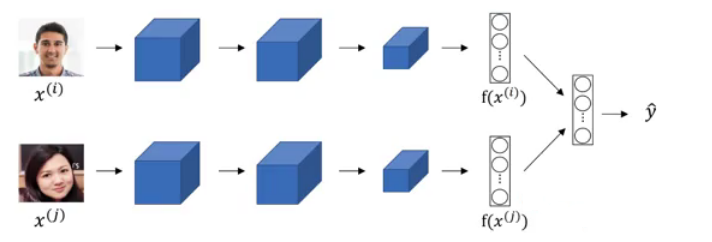
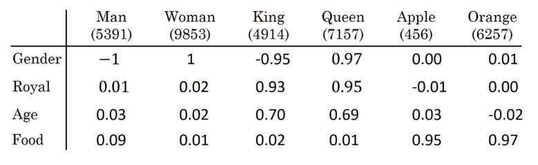
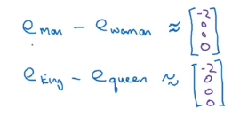
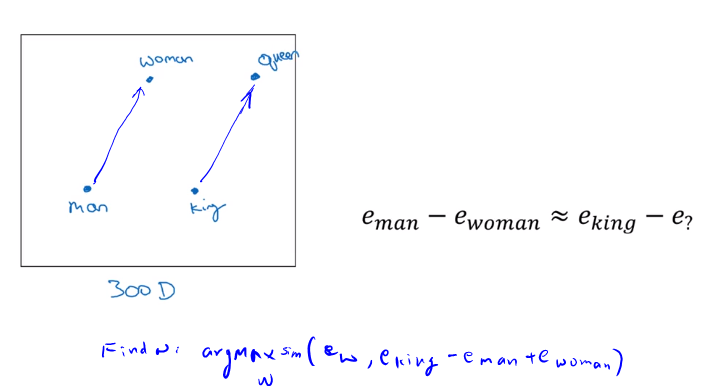
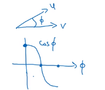
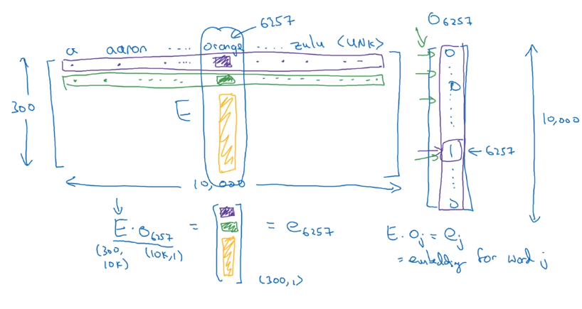

## Natural Language Processing & Word Embeddings

> Natural language processing with deep learning is an important combination. Using word vector representations and embedding layers you can train recurrent neural networks with outstanding performances in a wide variety of industries. Examples of applications are sentiment analysis, named entity recognition and machine translation.

### Introduction to Word Embeddings

#### Word Representation
- NLP has been revolutionized by deep learning and especially by RNNs and deep RNNs.
- Word embeddings is a way of representing words. It lets your algorithm automatically understand the analogies between words like "king" and "queen".
- So far we have defined our language by a vocabulary. Then represented our words with a one-hot vector that represents the word in the vocabulary.
  - An image example would be:
    
  - We will use the annotation **O** idx for any word that is represented with one-hot like in the image.
  - One of the weaknesses of this representation is that it treats a word as a thing that itself and it doesn't allow an algorithm to generalize across words.
    - For example: "I want a glass of **orange** ______", a model should predict the next word as **juice**.
    - A similar example "I want a glass of **apple** ______", a model won't easily predict **juice** here if it wasn't trained on it. And if so the two examples aren't related although orange and apple are similar.
  - Inner product between any one-hot encoding vector is zero. Also, the distances between them are the same.
- So, instead of a one-hot presentation, won't it be nice if we can learn a featurized representation with each of these words: man, woman, king, queen, apple, and orange?
  
  - Each word will have a, for example, 300 features with a type of float point number.
  - Each word column will be a 300-dimensional vector which will be the representation.
  - We will use the notation **e**5391 to describe **man** word features vector.
  - Now, if we return to the examples we described again:
    -  "I want a glass of **orange** ______"
    -  I want a glass of **apple** ______
  - Orange and apple now share a lot of similar features which makes it easier for an algorithm to generalize between them.
  - We call this representation **Word embeddings**.
- To visualize word embeddings we use a t-SNE algorithm to reduce the features to 2 dimensions which makes it easy to visualize:
  
  - You will get a sense that more related words are closer to each other.
- The **word embeddings** came from that we need to embed a unique vector inside a n-dimensional space.

#### Using word embeddings
- Let's see how we can take the feature representation we have extracted from each word and apply it in the Named entity recognition problem.
- Given this example (from named entity recognition):
  
- **Sally Johnson** is a person's name.
- After training on this sentence the model should find out that the sentence "**Robert Lin** is an *apple* farmer" contains Robert Lin as a name, as apple and orange have near representations.
- Now if you have tested your model with this sentence "**Mahmoud Badry** is a *durian* cultivator" the network should learn the name even if it hasn't seen the word *durian* before (during training). That's the power of word representations.
- The algorithms that are used to learn **word embeddings** can examine billions of words of unlabeled text - for example, 100 billion words and learn the representation from them.
- Transfer learning and word embeddings:
  1. Learn word embeddings from large text corpus (1-100 billion of words).
     - Or download pre-trained embedding online.
  2. Transfer embedding to new task with the smaller training set (say, 100k words).
  3. Optional: continue to finetune the word embeddings with new data.
     - You bother doing this if your smaller training set (from step 2) is big enough.
- Word embeddings tend to make the biggest difference when the task you're trying to carry out has a relatively smaller training set.
- Also, one of the advantages of using word embeddings is that it reduces the size of the input!
  - 10,000 one hot compared to 300 features vector.
- Word embeddings have an interesting relationship to the face recognition task:
  
  - In this problem, we encode each face into a vector and then check how similar are these vectors.
  - Words **encoding** and **embeddings** have a similar meaning here.
- In the word embeddings task, we are learning a representation for each word in our vocabulary (unlike in image encoding where we have to map each new image to some n-dimensional vector). We will discuss the algorithm in next sections.

#### Properties of word embeddings
- One of the most fascinating properties of word embeddings is that they can also help with analogy reasoning. While analogy reasoning may not be by itself the most important NLP application, but it might help convey a sense of what these word embeddings can do.
- Analogies example:
  - Given this word embeddings table:
    
  - Can we conclude this relation:
    - Man ==> Woman
    - King ==> ??
  - Lets subtract eMan from eWoman. This will equal the vector `[-2  0  0  0]`
  - Similar eKing - eQueen = `[-2  0  0  0]`

    
  - So the difference is about the gender in both.
    
    - This vector represents the gender.
    - This drawing is a 2D visualization of the 4D vector that has been extracted by a t-SNE algorithm. It's a drawing just for visualization. Don't rely on the t-SNE algorithm for finding parallels.
  - So we can reformulate the problem to find:
    - eMan - eWoman ≈ eKing - e??
  - It turns out that eQueen is the best solution here that gets the the similar vector.
- Cosine similarity - the most commonly used similarity function:

  
  - Equation:
    $sim(u,v)=\frac{u^Tv}{||u||_2||v||_2}$
    - `CosineSimilarity(u, v)` = `u . v` / `||u|| ||v||` = cos(&theta;)
    - The top part represents the inner product of `u` and `v` vectors. It will be large if the vectors are very similar.
- You can also use Euclidean distance as a similarity function (but it rather measures a dissimilarity, so you should take it with negative sign).
- We can use this equation to calculate the similarities between word embeddings and on the analogy problem where `u` = ew and `v` = eking - eman + ewoman

#### Embedding matrix
- When you implement an algorithm to learn a word embedding, what you end up learning is a **<u>embedding matrix</u>**.
- Let's take an example:
  - Suppose we are using 10,000 words as our vocabulary (plus <UNK> token).
  - The algorithm should create a matrix `E` of the shape (300, 10000) in case we are extracting 300 features.
    
  - If O6257 is the one hot encoding of the word **orange** of shape (10000, 1), then
    _np.dot(`E`,O6257) = e6257_ which shape is (300, 1).
  - Generally _np.dot(`E`, Oj) = ej_
- 
- Wwe first initialize `E` randomly and then try to learn all the parameters of this matrix.
- In practice it's not efficient to use a dot multiplication when you are trying to extract the embeddings of a specific word, instead, we will use slicing to slice a specific column. In Keras there is an `embedding layer` that extracts this column with no multiplication.
