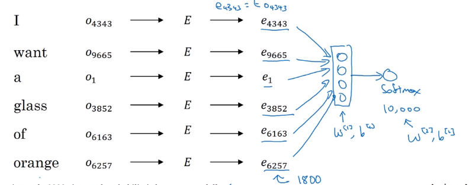
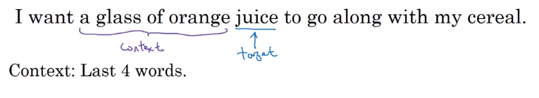

# Learning Word Embeddings

- At the start, word embeddings algorithms were complex but then they got simpler and simpler.

- **<u>Neural language model</u>**:
  - Let's start with an example:
    
  - We want to build a language model so that we can predict the next word.
  - So we use this neural network to learn the language model
    
    - We get ej by `np.dot(`E`,oj)`
    - NN layer has parameters `W1` and `b1` while softmax layer has parameters `W2` and `b2`
    - Input dimension is (300*6, 1) if the window size is 6 (six previous words).
    - Here we are optimizing `E` matrix and layers parameters. We need to maximize the likelihood to predict the next word given the context (previous words).
  - This model was build in 2003 and tends to work pretty decent for learning word embeddings.
- In the last example we took a window of 6 words that fall behind the word that we want to predict. There are other choices when we are trying to learn word embeddings.
  - Suppose we have an example: 
  - To learn **juice**, choices of **context** are:
    1. Last 4 words.
       - We use a window of last 4 words (4 is a hyperparameter), "<u>a glass of orange</u>" and try to predict the next word from it.
    2. 4 words on the left and on the right.
       - "<u>a glass of orange</u>" and "<u>to go along with</u>"
    3. Last 1 word.
       - "<u>orange</u>"
    4. Nearby 1 word.
       - "<u>glass</u>" word is near juice.
       - This is the idea of **skip grams** model.
       - The idea is much simpler and works remarkably well.
       - We will talk about this in the next section.
- Researchers found that if you really want to build a _language model_, it's natural to use the last few words as a context. But if your main goal is really to learn a _word embedding_, then you can use all of these other contexts and they will result in very meaningful work embeddings as well.
- To summarize, the language modeling problem poses a machines learning problem where you input the context (like the last four words) and predict some target words. And posing that problem allows you to learn good word embeddings.
