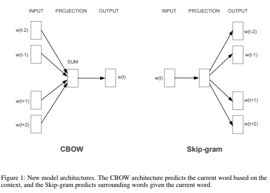
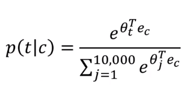
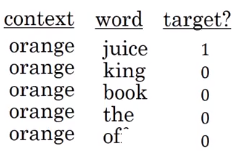
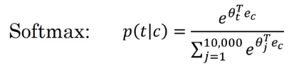
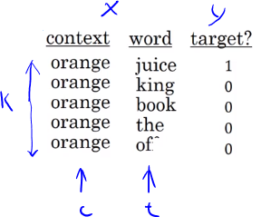
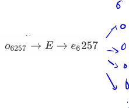
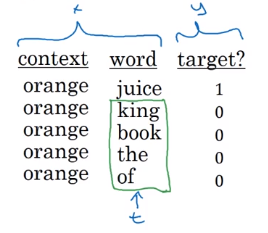

# Word2Vec

##  **skip-grams**:
  - For example, we have the sentence: "I want a glass of orange juice to go along with my cereal"
  - We will choose **context** and **target**.
  - The target is chosen randomly based on a window with a specific size.

    | Context | Target | How far |
    | ------- | ------ | ------- |
    | orange  | juice  | +1      |
    | orange  | glass  | -2      |
    | orange  | my     | +6      |

    We have converted the problem into a supervised problem.
  - This is not an easy learning problem because learning within -10/+10 words (10 - an example) is hard.
  - We want to learn this to get our word embeddings model.
- Word2Vec model:
  - Vocabulary size = 10,000 words
  - Let's say that the context word are `c` and the target word is `t`
  - We want to learn `c` to `t`
  - We get ec by `E`oc
  - We then use a softmax layer to get `P(t|c)` which is y&#770;
  - Softmax:$p(t|c)=\frac{e^{\theta_t^{T_{e_c}}}}{\sum_{j=1}^{V}e^{\theta_j^{T_{e_c}}}}$ where $\theta_t$ is the parameter associated with an output $t$ and $V$ is the number of vocabulary

  - Also we will use the cross-entropy loss function. 
    $\mathcal{L}(\hat{y},y)=-\sum_{i=1}^Vy_{i}\log{\hat{y_i}}$
  - This model is called skip-grams model.
  - The overall flow is: 
    $O_c \rightarrow E \rightarrow e_c \rightarrow O_{softmax} \rightarrow\hat{y}$
- The last model has a problem with the softmax layer: 
  
  - Here we are summing 10,000 numbers which corresponds to the number of words in our vocabulary.
  - If this number is larger say 1 million, the computation will become very slow.
- One of the solutions for the last problem is to use "**Hierarchical softmax classifier**" which works as a tree classifier.
  
- In practice, the hierarchical softmax classifier doesn't use a balanced tree like the drawn one. Common words are at the top and less common are at the bottom.
- How to sample the context **c**?
  - One way is to choose the context by random from your corpus.
  - If you have done it that way, there will be frequent words like "the, of, a, and, to, .." that can dominate other words like "orange, apple, durian,..."
  - In practice, we don't take the context uniformly random, instead there are some heuristics to balance the common words and the non-common words.
- word2vec paper includes 2 ideas of learning word embeddings. One is skip-gram model and another is CBoW (continuous bag-of-words).

#### Negative Sampling
- Negative sampling allows you to do something similar to the skip-gram model, but with a much more efficient learning algorithm. We will create a different learning problem.
- Given this example:
  >I want a glass of orange juice to go along with my cereal
- The $k=1$ negative sampling will look like this: 

  We get positive example by using the same skip-grams technique, with a fixed window that goes around.
- To generate a negative example, we pick a word randomly from the vocabulary.
- Notice, that we got word "of" as a negative example although it appeared in the same sentence.
- So the steps to generate the samples are:
  1. Pick a positive context
  2. Pick a $k$ negative contexts from the dictionary.
- $k$ is recommended to be from $5$ to $20$ in small datasets. For larger ones - $2$ to $5$.
- We will have a ratio of $k$ negative examples to 1 positive ones in the data we are collecting.
- Now let's define the model that will learn this supervised learning problem:
  
  - Lets say that the context word are `c` and the word are `t` and `y` is the target.
  
  - We will apply the simple logistic regression model. 
  $P(y=1|c,t)=\sigma (\theta_t^T e_c)$

  - The logistic regression model can be drawn like this:
  Say the input word is Orange (one hot vector 6257), 
  $o_{6257} \rightarrow E \rightarrow e_6257$

  
  - So we are having 10,000 binary classification problems, but instead we only train k+1 classifier of them in each iteration.
- How to select negative samples: 
  
  - We can sample according to empirical frequencies in words corpus which means according to how often different words appears. But the problem with that is that we will have more frequent words like _the, of, and..._
  - The best is to sample with this equation (according to authors):
    $P(w_i)=\frac{f(w_i)^{\frac{3}{4}}}{\sum^{V}_{j=1}f(w_j)^{\frac{3}{4}}}$
