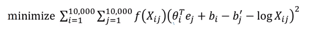

# GloVe

- GloVe is another algorithm for learning the word embedding. It's the simplest of them.
- This is not used as much as word2vec or skip-gram models, but it has some enthusiasts because of its simplicity.
- GloVe stands for Global vectors for word representation.

- Let's use our previous example: **"I want a glass of orange juice to go along with my cereal".**
- We will choose a context and a target from the choices we have mentioned in the previous sections.
- Then we will calculate this for every pair: Xct = # times `t` appears in context of `c`
- Xct = Xtc if we choose a window pair, but they will not equal if we choose the previous words for example. In GloVe they use a window which means they are equal
- The model is defined like this:

 

$i$ and $j$ plays a role of $t$ and $c$

$f(X_{ij})$ is weighting term and if it is 0 then $X_{ij}=0$

- f(x) - the weighting term, used for many reasons which include:
  - The `log(0)` problem, which might occur if there are no pairs for the given target and context values.
  - Giving not too much weight for stop words like "is", "the", and "this" which occur many times.
  - Giving not too little weight for infrequent words.
- **Theta** and **e** are symmetric which helps getting the final word embedding.

- _Conclusions on word embeddings:_
  - If this is your first try, you should try to download a pre-trained model that has been made and actually works best.
  - If you have enough data, you can try to implement one of the available algorithms.
  - Because word embeddings are very computationally expensive to train, most ML practitioners will load a pre-trained set of embeddings.
  - A final note that you can't guarantee that the axis used to represent the features will be well-aligned with what might be easily humanly interpretable axis like gender, royal, age.
