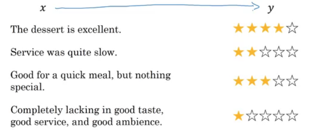
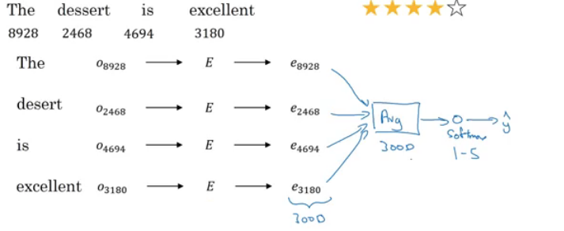
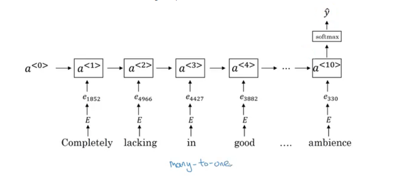
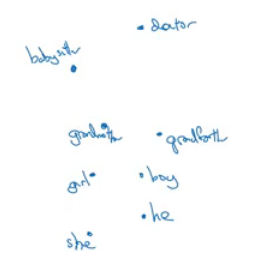
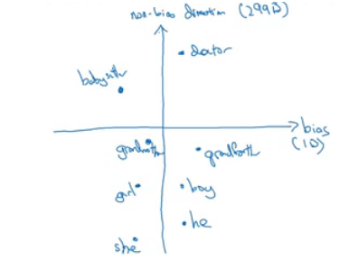
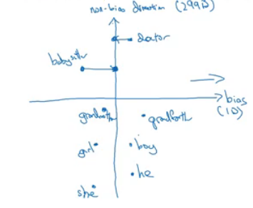
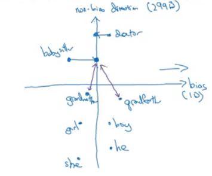

### Applications using Word Embeddings

#### Sentiment Classification
- As we have discussed before, Sentiment classification is the process of finding if a text has a positive or a negative review. Its so useful in NLP and is used in so many applications. An example would be:
  
- One of the challenges with it, is that you might not have a huge labeled training data for it, but using word embeddings can help getting rid of this.
- The common dataset sizes varies from 10,000 to 100,000 words.
- A simple sentiment classification model would be like this:
  
  - The embedding matrix may have been trained on say 100 billion words.
  - Number of features in word embedding is 300.
  - We can use **sum** or **average** given all the words then pass it to a softmax classifier. That makes this classifier works for short or long sentences.
- One of the problems with this simple model is that it ignores words order. For example "Completely lacking in **good** taste, **good** service, and **good** ambience" has the word _good_ 3 times but its a negative review.
- A better model uses an RNN for solving this problem:
  
  - And so if you train this algorithm, you end up with a pretty decent sentiment classification algorithm.
  - Also, it will generalize better even if words weren't in your dataset. For example you have the sentence "Completely **<u>absent</u>** of good taste, good service, and good ambience", then even if the word "absent" is not in your label training set, if it was in your 1 billion or 100 billion word corpus used to train the word embeddings, it might still get this right and generalize much better even to words that were in the training set used to train the word embeddings but not necessarily in the label training set that you had for specifically the sentiment classification problem.

#### Debiasing word embeddings
- We want to make sure that our word embeddings are free from undesirable forms of bias, such as gender bias, ethnicity bias and so on.
- Horrifying results on the trained word embeddings in the context of Analogies:
  - Man : Computer_programmer as Woman : **Homemaker**
  - Father : Doctor as Mother : **Nurse**
- Word embeddings can reflect gender, ethnicity, age, sexual orientation, and other biases of text used to train the model.
- Learning algorithms by general are making important decisions and it mustn't be biased.
- Andrew thinks we actually have better ideas for quickly reducing the bias in AI than for quickly reducing the bias in the human race, although it still needs a lot of work to be done.
- Addressing bias in word embeddings steps:
  - Idea from the paper: https://arxiv.org/abs/1607.06520
  - Given these learned embeddings:
    
  - We need to solve the **gender bias** here. The steps we will discuss can help solve any bias problem but we are focusing here on gender bias.
  - Here are the steps:
    1. Identify the direction:
       - Calculate the difference between:
         - ehe - eshe
         - emale - efemale
         - ....
       - Choose some k differences and average them.
       - This will help you find this:
         
       - By that we have found the bias direction which is 1D vector and the non-bias vector which is 299D vector.
    2. Neutralize: For every word that is not definitional, project to get rid of bias.
       - Babysitter and doctor need to be neutral so we project them on non-bias axis with the direction of the bias:
         
         - After that they will be equal in the term of gender.
         - To do this the authors of the paper trained a classifier to tell the words that need to be neutralized or not.
    3. Equalize pairs
       - We want each pair to have difference only in gender. Like:
         - Grandfather - Grandmother
         - He - She
         - Boy - Girl
       - We want to do this because the distance between grandfather and babysitter is bigger than babysitter and grandmother:
         
       - To do that, we move grandfather and grandmother to a point where they will be in the middle of the non-bias axis.
       - There are some words you need to do this for in your steps. Number of these words is relatively small.
