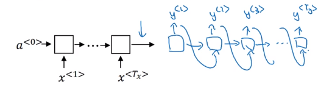
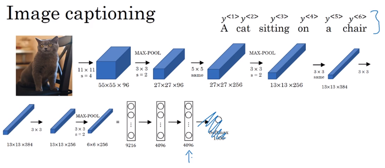
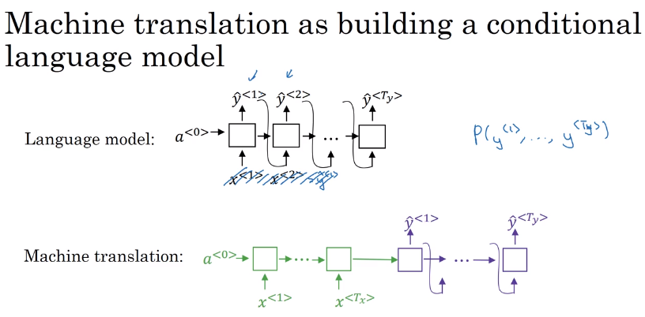

# Sequence models & Attention mechanism
Sequence models can be augmented using an attention mechanism. This algorithm will help your model understand where it should focus its attention given a sequence of inputs. This week, you will also learn about speech recognition and how to deal with audio data.
## Various sequence to sequence architectures
## Basic Model

Let's say we want to input a French sentence
>Jane visite l'Afrique en septembre

English sentence,

>Jane is visiting Africa in September.

Given this machine translation problem in which X is a French sequence and Y is an English sequence.

- Our architecture will include **encoder** and **decoder**.
- The encoder is RNN - LSTM or GRU are included - and takes the input sequence and then outputs a vector that should represent the whole input.
- After that the decoder network, also RNN, takes the sequence built by the encoder and outputs the new sequence.

These ideas are from the following papers:
Sutskever et al., 2014. [Sequence to sequence learning with neural networks](https://arxiv.org/abs/1409.3215)
Cho et al., 2014. [Learning phrase representations using RNN encoder-decoder for statistical machine translation](https://arxiv.org/abs/1406.1078)

- An architecture similar to the mentioned above works for image captioning problem:
In this problem X is an image, while Y is a sentence (caption).
The model architecture image:

- The architecture uses a pretrained CNN (like AlexNet) as an encoder for the image, and the decoder is an RNN.
- Ideas are from the following papers (they share similar ideas):
- Maoet et. al., 2014. [Deep captioning with multimodal recurrent neural networks](https://arxiv.org/abs/1412.6632)
- Vinyals et. al., 2014. [Show and tell: Neural image caption generator](https://arxiv.org/abs/1411.4555)
- Karpathy and Li, 2015. [Deep visual-semantic alignments for generating image descriptions](https://cs.stanford.edu/people/karpathy/cvpr2015.pdf)

