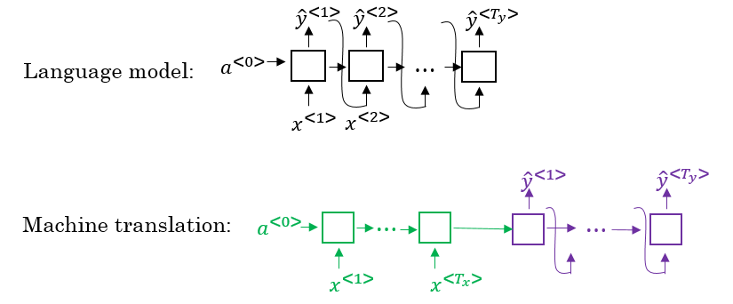
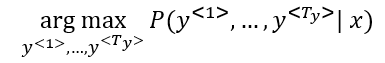

#### Picking the most likely sentence
- There are some similarities between the language model we have learned previously, and the machine translation model we have just discussed, but there are some differences as well.
- The language model we have learned is very similar to the decoder part of the machine translation model, except for a\<0>
  
- Problems formulations also are different:
  - In language model: $P(\hat{y}^{<1>}|x)$
  - In machine translation: $P\hat{y}^{<1>}, ..., \hat{y}^{<Ty>} | x^{<1>}, ...,  x^{<Ty>})$
- What we don't want in machine translation model, is not to sample the output at random. This may provide some choices as an output. Sometimes you may sample a bad output.
  - Example:
    - X = "Jane visite l’Afrique en septembre."
    - Y may be:
      - Jane is visiting Africa in September.
      - Jane is going to be visiting Africa in September.
      - In September, Jane will visit Africa.
- So we need to get the best output it can be:
  
- The most common algorithm is the beam search, which we will explain in the next section.
- Why not use greedy search? Why not get the best choices each time?
  - It turns out that this approach doesn't really work!
  - Lets explain it with an example:
    - The best output for the example we talked about is "Jane is visiting Africa in September."
    - Suppose that when you are choosing with greedy approach, the first two words were "Jane is", the word that may come after that will be "going" as "going" is the most common word that comes after "<Noun> is" so the result may look like this: "Jane is going to be visiting Africa in September.". And that isn't the best/optimal solution.
- So what is better than greedy approach, is to get an approximate solution, that will try to maximize the output (the last equation above).
