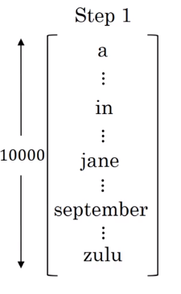
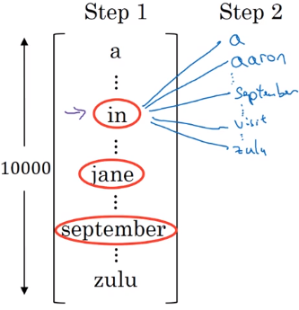
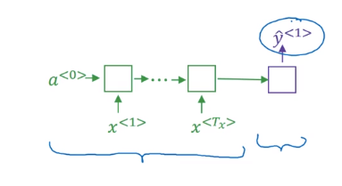
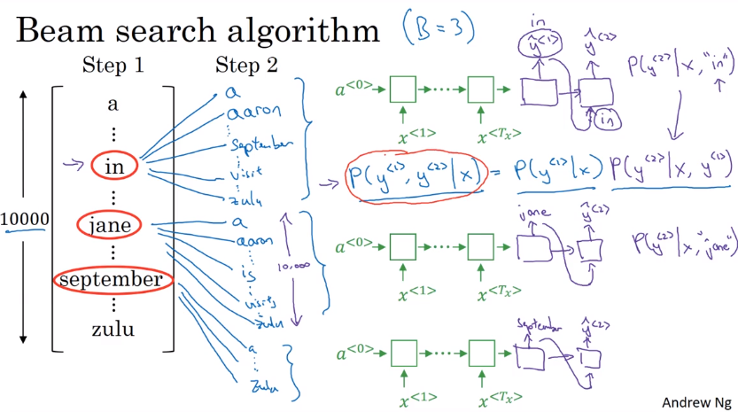
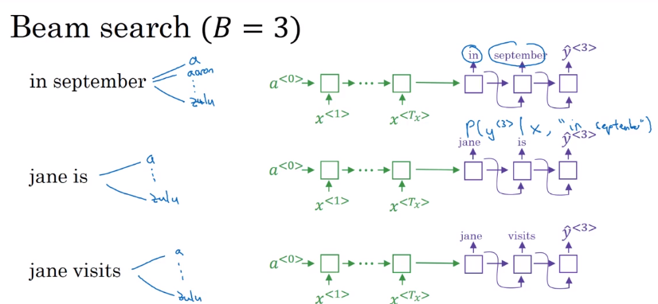

# Beam search

- Beam search is the most widely used algorithm to get the best output sequence. It's a heuristic search algorithm.
- To illustrate the algorithm we will use the example below. We need Y = "Jane is visiting Africa in September.


- The algorithm has a parameter `B`  which is the beam width. Lets take `B = 3` which means the algorithm will get 3 outputs at a time.
- For the first step you will get ["in", "jane", "september"] words that are the best candidates.
- 
- Then for each word in the first output, get B next (second) words and select top best B combinations where the best are those what give the highest value of multiplying both probabilities - $\prod_{t=1}^{T_y}p(y^{<t>}|x,y^{<1>}, \cdots, y^{<t-1>})=P(\hat{y}^{<1>}|x) * P(\hat{y}^{<2>}|x,\hat{y}^{<1>})* \cdots *P(\hat{y}^{<t>}|x,\hat{y}^{<t-1>})$. in other words,
arg $max_{y}\prod_{t=1}^{T_y}p(y^{<t>}|x,y^{<1>}, \cdots, y^{<t-1>})$


We will have then ["in september", "jane is", "jane visit"]. These three words are kept in the memory.



Notice, that we automatically discard _september_ as a first word.
- Repeat the same process and get the best B words for ["september", "is", "visit"]  and so on.
- In this algorithm, keep only B instances of your network.
- If `B = 1` this will become the greedy search.



## Refinements to Beam Search
### Length normalization
- Length normalization is a small change to the beam search algorithm that can help you get much better results.
- Since beam search is the product of probabilities (>=1), so it will results in a very small number.

arg $max_{y}\prod_{t=1}^{T_y}p(y^{<t>}|x,y^{<1>}, \cdots, y^{<t-1>})$

- SO, maximizing the sum of log probabilities would be a better option.

arg $max_{y}\sum_{y=1}^{T_y}\log p(y^{<t>}|x,y^{<1>}, \cdots, y{<t-1>})$

- The log of our probability is always less than or equal to 1. So the more terms you have together, the more negative this becomes.
- There's one other change to the algorithm that makes it work better, which is instead of using $\sum_{y=1}^{T_y}\log p(y^{<t>}|x,y^{<1>}, \cdots, y{<t-1>})$ as the objective you're trying to maximize, one thing you could do is normalize this by the number of words in your translation.

$\frac{1}{T}\sum_{y=1}^{T_y}\log p(y^{<t>}|x,y^{<1>}, \cdots, y{<t-1>})$

In practice, slightly softer approach may be taken with addition of $\alpha$
$\frac{1}{T}^{\alpha}\sum_{y=1}^{T_y}\log p(y^{<t>}|x,y^{<1>}, \cdots, y{<t-1>})$ where $\alpha$ is around 0.7 in practice.

  - alpha is a hyperparameter to tune.
  - If alpha = 0 - no sequence length normalization.
  - If alpha = 1 - full sequence length normalization.
  - In practice alpha = 0.7 is a good thing (somewhere in between two extremes).
---

- The second thing is how can we choose best B?
  - The larger B - the larger possibilities, the better are the results. But it will be more computationally expensive.
  - In practice, you might see in the production setting B=10
  - B=100, B=1000 are uncommon (sometimes used in research settings)
  - Unlike exact search algorithms like BFS (Breadth First Search) or DFS (Depth First Search), Beam Search runs faster but is not guaranteed to find the exact solution.

- Unlike exact search alrogithms like BFS or DFS, Beam Search runs faster but is not guaranteed to find exact maximum for arg $max_y P(y|x)$

## Beam-search algorithm in Python
See [here](./beam-search/readme.md)
```Python
# coding: utf-8

"""
Beam search for neural network sequence to sequence (encoder-decoder) models.
Usage example:

from beam_search import beam_search

# Load model and vocabularies...
input_text = "Hello World !"
X = [encoder_vocabulary.get(t, encoder_vocabulary['<UNK>']) for t in input_text.split()]

hypotheses = beam_search(model.initial_state_function, model.generate_function, X, decoder_vocabulary['<S>'], decoder_vocabulary['</S>'])

for hypothesis in hypotheses:

    generated_indices = hypothesis.to_sequence_of_values()
    generated_tokens = [reverse_decoder_vocabulary[i] for i in generated_indices]

    print(" ".join(generated_tokens))

"""

import numpy as np

class Node(object):
    def __init__(self, parent, state, value, cost, extras):
        super(Node, self).__init__()
        self.value = value
        self.parent = parent # parent Node, None for root
        self.state = state.flatten() if state is not None else None # recurrent layer hidden state
        self.cum_cost = parent.cum_cost + cost if parent else cost # e.g. -log(p) of sequence up to current node (including)
        self.length = 1 if parent is None else parent.length + 1
        self.extras = extras # can hold, for example, attention weights
        self._sequence = None

    def to_sequence(self):
        # Return sequence of nodes from root to current node.
        if not self._sequence:
            self._sequence = []
            current_node = self
            while current_node:
                self._sequence.insert(0, current_node)
                current_node = current_node.parent
        return self._sequence

    def to_sequence_of_values(self):
        return [s.value for s in self.to_sequence()]

    def to_sequence_of_extras(self):
        return [s.extras for s in self.to_sequence()]

def beam_search(initial_state_function, generate_function, X, start_id, end_id, beam_width=4, num_hypotheses=1, max_length=50):
    """Beam search for neural network sequence to sequence (encoder-decoder) models.

    :param initial_state_function: A function that takes X as input and returns state (2-dimensonal numpy array with 1 row
                                   representing decoder recurrent layer state - currently supports only one recurrent layer).
    :param generate_function: A function that takes X, Y_tm1 (1-dimensional numpy array of token indices in decoder vocabulary
                              generated at previous step) and state_tm1 (2-dimensonal numpy array of previous step decoder recurrent
                              layer states) as input and returns state_t (2-dimensonal numpy array of current step decoder recurrent
                              layer states), p_t (2-dimensonal numpy array of decoder softmax outputs) and optional extras
                              (e.g. attention weights at current step).
    :param X: List of input token indices in encoder vocabulary.
    :param start_id: Index of <start sequence> token in decoder vocabulary.
    :param end_id: Index of <end sequence> token in decoder vocabulary.
    :param beam_width: Beam size. Default 4.
    :param num_hypotheses: Number of hypotheses to generate. Default 1.
    :param max_length: Length limit for generated sequence. Default 50.
    """

    if isinstance(X, list) or X.ndim == 1:
        X = np.array([X], dtype=np.int32).T
    assert X.ndim == 2 and X.shape[1] == 1, "X should be a column array with shape (input-sequence-length, 1)"

    next_fringe = [Node(parent=None, state=initial_state_function(X), value=start_id, cost=0.0, extras=None)]
    hypotheses = []

    for _ in range(max_length):

        fringe = []
        for n in next_fringe:
            if n.value == end_id:
                hypotheses.append(n)
            else:
                fringe.append(n)

        if not fringe or len(hypotheses) >= num_hypotheses:
            break

        Y_tm1 = np.array([n.value for n in fringe], dtype=np.int32)
        state_tm1 = np.array([n.state for n in fringe], dtype=np.float32)
        state_t, p_t, extras_t = generate_function(X, Y_tm1, state_tm1)
        Y_t = np.argsort(p_t, axis=1)[:,-beam_width:] # no point in taking more than fits in the beam

        next_fringe = []
        for Y_t_n, p_t_n, extras_t_n, state_t_n, n in zip(Y_t, p_t, extras_t, state_t, fringe):
            Y_nll_t_n = -np.log(p_t_n[Y_t_n])

            for y_t_n, y_nll_t_n in zip(Y_t_n, Y_nll_t_n):
                n_new = Node(parent=n, state=state_t_n, value=y_t_n, cost=y_nll_t_n, extras=extras_t_n)
                next_fringe.append(n_new)

        next_fringe = sorted(next_fringe, key=lambda n: n.cum_cost)[:beam_width] # may move this into loop to save memory

    hypotheses.sort(key=lambda n: n.cum_cost)
    return hypotheses[:num_hypotheses]

```

Usage example:

```python
from beam_search import beam_search

# Load model and vocabularies...
input_text = "Hello World !"
X = [encoder_vocabulary.get(t, encoder_vocabulary['<UNK>']) for t in input_text.split()]

hypotheses = beam_search(model.initial_state_function, model.generate_function, X, decoder_vocabulary['<S>'], decoder_vocabulary['</S>'])

for hypothesis in hypotheses:

    generated_indices = hypothesis.to_sequence_of_values()
    generated_tokens = [reverse_decoder_vocabulary[i] for i in generated_indices]

    print(" ".join(generated_tokens))`
```
