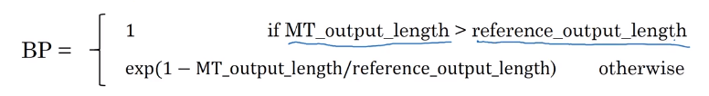

# Error analysis in beam search
- We have talked before on **Error analysis** in _"Structuring Machine Learning Projects"_ course. We will apply these concepts to improve our beam search algorithm.
- We will use error analysis to figure out if the $\mathcal{B}$ hyperparameter of the beam search is the problem (it doesn't get an optimal solution) or in our RNN part.
- Let's take an example:
  - Initial info:
    - x = **"Jane visite l’Afrique en septembre."**
    - y* = **"Jane visits Africa in September."** - right answer
    - y&#770; = **"Jane visited Africa last September."** - answer produced by model
  - Our model that has produced not a good result.
  - We now want to know who to blame - the RNN or the beam search.
  - To do that, we calculate P(y* | X) and P(y&#770; | X) using RNN. There are two cases:
    - **Case 1** (P(y* | X)  > P(y&#770; | X)):
      - **Conclusion:** Beam search is at fault.
    - **Case 2** (P(y* | X)  <= P(y&#770; | X)):
      - **Conclusion:** RNN model is at fault.
- The error analysis process is as following:
  - You choose N error examples and make the following table:

|Human|Algorithm|$P(y*|x)$|$P(\hat{y}|x)$|At fault?|
| -----                           | ---------                          | ---------           | ----------          | --- | --------- |
| Jane visits Agrica in September | Jane visited Africa last September | $2 \times 10^{-10}$ | $1 \times 10^{-10}$ | B   |  $\cdots$         |$\cdots$
|                $\cdots$                          |          $\cdots$                                   |                     |                     |R     |           |  $\cdots$         |$\cdots$
|                $\cdots$                          |          $\cdots$                                   |                     |                     |R     |           |  $\cdots$         |$\cdots$
|                $\cdots$                          |          $\cdots$                                   |                     |                     |R     |           |  $\cdots$         |$\cdots$
|                $\cdots$                          |          $\cdots$                                   |                     |                     |B     |           |  $\cdots$         |$\cdots$
|                $\cdots$                          |          $\cdots$                                   |                     |                     |R     |           |

  - `B` for beam search, `R` is for the RNN.
  - Get counts and decide what to work on next.

# BLEU Score
- One of the challenges of machine translation, is that given a sentence in a language there are one or more possible good translation in another language. So how do we evaluate our results?
- The way we do this is by using **BLEU score**. BLEU stands for _bilingual evaluation understudy_.
- The intuition is: as long as the machine-generated translation is pretty close to any of the references provided by humans, then it will get a high BLEU score.
- Let's take an example:
  - **X = "Le chat est sur le tapis."**
  - **Y1 = "The cat is on the mat." (human reference 1)**
  - **Y2 = "There is a cat on the mat." (human reference 2)**
  - Suppose that the machine outputs: "the the the the the the the."
  - One way to evaluate the machine output is to look at each word in the output and check if it is in the references. This is called **_precision_**:
    - **precision** = 7/7  because "the" appeared in **Y1** or **Y2**
  - This is not a useful measure!
  - We can use a **modified precision** in which we are looking for the **reference with the maximum number of a particular word and set the maximum appearing of this word to this number**. So:
    - modified precision = $\frac{2}{7}$ because the max is 2 in **Y1**
    - We clipped the 7 times by the max which is 2.
  - Here we are looking at one word at a time - unigrams, we may look at n-grams too
- BLEU score on **bigrams**
  - The **n-grams** typically are collected from a text or speech corpus. When the items are words, **n-grams** may also be called shingles. An **n-gram** of size 1 is referred to as a "unigram"; size 2 is a "bigram" (or, less commonly, a "digram"); size 3 is a "trigram".

  |Source    |Output                             |
  |----------|-----------------------------------|
  |Input X   | "Le chat est sur le tapis."       |
  |Y1        | "The cat is on the mat."          |
  |Y2        | "There is a cat on the mat."      |
  |Machine $\hat{y}$   | "the cat the cat on the mat."     |

  - The bigrams in the machine output:

    | Pairs      | Count | Count_{clip} |
    | ---------- | ----- | ---------- |
    | the cat    | 2     | 1 (Y1)     |
    | cat the    | 1     | 0          |
    | cat on     | 1     | 1 (Y2)     |
    | on the     | 1     | 1 (Y1)     |
    | the mat    | 1     | 1 (Y1)     |
    | **Totals** | 6     | 4          |

    Count = How many times the each of bigram appers 
    Count Clip = the maximum number of times that that bigram appears in either Y1 or Y2 
    Modified precision = sum(Count clip) / sum(Count) = 4/6
- So here are the equations for modified precision for the n-grams case:

$P_n=\frac{\sum_{n-gram \in \hat{y}} Count_{clip}(n-gram )}{\sum_{n-gram  \in \hat{y}} Count(n-gram )}$

- Let's put this together to formalize the BLEU score:
  - **$P_n$** = Bleu score on one type of n-gram like $P_1, P_2, P_3, P_4$ where $n=4$
  - **Combined BLEU score** = BP * exp(1/n * sum(Pn))

$exp(\frac{1}{n}\sum^{4}_{n=1}P_n)$

  - For example if we want BLEU for 4, we compute P1, P2, P3, P4 and then average them and take the exp.
  - **BP** is called **BP penalty** which stands for brevity penalty. It turns out that if a machine outputs a small number of words it will get a better score so we need to handle that.
    
- BLEU score has several open source implementations.
- It is used in a variety of systems like machine translation and image captioning.
