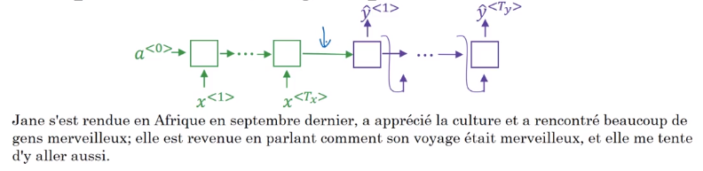
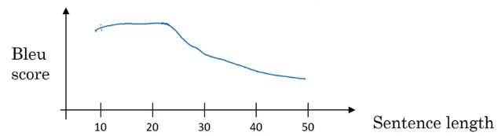
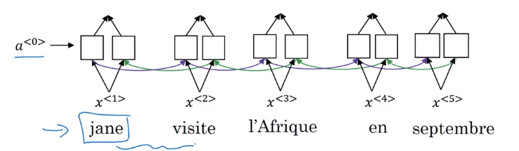
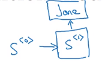
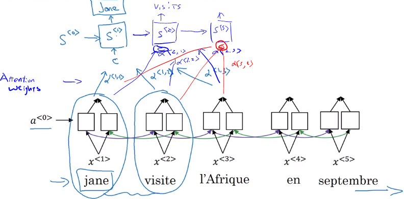
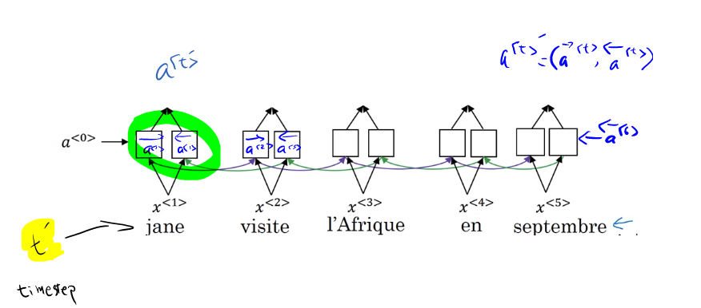
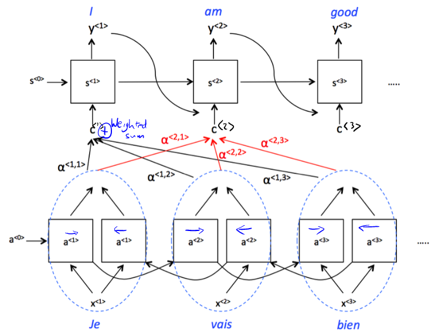
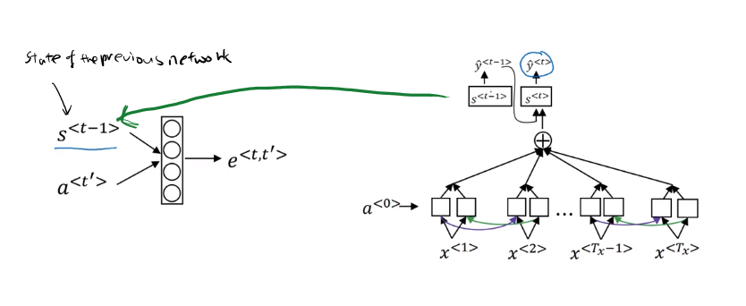
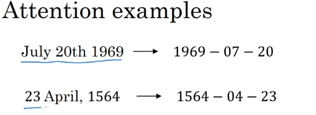
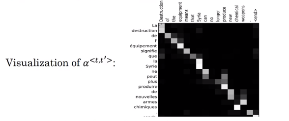

# Attention Model

## Motivation:
The motivation of attention model comes from the fact that the encoder/decoder of RNN needs to store the entire sentence in the encoder before decoder can make the prediction.

So, typically encoder/decoder performs well on the short sentence, but the BLUE score descreases as the sentence length get larger.

## Attention model intuition

- Original paper on attention model
  - Bahdanau, D. et.al. (2014) [Neural Machine Translation by Jointly Learning to Align and Translate](https://arxiv.org/abs/1409.0473)
- Let's start with this example:
- 
- In order to output the first word 'Jane', you need to look the first word in the input sentence.
- 
- Attention model looks at the **'attention weight'**

## Attention model

- Lets assume we have an input sentence and use bidirectional RNN, or bidirectional GRU, or bidirectional LSTM

- The input to the second RNN are controlled by the attention weights, which denote the context that is considered by every single word to compute the translation.
- $\alpha$ weights tell us how much the context would depend on the features we are getting, so the activations we are receving from the different time steps.
- $c$ context is **the weighted sum of the attension weights**.
- $c^{<1>}=\sum_{t^{\prime}} \alpha^{<1,t^{\prime}>} \alpha^{<t^{\prime}>}$ where $\alpha^{<t^{\prime}>}=(\overrightarrow{\alpha}^{<t^{\prime}>},\overleftarrow{\alpha}^{<t^{\prime}>})$

$\alpha^{<1,t^{\prime}>}$ is the amount of 'attention' $y^{<t>}$ should pay to $a^{<t^{\prime}>}$
- For the second word, $c^{<2>}=\sum_{t^{\prime}} \alpha^{<2,t^{\prime}>} \alpha^{<t^{\prime}>}$

### Computing attention $\alpha^{<t,t^{\prime}>}$
- $\alpha^{<t,t^{\prime}>}$= amount of attention $y^{<t>}$ should pay to $a^{<t^{\prime}>}$
- $\alpha^{<t,t^{\prime}>}=\frac{exp(e^{t,t^{\prime}})}{\sum_{t^{\prime}=1}^{T_x} exp(e^{<t,t^{\prime}>})}$ - softmax
- In order to compute these $e$, we use a small network
- 
- $s^{<t-1>}$ is the hidden state of the RNN s, and $a^{<t'>}$ is the activation of the other bidirectional RNN.
- One of the disadvantages of this algorithm is that it takes quadratic time or quadratic cost to run.

