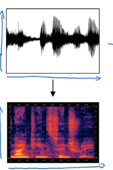
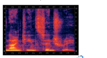

### Speech recognition - Audio data

#### Speech recognition
- One of the most exciting developments using sequence-to-sequence models has been the rise of very accurate speech recognition.
- Let's define the speech recognition problem:
  - X: audio clip
  - Y: transcript
  - If you plot an audio clip it will look like this:
    
    - The horizontal axis is time while the vertical is changes in air pressure.
  - What really is an audio recording? A microphone records little variations in air pressure over time, and it is these little variations in air pressure that your ear perceives as sound. You can think of an audio recording is a long list of numbers measuring the little air pressure changes detected by the microphone. We will use audio sampled at 44100 Hz (or 44100 Hertz). This means the microphone gives us 44100 numbers per second. Thus, a 10 second audio clip is represented by 441000 numbers (= 10 * 44100).
  - It is quite difficult to work with "raw" representation of audio.
  - Because even human ear doesn't process raw wave forms, the human ear can process different frequencies.
  - There's a common preprocessing step for an audio - generate a spectrogram which works similarly to human ears.
    
    - The horizontal axis is time while the vertical is frequencies. Intensity of different colors shows the amount of energy - how loud is the sound for different frequencies (a human ear does a very similar preprocessing step).
  - A spectrogram is computed by sliding a window over the raw audio signal, and calculates the most active frequencies in each window using a Fourier transformation.
  - In the past days, speech recognition systems were built using **_phonemes_** that are a hand engineered basic units of sound.  Linguists used to hypothesize that writing down audio in terms of these basic units of sound called _phonemes_ would be the best way to do speech recognition.
  - End-to-end deep learning found that phonemes was no longer needed. One of the things that made this possible is the large audio datasets.
  - Research papers have around 300 - 3000 hours of training data while the best commercial systems are now trained on over 100,000 hours of audio.
- You can build an accurate speech recognition system using the attention model that we have descried in the previous section:
  
- One of the methods that seem to work well is _CTC cost_ which stands for "Connectionist temporal classification"
  - To explain this let's say that Y = "the quick brown fox"
  - We are going to use an RNN with input, output structure:
    
  - Note: this is a unidirectional RNN, but in practice a bidirectional RNN is used.
  - Notice, that the number of inputs and number of outputs are the same here, but in speech recognition problem input X tends to be a lot larger than output Y.
    - 10 seconds of audio at 100Hz gives us X with shape (1000, ). These 10 seconds don't contain 1000 character outputs.
  - The CTC cost function allows the RNN to output something like this:
    - `ttt_h_eee<SPC>___<SPC>qqq___` - this covers "the q".
    - The _ is a special character called "blank" and `<SPC>` is for the "space" character.
    - Basic rule for CTC: collapse repeated characters not separated by "blank"
  - So the 19 character in our Y can be generated into 1000 character output using CTC and it's special blanks.
  - The ideas were taken from this paper:
    - [Graves et al., 2006. Connectionist Temporal Classification: Labeling unsegmented sequence data with recurrent neural networks](https://dl.acm.org/citation.cfm?id=1143891)
    - This paper's ideas were also used by Baidu's DeepSpeech.
- Using both attention model and CTC cost can help you to build an accurate speech recognition system.

#### Trigger Word Detection
- With the rise of deep learning speech recognition, there are a lot of devices that can be waked up by saying some words with your voice. These systems are called trigger word detection systems.
- For example, Alexa - a smart device made by Amazon - can answer your call "Alexa, what time is it?" and then Alexa will respond to you.
- Trigger word detection systems include:
  
- For now, the trigger word detection literature is still evolving so there actually isn't a single universally agreed on the algorithm for trigger word detection yet. But let's discuss an algorithm that can be used.
- Let's now build a model that can solve this problem:
  - X: audio clip
  - X has been preprocessed and spectrogram features have been returned of X
    - X\<1>, X\<2>, ... , X\<t>
  - Y will be labels 0 or 1. 0 represents the non-trigger word, while 1 is that trigger word that we need to detect.
  - The model architecture can be like this:
    
    - The vertical lines in the audio clip represent moment just after the trigger word. The corresponding to this will be 1.
  - One disadvantage of this creates a very imbalanced training set. There will be a lot of zeros and few ones.
  - A hack to solve this is to make an output a few ones for several times or for a fixed period of time before reverting back to zero.
    
    
