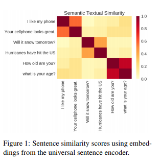
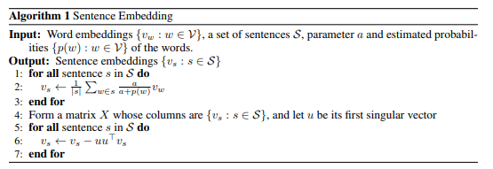

# Universal Sentence Embessings

Cer et al. [Universal Sentence Encoder](https://arxiv.org/abs/1803.11175)

## Introduction of USE.

* Models for encoding sentences into embedding vectors that specifically target transfer learning.
* Two variants of the encoding models are published
* Surprisingly good performance with minimal amounts of supervised training data
for a transfer task with transfer learning via sentence embeddings

## Prior Works:
* Simplest sentence embedding technique is to average individual word embeddings, and widely used. Limitation is that there is (practically) only a finite number of words in natural languages, so that the additional dimensions will not be used to store additional information, beyond a certain threshold
* Previous works have computed phrase or sentence embeddings by composing word embeddings using operations on vectors and matrices e.g.,(Mitchell & Lapata, 2008; 2010; Blacoe & Lapata, 2012). They found that coordinate-wise multiplication of the vectors performed very well among the binary operations studied.
* Unweighted averaging is also found to do well in representing short phrases (Mikolov et al., 2013a)
* Another approach is recursive neural networks (RNNs) defined on the parse tree, trained with supervision (Socheret al., 2011) or without (Socher et al., 2014).
* the skip-gram model (Mikolov et al.,2013) is extended to incorporate a latent vector for the sequence, or to treat the sequences rather than the word as basic units.
* **Skip-thought of (Kiros et al., 2015)** tries to reconstruct the surrounding sentences from surrounded one and treats the hidden parameters as their vector representations. The model consists of an RNN-based encoder-decoder. One interesting insight in the Skip-Thought paper was a vocabulary expansion scheme: Kiros et al. handled words not seen during training by learning a linear transformation between their RNN word embedding space and a larger word embedding such as word2vec.
* Other neural network structures include convolution neural networks, such as (Blunsom et al., 2014) that uses a dynamic pooling to handle input sentences of varying length and do well in sentiment prediction and classification tasks.
* Zhang et al. demonstrated simple cocatenation of word embeddings produced good results in 2016
* Arora from Princeton University published a relatively simple method
  -  just compute the weighted average of the word vectors in the sentence and then remove the projections of the average vectors on their first singular vector (“common component removal”).
  - Smooth inverse frequency (SIF) Weight of a word $w$ is $\frac{\alpha}{\alpha+p(w)}$ where $\alpha$ is the parameter, and $p(w)$ is the estimated word frequency.
  - SIF is highhly reminiscent of TF-IDF reweighting (Sparck Jones, 1972; Robertson, 2004) if one treats a “sentence” as a “document” and make the reasonable assumption that the sentence doesn’t typically contain repeated words. Such reweightings are a good rule of
thumb but has not had theoretical justification in a word embedding setting.

    

* More recently (2018), Ruckle proposed of a strong Bag of Word baseline is the concatenated p-mean embeddings.
* Quick-thoughts vectors are a recent development of the Skip-thoughts vectors by Logeswaran (2018)

[MGNC-CNN: A simple approach to exploiting multiple word embeddings for sentence classification.](http://www.aclweb.org/anthology/N16-1178)
Arola et al., (2017) [A Simple but Tough-to-Beat Baseline for Sentence Embeddings](https://openreview.net/pdf?id=SyK00v5xx)
Ruckle et al., (2018) [Concatenated Power Mean Word Embeddings as Universal Cross-Lingual Sentence Representations](https://arxiv.org/abs/1803.01400)
Logeswaran et al., (2018) [An efficient framework for learning sentence representations](https://openreview.net/pdf?id=rJvJXZb0W)
