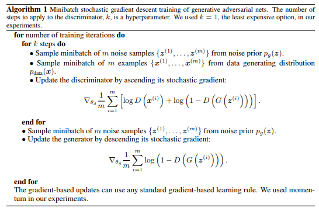

# GANS for Anomaly Detection

**Anomalies** are patterns in data that do not conform well to a normal behavior.  **Generative Adversarial Networks (GANs)** and the **adversarial training framework** (Goodfellow et al., 2014) have been successfully applied to model complex and high dimensional distribution of real-world data. This GAN characteristic suggests they can be used successfully for anomaly detection, although their application has been only recently explored.

Anomaly detection using GANs is the task of modeling the normal behavior using the adversarial training
process and detecting the anomalies measuring an *anomaly score* (Schlegl et al., 2017).

- The GAN framework learns a generator that maps samples from an arbitrary **latent distribution** (noise prior) to data as well as a **discriminator** which tries to distinguish between real and generated. allow us to implicitly maximize the likelihood of complex distributions thereby allowing us to generate samples from such distributions — the key point here is the implicit maximum likelihood estimation principle whereby we do not specify what this complex distribution is parameterized as. The generator’s goal is to “fool” the discriminator by producing samples which are as close to real data as possible. When trained on databases of natural images, GANs
produce impressive results (Radford et al., 2016; Denton et al., 2015)
- BiGAN adds the learning of the inverse mapping which maps the data back to the latent representation. A learned function that maps input data to its latent representation together with a function that does the opposite (the generator).

## GAN
The generator G aim is to capture the data distribution, while the discriminator D estimates the probability that a sample came from the training data rather than G.

### Notations:
- $p_g$: generator’s noize distribution over data $x$
- $p_z(z)$: input prior noise variable. $z$ is each noise samples
- $G$: Differentiable function represented by a multilayer perceptron with parameters $\theta_g$. It takes $z$ and distribute to $p_g$.
- $G(z; θ_g)$: mapped data space where $θ_g$ are the generator parameters
- $D(x; θ_d)$: Discriminator where $θ_D$ are discriminator parameters. This is the second multilayer perceptron which outputs a single scalar (1 or 0).
- $D(x)$: the probability that $p_x$ (1) came from the data rather than $p_g$ (0)

To learn a generative distribution $p_g$ over the data $x$ the generator builds a mapping from a prior noise distribution $p_z(z)$ to a data space as $G(z; θ_g)$ to minimize $log(1 − D(G(z)))$.
.
The discriminator outputs a single scalar representing the probability that x came from real data rather than from $p_g$.

$$\min_G \max_D V(D, G)=
\mathbb{E}_{x\sim p_{data}(x)}[\log D(x)]
+ \mathbb{E}_{z\sim p_z(z)}[\log(1 - D(G(z)))]$$

In this context, we want to maximize $V(D,G)$ with respect to the discriminator $D$, that is, the $max_DV(D,G)$ part from equation 1 and minimize $log(1 − D(G(z)))$.
So if $D$ can classify sample $x$ correctly, $logD(x)$ gets larger, and if $G$ can generates sample as close as sample $x$, then $D(G(x))$ becomes closer to 1 so $log(1 − D(G(z)))$ gets closer to 0.

Algorithm from the original paper

## Reference:
- Goodfellow, I.  et al.,  [Generative Adversarial Nets.](http://papers.nips.cc/paper/5423-generative-adversarial-nets.pdf) pp. 2672–2680, 2014.
- Abadi, M. et al.,. [TensorFlow: Large-Scale Machine Learning on Heterogeneous Systems.](https://www.tensorflow.org/)
.
- Akcay, S. et al., [GANomaly: Semi-Supervised Anomaly Detection via Adversarial Training.](http://arxiv.org/abs/1805.06725) abs/1805.06725, 2018.
- Chandola, V. et al., [Adversarial Feature Learning.](http://arxiv.org/abs/1605.09782) abs/1605.09782, 2016.
- Dumoulin, V. et al., [Adversarially learned inference.](http://arXiv.org/abs/1606.00704) 2017.

- Isola, P. et al., [Imageto-Image Translation with Conditional Adversarial Networks.](http://arxiv.org/abs/1611.07004) abs/1611.07004, 2016.
- Mirza, M. et al., [Conditional Generative Adversarial Nets.](http://arxiv.org/abs/1411.1784) abs/1411.1784, 2014.
- Salimans, T. et al., [Improved Techniques for Training GANs.](http://arxiv.org/abs/1606.03498) abs/1606.03498, 2016.
- Schlegl, T. et al., [Unsupervised Anomaly Detection with Generative Adversarial Networks to Guide Marker Discovery.](http://arxiv.org/abs/1703.05921) abs/1703.05921, 2017.
- Yeh, R. A. et al., [Semantic Image Inpainting with Perceptual and Contextual Losses.](http://arxiv.org/abs/1607.07539) abs/1607.07539, 2016..
- Zenati, H. et al., [Efficient GAN-Based Anomaly Detection.](http://arxiv.org/abs/1802.06222) abs/1802.06222, 2018.
