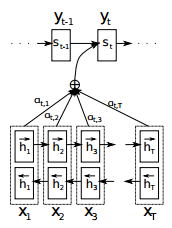

# seq2seq

[Paper](http://papers.nips.cc/paper/5346-information-based-learning-by-agents-in-unbounded-state-spaces.pdf)
Bahdanau et.al. [NEURAL MACHINE TRANSLATION
BY JOINTLY LEARNING TO ALIGN AND TRANSLATE](https://arxiv.org/pdf/1409.0473.pdf) 2015 ICLR

tf-seq2seq is a general-purpose encoder-decoder framework for Tensorflow that can be used for Machine Translation, Text Summarization, Conversational Modeling, Image Captioning, and more.

## Fundamental of seq2seq

